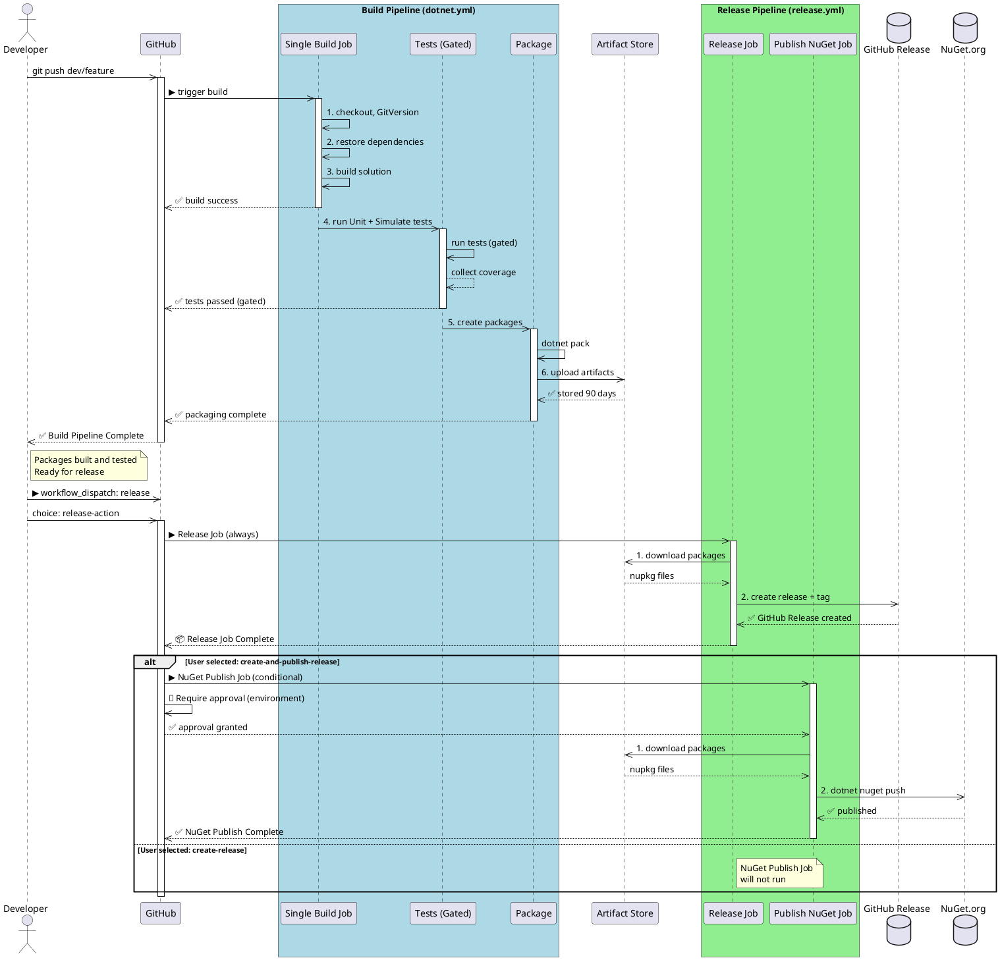

# OoBDev CI/CD Workflows

This directory contains GitHub Actions workflows for building, testing, packaging, and releasing the OoBDev framework.

---

## Table of Contents

- [Current Pipeline Architecture](#current-pipeline-architecture-implemented)
  - [Three-Workflow Design](#three-workflow-design)
  - [Why This Design?](#why-this-design)
  - [Workflow Comparison](#workflow-comparison)
  - [Which Workflow to Use?](#which-workflow-to-use)
- [Workflow Details](#workflow-details)
  - [Build Pipeline](#build-pipeline-dotnetyml---single-job)
  - [Deploy Release Pipeline](#deploy-release-pipeline-deploy-releaseyml---reusable-unified-deployment)
  - [Manual Release Pipeline](#manual-release-pipeline-releaseyml---on-demand-with-parameters)
  - [Scheduled Release Pipeline](#scheduled-release-pipeline-scheduled-releaseyml---automatic-daily)
- [Architecture Diagram](#architecture-diagram)
- [Branch Behavior](#branch-behavior)
- [Key Configuration](#key-configuration)
  - [What Gets Tested](#what-gets-tested-build-pipeline)
  - [How Releases Work](#how-releases-work)
  - [Versioning](#versioning)
- [GitVersion Property Passing](#gitversion-property-passing)
- [Running Locally](#running-locally)
- [Workflow Files](#workflow-files)
- [Common Tasks](#common-tasks)
  - [Manual Build](#trigger-a-manual-build)
  - [GitHub Release Only](#manual-release-create-github-release-only)
  - [GitHub + NuGet](#manual-release-github-release--nuget-requires-approval)
  - [Specific Artifact](#manual-release-from-specific-build-artifact)
  - [Auto-Detect Latest](#auto-detect-latest-artifact-and-create-release)
  - [Scheduled Release (Manual)](#trigger-scheduled-release-manually-for-testing)
  - [Adjust Schedule](#adjust-scheduled-release-time)
  - [Check Status](#check-workflow-status)
  - [View Logs](#view-workflow-logs)
  - [Troubleshooting](#troubleshooting-scheduled-release)
- [Maintenance](#maintenance)
- [References](#references)

---

## Current Pipeline Architecture (Implemented)

### Three-Workflow Design

**1. Build Pipeline** (`dotnet.yml`) - Single Job
- ✅ Triggers on every **push** to `main` and `dev/*` branches
- ✅ **Skipped on PRs** (no packages generated for pull requests)
- ✅ Single job: Restore → Build → Test → Package
- ✅ Tests gated (Unit + Simulate only; Integration tests disabled)
- ✅ Creates build tags: `vX.Y.Z` (main) or `vX.Y.Z-{branch-name}.{count}` (dev/*)
  - GitVersion automatically includes normalized branch name in version
  - Examples: `v0.0.11` (main), `v0.0.11-dev-fix-pipelines.1` (dev/fix-pipelines)
- ✅ Uploads packages as artifacts (90-day retention)

**2. Deploy Release Pipeline** (`deploy-release.yml`) - Unified Deployment
- ✅ Reusable workflow called by both manual and scheduled releases
- ✅ Parameters:
  - `artifact-name` (required) - Specify which artifact to deploy
  - `publish-to-nuget` (optional) - Publish to NuGet.org (true/false)
- ✅ Always creates GitHub Release with git tag
- ✅ Conditionally publishes to NuGet based on parameter
- ✅ Requires approval when publishing to NuGet

**3. Scheduled Release Pipeline** (`scheduled-release.yml`) - Automatic Daily
- ✅ Runs automatically at **5 PM UTC daily** on `main` branch
- ✅ Checks if commits exist since last tag
- ✅ Skip if No Changes: Exits early if no new work
- ✅ Calls `deploy-release.yml` with `publish-to-nuget=true`
- ✅ Automatically creates GitHub Release and publishes to NuGet

**4. Manual Release Pipeline** (`release.yml`) - On-Demand Flexible Release
- ✅ Manual on-demand trigger via GitHub UI or CLI
- ✅ Parameters:
  - `artifact-name` (optional) - Specify artifact or auto-detect latest
  - `publish-to-nuget` (optional) - Publish to NuGet (true/false)
- ✅ Calls `deploy-release.yml` with your chosen parameters
- ✅ Works on any branch

### Why This Design?

✅ **Instant feedback** - Tests must pass before packaging (gated flow)
✅ **No friction** - Developers get fast CI results without approval wait
✅ **DRY principle** - Single `deploy-release.yml` used for all deployments (no code duplication)
✅ **Flexible releases** - Manual releases with choice of GitHub-only or GitHub + NuGet
✅ **Audit trail** - Approval only for NuGet (high-risk action)
✅ **Package reuse** - Once built, packages never rebuilt (artifact-based)
✅ **Cost efficient** - No duplicate builds, just download and release
✅ **Automated delivery** - Scheduled release on main ensures constant delivery rhythm
✅ **Parametrized** - Control deployment behavior through workflow parameters

### Workflow Comparison

| Feature | Build | Manual Release | Scheduled Release | Deploy (Reusable) |
|---------|-------|----------------|-------------------|--------------------|
| **Trigger** | Push to main, dev/* | Manual (CLI/UI) | Daily 5 PM UTC | Called by other workflows |
| **Runs On** | Pushes only (no PRs) | Any branch | main only | N/A (reusable) |
| **GitHub Release** | ✅ Tags only | ✅ Yes | ✅ Yes | ✅ Yes |
| **NuGet Publish** | ❌ No | ⚙️ Configurable | ✅ Yes | ⚙️ Configurable |
| **Approval Needed** | ❌ No | ✅ If NuGet=true | ✅ Yes | ✅ If NuGet=true |
| **Parameters** | N/A | artifact-name, publish-to-nuget | N/A | artifact-name, publish-to-nuget |

### Which Workflow to Use?

```
Do you want to release RIGHT NOW?
├─ YES, to GitHub only
│   └─ Use Manual Release (release.yml)
│       ├─ Input: artifact-name (optional: auto-detect latest)
│       └─ Input: publish-to-nuget = false (default)
│
├─ YES, to GitHub + NuGet (any branch)
│   └─ Use Manual Release (release.yml)
│       ├─ Input: artifact-name (optional: auto-detect latest)
│       └─ Input: publish-to-nuget = true (requires approval)
│
└─ NO → Automatic workflows handle it:
    └─ Main branch: Scheduled Release (scheduled-release.yml) runs daily at 5 PM UTC
        ├─ Detects commits since last release
        ├─ Auto-skips if no new work
        ├─ Creates GitHub Release
        └─ Publishes to NuGet (requires approval)
```

---

## Workflow Details

### Build Pipeline (`dotnet.yml`) - Single Job

Runs automatically on:
- Push to `main`, `master`, `dev/*`
- Pull requests to `main`, `master`, `dev/*`
- Manual trigger via workflow_dispatch

**Job Sequence:**
1. **Setup** - Checkout, install .NET, run GitVersion
2. **Restore** - Restore NuGet dependencies
3. **Build** - Compile solution (fails if errors)
4. **Unit Test** - Run Unit + Simulate tests (gated - must pass)
5. **Publish Results** - Display test coverage on PR
6. **Package** - Create .nupkg files (only if tests pass)
7. **Upload Artifacts** - Store for 90 days

**Outputs:**
- ✅ PR/commit shows build status
- ✅ Test coverage reports visible
- ✅ Packages ready for release workflow
- ✅ Artifacts available for 90 days

---

### Deploy Release Pipeline (`deploy-release.yml`) - Reusable Unified Deployment

Reusable workflow called by both manual and scheduled releases. Handles creating GitHub Releases and optionally publishing to NuGet.

**Inputs (Parameters):**
- **artifact-name** (required) - Package artifact name (e.g., `packages-1.2.3`)
- **publish-to-nuget** (optional) - Publish to NuGet.org (`true` or `false`, default: `false`)

**Job 1: Deploy (Always Runs)**
1. Validate artifact name format
2. Parse version from artifact name
3. Download packages from build artifacts
4. Create GitHub Release with auto-generated release notes
5. Attach .nupkg files to release
6. Create release tracking tag (`v-released-X.Y.Z`)

**Job 2: Publish NuGet (Conditional)**
- Runs only if `publish-to-nuget == 'true'`
- Requires approval via environment protection (`nuget-release`)
- Publishes packages to NuGet.org
- Creates NuGet deployment tag (`nuget-X.Y.Z`)

**Outputs:**
- ✅ GitHub Release created with tag
- ✅ Packages attached to release
- ✅ Release notes auto-generated from commit history
- ✅ (Optional) Published to NuGet.org
- ✅ Tracking tags created for audit trail

---

### Manual Release Pipeline (`release.yml`) - On-Demand with Parameters

Manual trigger via GitHub UI or CLI for flexible deployments.

**Inputs (Parameters):**
- **artifact-name** (optional) - Specific artifact to deploy
  - If empty: auto-detects latest successful build
  - Format: `packages-X.Y.Z-...`
- **publish-to-nuget** (optional) - Publish to NuGet (default: `false`)
  - `false` → GitHub Release only (no approval)
  - `true` → GitHub Release + NuGet (requires approval)

**Job Sequence:**
1. **Find Artifact** - Locate artifact (specified or auto-detected)
2. **Deploy** - Call `deploy-release.yml` with parameters

**Examples:**

GitHub Release only:
```bash
gh workflow run release.yml --ref main \
  -f artifact-name=packages-1.2.3 \
  -f publish-to-nuget=false
```

GitHub + NuGet (requires approval):
```bash
gh workflow run release.yml --ref main \
  -f artifact-name=packages-1.2.3 \
  -f publish-to-nuget=true
```

Auto-detect latest (GitHub only):
```bash
gh workflow run release.yml --ref main
```

---

### Scheduled Release Pipeline (`scheduled-release.yml`) - Automatic Daily

Automatically runs at **5 PM UTC daily** on `main` branch only.

**How It Works:**
1. **Check for Changes**: Compares current main against last release tag
2. **Skip if No Changes**: Exits early if no new commits
3. **Find Artifact** (if changes found):
   - Queries latest successful build on main branch
   - Extracts package artifact name
4. **Deploy** (calls `deploy-release.yml` with `publish-to-nuget=true`):
   - Creates GitHub Release with git tag
   - Attaches .nupkg files
   - Publishes to NuGet.org (requires approval)

**Triggers:**
- ✅ Scheduled: Daily at 5 PM UTC
- ✅ Manual: `gh workflow run scheduled-release.yml --ref main`

**Behavior:**
- ✅ Only runs on `main` branch
- ✅ Skips if no new commits since last release
- ✅ Always publishes to both GitHub and NuGet (no choice)
- ✅ Requires approval for NuGet (environment protection)
- ✅ No-op if no build artifacts available

**Example Log Output:**
```
✅ Found 5 new commits since v1.2.3 - changes detected
✅ Using artifact: packages-1.2.4
✅ Release version: 1.2.4
✅ GitHub Release created
✅ Scheduled release published to NuGet
```

---

## Architecture Diagram



**To view diagram:**
1. Copy PlantUML code
2. Paste at https://www.plantuml.com/plantuml/uml/
3. Or use VS Code extension: `PlantUML` by jebbs

**Note on Scheduled Release:**
The diagram above shows the manual release flow. The scheduled release workflow (`scheduled-release.yml`) follows the same pattern but:
- Runs automatically at 5 PM UTC
- Checks for changes since last tag before running
- Skips if no new commits on main
- Always publishes to both GitHub and NuGet (no choice)
- Still requires approval for NuGet publishing via environment protection


---

## Branch Behavior

| Branch | Build Trigger | Tests | Manual Release | Auto Release | Approval |
|--------|---------------|-------|---|---|---|
| `main` | Push (not PR) | ✅ Unit/Simulate | ✅ GitHub or GitHub+NuGet | ✅ Daily 5PM | ✅ If NuGet |
| `dev/*` | Push (not PR) | ✅ Unit/Simulate | ✅ GitHub or GitHub+NuGet | ❌ No | ✅ If NuGet |
| Other | Never | N/A | ❌ No | ❌ No | N/A |

**Build Behavior:**
- `main` and `dev/*`: Builds on every push (creates build tags automatically)
- PRs: Skipped (no artifacts generated)

**Release Behavior:**
- Approval required only when `publish-to-nuget=true`
- Use `release.yml` for manual releases on any branch
- Use `scheduled-release.yml` auto-release only applies to `main` (daily at 5 PM UTC)

---

## Key Configuration

### What Gets Tested (Build Pipeline)
- ✅ **Unit** - Fast, isolated tests
- ✅ **Simulate** - Integration tests with mocks
- ❌ **Integration** - Not in CI (requires external resources)
- ❌ **DevLocal** - Developer utility tests only

### How Releases Work

**Build Pipeline** (automatic, `dotnet.yml`):
1. Restores dependencies
2. Builds solution
3. Runs Unit + Simulate tests (gated - must pass)
4. Creates .nupkg packages (only if tests pass)
5. Uploads artifacts (90-day retention)

**Release Pipeline** (manual, `release.yml`):
- **Release Job** (always runs):
  1. Downloads packages from build artifacts
  2. Creates GitHub Release with git tag
  3. Attaches .nupkg files to release

- **Publish NuGet Job** (conditional on user choice):
  1. Only runs if user selected "create-and-publish-release"
  2. Requires approval via environment protection
  3. Publishes packages to NuGet.org

### Versioning
- Uses **GitVersion** for semantic versioning
- `main` → Release version (e.g., `1.2.3`)
- `dev/*` → Prerelease version (e.g., `1.2.3-dev-feature-branch.1`)
- **Build Tags** (created after successful builds):
  - Format: `v{GitVersion.fullSemVer}`
  - Main branch: `v1.2.3`
  - Dev branches: `v1.2.3-dev-feature-branch.1` (branch name normalized by GitVersion)
  - Slash characters in branch names converted to hyphens
- **Release Tags** (created when deploying):
  - GitHub Release: `v-released-X.Y.Z`
  - NuGet Release: `nuget-X.Y.Z`
- Properties passed to MSBuild for `.sqlproj` projects

---

## GitVersion Property Passing

The pipeline passes all GitVersion properties to MSBuild so projects (especially sqlproj database projects) can access them without recalculation:

```yaml
--property:GitVersion_AssemblySemFileVer=${{ steps.gitversion.outputs.assemblySemFileVer }}
--property:GitVersion_InformationalVersion=${{ steps.gitversion.outputs.informationalVersion }}
--property:GitVersion_FullSemVer=${{ steps.gitversion.outputs.fullSemVer }}
--property:GitVersion_Major=${{ steps.gitversion.outputs.major }}
--property:GitVersion_Minor=${{ steps.gitversion.outputs.minor }}
--property:GitVersion_Patch=${{ steps.gitversion.outputs.patch }}
```

This allows `.targets` files like `Directory.Build.Database.targets` to use these properties directly:
```xml
<PropertyGroup Condition="'$(GitVersion_AssemblySemFileVer)' != ''">
  <FileVersion>$(GitVersion_AssemblySemFileVer)</FileVersion>
</PropertyGroup>
```

---

## Running Locally

```bash
# Build
dotnet build src/

# Build with explicit GitVersion properties (if needed for .sqlproj projects)
dotnet build src/ \
  --property:GitVersion_AssemblySemFileVer=$(dotnet gitversion /showvariable AssemblySemFileVer)

# Test (Unit + Simulate only, like CI)
dotnet test src/ --filter "TestCategory=Unit|TestCategory=Simulate"

# Pack
dotnet pack src/ --configuration Release --output ./packages

# Publish to NuGet (requires API key)
dotnet nuget push "./packages/*.nupkg" --api-key [YOUR_KEY] --source https://api.nuget.org/v3/index.json
```

---

## Workflow Files

- **`dotnet.yml`** - Build pipeline: restore → build → test → package → upload (runs on push, skipped on PRs)
- **`deploy-release.yml`** - Reusable deployment: creates GitHub Release, conditionally publishes to NuGet (called by other workflows)
- **`release.yml`** - Manual release: parametrized trigger (artifact-name, publish-to-nuget) that calls deploy-release.yml
- **`scheduled-release.yml`** - Automatic release: runs daily at 5 PM UTC on main if changes detected, calls deploy-release.yml with publish-to-nuget=true

---

## Common Tasks

### Trigger a Manual Build
```bash
gh workflow run dotnet.yml --ref dev/my-feature
```

### Manual Release: Create GitHub Release Only
```bash
gh workflow run release.yml --ref main \
  -f publish-to-nuget=false
```

### Manual Release: GitHub Release + NuGet (Requires Approval)
```bash
gh workflow run release.yml --ref main \
  -f publish-to-nuget=true
```

### Manual Release from Specific Build Artifact
```bash
gh workflow run release.yml --ref main \
  -f artifact-name=packages-1.2.3 \
  -f publish-to-nuget=true
```

### Auto-Detect Latest Artifact and Create Release
```bash
# Finds latest successful build and creates GitHub Release (no NuGet)
gh workflow run release.yml --ref main
```

### Trigger Scheduled Release Manually (for testing)
```bash
gh workflow run scheduled-release.yml --ref main
```

### Adjust Scheduled Release Time
Edit `scheduled-release.yml` line with cron expression:
```yaml
schedule:
  - cron: '0 17 * * *'  # 5 PM UTC daily
  # Use https://crontab.guru/ to generate custom times
  # Examples:
  # '0 18 * * *'  # 6 PM UTC
  # '0 9 * * 1'   # 9 AM UTC on Mondays only
  # '0 17 * * 1-5' # 5 PM UTC weekdays only
```

### Check Workflow Status
```bash
# Build pipeline
gh run list --workflow dotnet.yml --limit 5

# Manual release pipeline
gh run list --workflow release.yml --limit 5

# Scheduled release pipeline
gh run list --workflow scheduled-release.yml --limit 5

# All workflows
gh run list --limit 10
```

### View Workflow Logs
```bash
gh run view [RUN_ID] --log

# Example: View latest scheduled release
gh run list --workflow scheduled-release.yml --limit 1 --json databaseId -q '.[0].databaseId' | xargs -I {} gh run view {} --log
```

### Troubleshooting Scheduled Release

**Scheduled release didn't run:**
- Check if main branch has new commits since last tag
- Verify GitHub Actions is enabled in repository settings
- Check "Actions" tab → "Scheduled" for timing info

**Scheduled release failed to find artifacts:**
- Ensure build workflow (`dotnet.yml`) ran successfully on main
- Check if build produced valid .nupkg files
- Verify artifact retention is not expired (90-day default)

**Approval stuck for NuGet publishing:**
- Check "Environments" → "nuget-release" settings
- Verify required reviewers are configured
- Check if approval notification was sent to reviewers

---

## Maintenance

When updating workflows:
1. **Test changes locally** using `act` tool or manual triggering
2. **Document changes** in this README
3. **Update diagrams** if flow changes
4. **Notify team** of breaking changes

### Recent Changes

**2026-01-20: Fixed Build Tag Format**
- **Issue:** Build tags were malformed on dev branches (e.g., `v0.0.11-dev-fix-pipelines.1-dev/fix-pipelines`)
- **Cause:** Pipeline was appending raw branch name to GitVersion output that already included normalized branch name
- **Fix:** Simplified tag creation to use GitVersion's `fullSemVer` directly without additional branch name appending
- **Result:** Clean tags now generated correctly:
  - Main: `v0.0.11`
  - Dev branches: `v0.0.11-dev-fix-pipelines.1`
- **File:** `.github/workflows/dotnet.yml` lines 229-243

---

## References

- [GitHub Actions Documentation](https://docs.github.com/en/actions)
- [GitVersion Configuration](https://gitversion.net/)
- [MSTest Framework](https://docs.microsoft.com/en-us/dotnet/core/testing/unit-testing-with-mstest)
- [NuGet Package Publishing](https://docs.microsoft.com/en-us/nuget/create-packages/creating-a-package)
