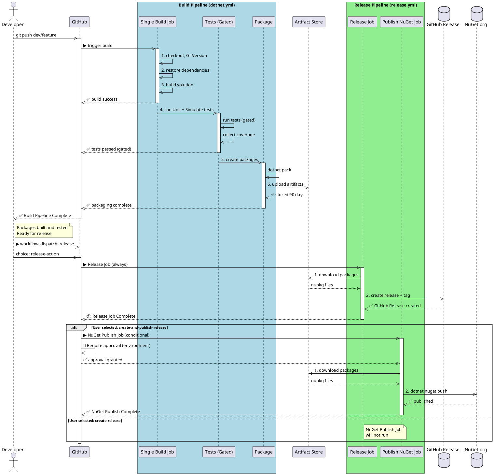

# OoBDev CI/CD Workflows

This directory contains GitHub Actions workflows for building, testing, packaging, and releasing the OoBDev framework.

## Current Pipeline Architecture (Implemented)

### Three-Workflow Design

**1. Build Pipeline** (`dotnet.yml`) - Single Job
- ✅ Triggers on every push/PR to `main` and `dev/*`
- ✅ Single job: Restore → Build → Test → Package
- ✅ Tests gated (must pass before packaging)
- ✅ Uploads packages as artifacts (90-day retention)

**2. Manual Release Pipeline** (`release.yml`) - Two Conditional Jobs
- ✅ Manual on-demand trigger via GitHub UI or CLI
- ✅ **Release Job** (always runs):
  - Downloads pre-built packages from artifacts
  - Creates GitHub Release with git tag
  - Attaches .nupkg files to release
- ✅ **Publish NuGet Job** (conditional on user choice):
  - `create-release` → GitHub only (no approval)
  - `create-and-publish-release` → GitHub + NuGet (requires approval)

**3. Scheduled Release Pipeline** (`scheduled-release.yml`) - Automatic Daily
- ✅ Runs automatically at **5 PM UTC daily** (on `main` only)
- ✅ **Change Detection**: Checks if commits exist since last tag
- ✅ **Skip if No Changes**: Exits early if no new work
- ✅ **Release Job** (if changes found):
  - Downloads latest package artifact
  - Creates GitHub Release with git tag
- ✅ **Publish NuGet Job** (auto-runs):
  - Always publishes to NuGet when scheduled release runs
  - Requires approval via environment protection

### Why This Design?

✅ **Instant feedback** - Tests must pass before packaging (gated flow)
✅ **No friction** - Developers get fast CI results without approval wait
✅ **Flexible releases** - Manual: choose GitHub only or GitHub + NuGet | Scheduled: always both
✅ **Audit trail** - Approval only for NuGet (high-risk action)
✅ **Package reuse** - Once built, packages never rebuilt (artifact-based)
✅ **Cost efficient** - No duplicate builds, just download and release
✅ **Automated delivery** - End-of-day release ensures constant delivery rhythm

### Workflow Comparison

| Feature | Build | Manual Release | Scheduled Release |
|---------|-------|----------------|-------------------|
| **Trigger** | Push/PR to main, dev/* | Manual (CLI/UI) | Daily 5 PM UTC |
| **Runs On** | All branches | main only | main only |
| **Branch Check** | None | None | Yes (skips if no changes) |
| **GitHub Release** | ✅ No | ✅ Yes | ✅ Yes |
| **NuGet Publish** | ✅ No | ⚙️ Optional | ✅ Yes |
| **Approval Needed** | ❌ No | ⚙️ If NuGet | ✅ Yes (for NuGet) |
| **Use Case** | Validation | Ad-hoc release | Daily delivery rhythm |

### Which Workflow to Use?

```
Do you want to release RIGHT NOW?
├─ YES → Use Manual Release (release.yml)
│   ├─ GitHub only?        → create-release (no approval)
│   └─ GitHub + NuGet?     → create-and-publish-release (requires approval)
│
└─ NO → Already set up
    └─ Scheduled Release (scheduled-release.yml) runs daily at 5 PM UTC
        ├─ Auto-skips if no new commits since last release
        └─ Auto-publishes to GitHub + NuGet (requires approval for NuGet)
```

---

## Workflow Details

### Build Pipeline (`dotnet.yml`) - Single Job

Runs automatically on:
- Push to `main`, `master`, `dev/*`
- Pull requests to `main`, `master`, `dev/*`
- Manual trigger via workflow_dispatch

**Job Sequence:**
1. **Setup** - Checkout, install .NET, run GitVersion
2. **Restore** - Restore NuGet dependencies
3. **Build** - Compile solution (fails if errors)
4. **Unit Test** - Run Unit + Simulate tests (gated - must pass)
5. **Publish Results** - Display test coverage on PR
6. **Package** - Create .nupkg files (only if tests pass)
7. **Upload Artifacts** - Store for 90 days

**Outputs:**
- ✅ PR/commit shows build status
- ✅ Test coverage reports visible
- ✅ Packages ready for release workflow
- ✅ Artifacts available for 90 days

---

### Release Pipeline (`release.yml`) - Manual Two Jobs

Manual trigger via GitHub UI.

**Inputs:**
- **Release Action** (required):
  - `create-release` → Publish to GitHub only (no approval needed)
  - `create-and-publish-release` → Publish to GitHub + NuGet (requires approval)
- **Package Artifact** (optional):
  - Auto-detects latest successful build
  - Or specify artifact name manually

**Job 1: Release (Always Runs)**
1. Find/validate package artifact (auto or specified)
2. Download packages from build artifacts
3. Create GitHub Release (git tag + release notes)
4. Attach .nupkg files to release

**Job 2: Publish NuGet (Conditional)**
- Runs only if user selected `create-and-publish-release`
- Requires approval via environment protection
- Publishes packages to NuGet.org

**Outputs:**
- ✅ GitHub Release created with tag
- ✅ Packages attached to release
- ✅ Release notes auto-generated
- ✅ (Optional) Published to NuGet.org

---

### Scheduled Release Pipeline (`scheduled-release.yml`) - Automatic Daily

Automatically runs at **5 PM UTC daily** on `main` branch only.

**How It Works:**
1. **Check for Changes**: Compares current main against last release tag
2. **Skip if No Changes**: Exits early if no new commits
3. **Release Job** (if changes found):
   - Downloads latest package artifact from successful build
   - Creates GitHub Release with git tag
   - Attaches .nupkg files
4. **Publish NuGet Job** (auto-runs after release):
   - Requires approval via environment protection
   - Publishes packages to NuGet.org

**Triggers:**
- ✅ Scheduled: Daily at 5 PM UTC
- ✅ Manual: `gh workflow run scheduled-release.yml --ref main`

**Behavior:**
- ✅ Only runs on `main` branch
- ✅ Skips if no new commits since last release
- ✅ Always publishes to both GitHub and NuGet (no choice)
- ✅ Requires approval for NuGet (environment protection)
- ✅ No-op if no build artifacts available

**Example Log Output:**
```
✅ Found 5 new commits since v1.2.3 - changes detected
✅ Using artifact: packages-1.2.4
✅ Release version: 1.2.4
✅ GitHub Release created
✅ Scheduled release published to NuGet
```

---

## Architecture Diagram



**To view diagram:**
1. Copy PlantUML code
2. Paste at https://www.plantuml.com/plantuml/uml/
3. Or use VS Code extension: `PlantUML` by jebbs

**Note on Scheduled Release:**
The diagram above shows the manual release flow. The scheduled release workflow (`scheduled-release.yml`) follows the same pattern but:
- Runs automatically at 5 PM UTC
- Checks for changes since last tag before running
- Skips if no new commits on main
- Always publishes to both GitHub and NuGet (no choice)
- Still requires approval for NuGet publishing via environment protection


---

## Branch Behavior

| Branch | Build Trigger | Tests | Release | Approval |
|--------|---------------|-------|---------|----------|
| `main` | Push + PR | ✅ Unit/Simulate | Manual (GitHub) | ❌ None |
| `main` | Release trigger | N/A | Manual (GitHub + NuGet) | ✅ Required |
| `dev/*` | Push + PR | ✅ Unit/Simulate | Manual (GitHub) | ❌ None |
| `dev/*` | Release trigger | N/A | Manual (GitHub + NuGet) | ✅ Required |
| Other | PR only | ✅ Unit/Simulate | ❌ Never | N/A |

**Note:** All releases are manual and on-demand. Approval is only required when selecting "create-and-publish-release" (NuGet).

---

## Key Configuration

### What Gets Tested (Build Pipeline)
- ✅ **Unit** - Fast, isolated tests
- ✅ **Simulate** - Integration tests with mocks
- ❌ **Integration** - Not in CI (requires external resources)
- ❌ **DevLocal** - Developer utility tests only

### How Releases Work

**Build Pipeline** (automatic, `dotnet.yml`):
1. Restores dependencies
2. Builds solution
3. Runs Unit + Simulate tests (gated - must pass)
4. Creates .nupkg packages (only if tests pass)
5. Uploads artifacts (90-day retention)

**Release Pipeline** (manual, `release.yml`):
- **Release Job** (always runs):
  1. Downloads packages from build artifacts
  2. Creates GitHub Release with git tag
  3. Attaches .nupkg files to release

- **Publish NuGet Job** (conditional on user choice):
  1. Only runs if user selected "create-and-publish-release"
  2. Requires approval via environment protection
  3. Publishes packages to NuGet.org

### Versioning
- Uses **GitVersion** for semantic versioning
- `main` → Release version (e.g., `1.2.3`)
- `dev/*` → Prerelease version (e.g., `1.2.3-dev-feature-branch.1`)
- Automatic git tagging when release is created
- Properties passed to MSBuild for `.sqlproj` projects

---

## GitVersion Property Passing

The pipeline passes all GitVersion properties to MSBuild so projects (especially sqlproj database projects) can access them without recalculation:

```yaml
--property:GitVersion_AssemblySemFileVer=${{ steps.gitversion.outputs.assemblySemFileVer }}
--property:GitVersion_InformationalVersion=${{ steps.gitversion.outputs.informationalVersion }}
--property:GitVersion_FullSemVer=${{ steps.gitversion.outputs.fullSemVer }}
--property:GitVersion_Major=${{ steps.gitversion.outputs.major }}
--property:GitVersion_Minor=${{ steps.gitversion.outputs.minor }}
--property:GitVersion_Patch=${{ steps.gitversion.outputs.patch }}
```

This allows `.targets` files like `Directory.Build.Database.targets` to use these properties directly:
```xml
<PropertyGroup Condition="'$(GitVersion_AssemblySemFileVer)' != ''">
  <FileVersion>$(GitVersion_AssemblySemFileVer)</FileVersion>
</PropertyGroup>
```

---

## Running Locally

```bash
# Build
dotnet build src/

# Build with explicit GitVersion properties (if needed for .sqlproj projects)
dotnet build src/ \
  --property:GitVersion_AssemblySemFileVer=$(dotnet gitversion /showvariable AssemblySemFileVer)

# Test (Unit + Simulate only, like CI)
dotnet test src/ --filter "TestCategory=Unit|TestCategory=Simulate"

# Pack
dotnet pack src/ --configuration Release --output ./packages

# Publish to NuGet (requires API key)
dotnet nuget push "./packages/*.nupkg" --api-key [YOUR_KEY] --source https://api.nuget.org/v3/index.json
```

---

## Workflow Files

- **`dotnet.yml`** - Build pipeline: single job with restore → build → test → package → upload
- **`release.yml`** - Manual release pipeline: two conditional jobs (release always, NuGet publish on demand with approval)
- **`scheduled-release.yml`** - Automatic scheduled release: runs daily at end of day if changes detected on main

---

## Common Tasks

### Trigger a Manual Build
```bash
gh workflow run dotnet.yml --ref dev/my-feature
```

### Manual Release: Create GitHub Release Only
```bash
gh workflow run release.yml --ref main -f release-action=create-release
```

### Manual Release: Publish to GitHub + NuGet (Requires Approval)
```bash
gh workflow run release.yml --ref main -f release-action=create-and-publish-release
```

### Manual Release from Specific Build Artifact
```bash
gh workflow run release.yml --ref main \
  -f release-action=create-and-publish-release \
  -f packages-artifact=packages-1.2.3
```

### Trigger Scheduled Release Manually (for testing)
```bash
gh workflow run scheduled-release.yml --ref main
```

### Adjust Scheduled Release Time
Edit `scheduled-release.yml` line with cron expression:
```yaml
schedule:
  - cron: '0 17 * * *'  # 5 PM UTC daily
  # Use https://crontab.guru/ to generate custom times
  # Examples:
  # '0 18 * * *'  # 6 PM UTC
  # '0 9 * * 1'   # 9 AM UTC on Mondays only
  # '0 17 * * 1-5' # 5 PM UTC weekdays only
```

### Check Workflow Status
```bash
# Build pipeline
gh run list --workflow dotnet.yml --limit 5

# Manual release pipeline
gh run list --workflow release.yml --limit 5

# Scheduled release pipeline
gh run list --workflow scheduled-release.yml --limit 5

# All workflows
gh run list --limit 10
```

### View Workflow Logs
```bash
gh run view [RUN_ID] --log

# Example: View latest scheduled release
gh run list --workflow scheduled-release.yml --limit 1 --json databaseId -q '.[0].databaseId' | xargs -I {} gh run view {} --log
```

### Troubleshooting Scheduled Release

**Scheduled release didn't run:**
- Check if main branch has new commits since last tag
- Verify GitHub Actions is enabled in repository settings
- Check "Actions" tab → "Scheduled" for timing info

**Scheduled release failed to find artifacts:**
- Ensure build workflow (`dotnet.yml`) ran successfully on main
- Check if build produced valid .nupkg files
- Verify artifact retention is not expired (90-day default)

**Approval stuck for NuGet publishing:**
- Check "Environments" → "nuget-release" settings
- Verify required reviewers are configured
- Check if approval notification was sent to reviewers

---

## Maintenance

When updating workflows:
1. **Test changes locally** using `act` tool or manual triggering
2. **Document changes** in this README
3. **Update diagrams** if flow changes
4. **Notify team** of breaking changes

---

## References

- [GitHub Actions Documentation](https://docs.github.com/en/actions)
- [GitVersion Configuration](https://gitversion.net/)
- [MSTest Framework](https://docs.microsoft.com/en-us/dotnet/core/testing/unit-testing-with-mstest)
- [NuGet Package Publishing](https://docs.microsoft.com/en-us/nuget/create-packages/creating-a-package)
