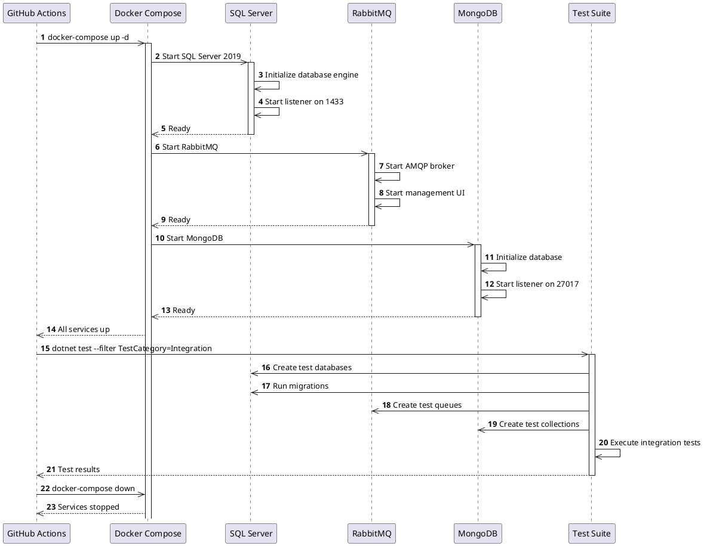
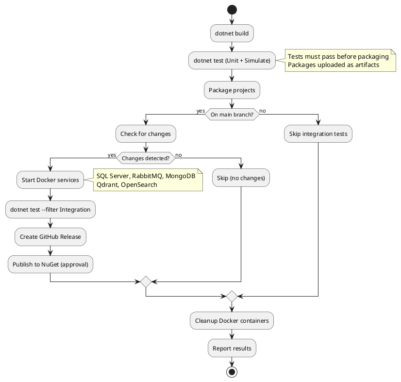
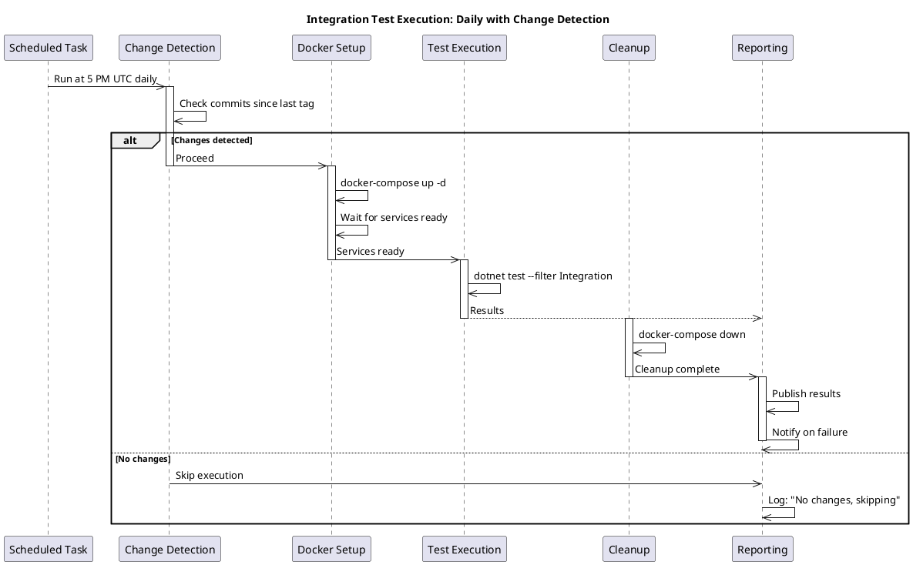
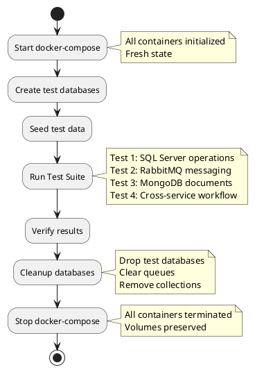
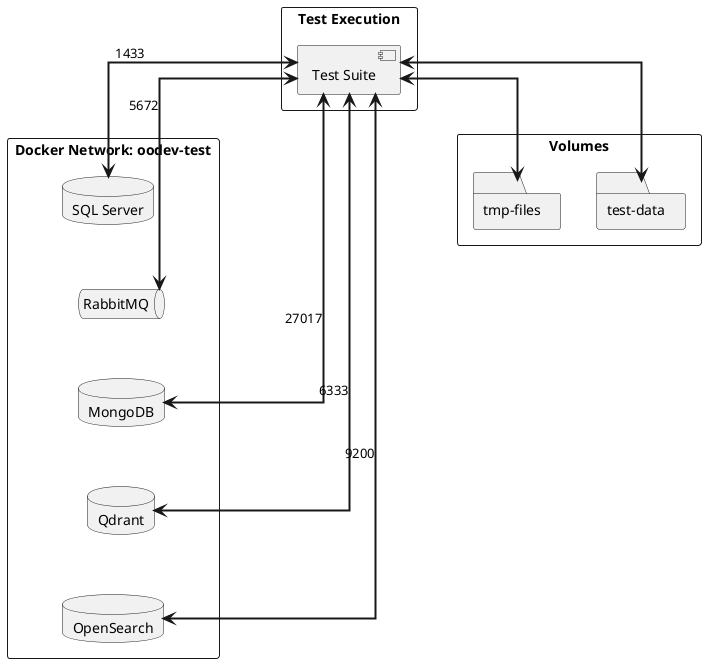

# Docker Setup for Integration Testing

**Status:** Planning Phase - Container Architecture Design
**Execution Model:** Daily runs (once per day if changes detected)
**Cost:** Free (unlimited GitHub Actions minutes for public repo)

## Overview

This document defines the Docker container architecture for integration testing OoBDev. All services run in Docker containers within GitHub Actions runners (or locally for development).

## Container Architecture

### Complete Integration Testing Stack

```plantuml
@startuml IntegrationTestingArchitecture
skinparam backgroundColor #FEFEFE
skinparam packageBorderColor #333333
skinparam packageBackgroundColor #F5F5F5

rectangle "GitHub Actions Runner" as RUNNER #F5F5F5 {
    rectangle "Docker Network: oodev-test" as NETWORK #F0E8F8 {
        database "SQL Server\n2019+" as SQLSERVER #E8F4F8
        note right of SQLSERVER
            Port: 1433
            User: sa
            Dbs: VectorDb, ExampleDb
        end note

        database "RabbitMQ\n3.12" as RABBITMQ #E8F4F8
        note right of RABBITMQ
            AMQP: 5672
            Admin: 15672
            User: guest
        end note

        database "MongoDB\n7.0" as MONGODB #E8F4F8
        note right of MONGODB
            Port: 27017
            Db: test_oodev
        end note

        database "Qdrant\nVector DB" as QDRANT #E8F4F8
        note right of QDRANT
            Port: 6333
            Collections: test_*
        end note

        database "OpenSearch\n2.0" as OPENSEARCH #E8F4F8
        note right of OPENSEARCH
            Port: 9200
            Indices: test_*
        end note

        rectangle "Ollama\nLLM" as OLLAMA #F8F4E8
        note right of OLLAMA
            Port: 11434
            Models: mistral
        end note

        rectangle "Keycloak" as KEYCLOAK #F8F4E8
        note right of KEYCLOAK
            Port: 8080
            Admin: admin/admin
        end note

        rectangle "Shared Volumes" as VOLUMES #E8F8E8
        note right of VOLUMES
            /test-data
            /tmp-files
        end note
    }

    rectangle "Test Execution" as TESTS #E8F8E8 {
        component "Build Pipeline" as BUILD
        component "Integration\nTests" as INTESTS
        component "Reporting" as REPORT
    }

    BUILD --> INTESTS
    INTESTS --> SQLSERVER
    INTESTS --> RABBITMQ
    INTESTS --> MONGODB
    INTESTS --> QDRANT
    INTESTS --> OPENSEARCH
    INTESTS --> OLLAMA
    INTESTS --> KEYCLOAK
    INTESTS --> VOLUMES
    INTESTS --> REPORT
}

@enduml
```



**View diagram:** Copy code above to https://www.plantuml.com/plantuml/uml/

---

## Service Dependency Matrix

Which tests need which services:

```plantuml
@startuml ServiceDependencyMatrix
!define SQL_COLOR #E8F4F8
!define QUEUE_COLOR #FFE8CC
!define DB_COLOR #FFF4E8
!define SEARCH_COLOR #E8FFE8
!define AI_COLOR #F0E8FF

skinparam componentStyle uml2

package "OoBDev Projects" {
    [OoBDev.Data.Vectors.DB] <<SQL_COLOR>>
    [OoBDev.Microsoft.SqlServer.Server] <<SQL_COLOR>>
    [OoBDev.Microsoft.SqlServer.DacFx] <<SQL_COLOR>>

    [OoBDev.RabbitMQ] <<QUEUE_COLOR>>
    [OoBDev.Communications.MessageQueueing] <<QUEUE_COLOR>>

    [OoBDev.MongoDB] <<DB_COLOR>>

    [OoBDev.Qdrant] <<SEARCH_COLOR>>
    [OoBDev.OpenSearch] <<SEARCH_COLOR>>

    [OoBDev.Ollama] <<AI_COLOR>>
}

package "Required Services" {
    [SQL Server 2019+] <<SQL_COLOR>>
    [PostgreSQL 15] <<SQL_COLOR>>

    [RabbitMQ 3.12] <<QUEUE_COLOR>>

    [MongoDB 7.0] <<DB_COLOR>>

    [Qdrant 1.0+] <<SEARCH_COLOR>>
    [OpenSearch 2.0] <<SEARCH_COLOR>>

    [Ollama (optional)] <<AI_COLOR>>
}

[OoBDev.Data.Vectors.DB] --> [SQL Server 2019+]
[OoBDev.Microsoft.SqlServer.Server] --> [SQL Server 2019+]
[OoBDev.Microsoft.SqlServer.DacFx] --> [SQL Server 2019+]

[OoBDev.RabbitMQ] --> [RabbitMQ 3.12]
[OoBDev.Communications.MessageQueueing] --> [RabbitMQ 3.12]

[OoBDev.MongoDB] --> [MongoDB 7.0]

[OoBDev.Qdrant] --> [Qdrant 1.0+]
[OoBDev.OpenSearch] --> [OpenSearch 2.0]

[OoBDev.Ollama] --> [Ollama (optional)]

@enduml
```



**View diagram:** Copy code above to https://www.plantuml.com/plantuml/uml/

---

## Container Startup Sequence

How containers initialize during test execution:



**View diagram:** Copy code above to https://www.plantuml.com/plantuml/uml/

---

## GitHub Actions Execution Flow



**View diagram:** Copy code above to https://www.plantuml.com/plantuml/uml/

---

## Docker Compose Configuration Structure

Expected structure for when you implement:

```
Features/Integration/Workflows/
├── docker-compose.yml              # All services
├── docker-compose.override.yml     # Local development overrides
├── .env.example                    # Environment variables template
├── services/
│   ├── sqlserver/
│   │   ├── Dockerfile             # SQL Server configuration
│   │   ├── init.sql               # Database initialization
│   │   └── setup.sh               # Setup script
│   ├── rabbitmq/
│   │   ├── rabbitmq.conf          # RabbitMQ configuration
│   │   └── definitions.json       # Queue/exchange definitions
│   ├── mongodb/
│   │   ├── mongod.conf            # MongoDB configuration
│   │   └── init.js                # Database initialization
│   ├── qdrant/
│   │   └── config.yaml            # Qdrant configuration
│   ├── opensearch/
│   │   └── opensearch.yml         # OpenSearch configuration
│   └── ollama/
│       └── Dockerfile             # Ollama custom image
├── scripts/
│   ├── start-services.sh          # Start all containers
│   ├── stop-services.sh           # Stop all containers
│   ├── wait-for-db.sh             # Wait for SQL Server ready
│   ├── init-databases.sh          # Initialize test databases
│   └── health-check.sh            # Verify all services healthy
└── health-checks/
    ├── sqlserver.sh
    ├── rabbitmq.sh
    └── mongodb.sh
```

---

## Service Specifications

### SQL Server 2019+

**Container:** `mcr.microsoft.com/mssql/server:2019-latest`

**Configuration:**
```yaml
environment:
  ACCEPT_EULA: Y
  MSSQL_SA_PASSWORD: L0c@lD3v
  MSSQL_PID: Developer
ports:
  - "1433:1433"
volumes:
  - sqlserver-data:/var/opt/mssql/data
  - sqlserver-log:/var/opt/mssql/log
```

**Test Databases:**
- VectorDb (primary)
- ExampleDb (secondary)
- Test isolation databases (created per test run)

**Health Check:**
```bash
/opt/mssql-tools/bin/sqlcmd -S localhost -U sa -P L0c@lD3v -Q "SELECT 1"
```

**Cleanup:**
```sql
-- Drop test databases
DROP DATABASE [test_*];

-- Clear queues
EXECUTE msdb.dbo.sp_delete_backuphistory @oldest_date = N'2099-01-01T00:00:00.000'
```

---

### RabbitMQ 3.12

**Container:** `rabbitmq:3.12-management`

**Configuration:**
```yaml
environment:
  RABBITMQ_DEFAULT_USER: guest
  RABBITMQ_DEFAULT_PASS: guest
ports:
  - "5672:5672"    # AMQP
  - "15672:15672"  # Management UI
volumes:
  - rabbitmq-data:/var/lib/rabbitmq
  - ./services/rabbitmq/definitions.json:/etc/rabbitmq/definitions.json:ro
```

**Test Queues:**
```json
{
  "queues": [
    {"name": "test.queue.1", "vhost": "/", "durable": true},
    {"name": "test.queue.2", "vhost": "/", "durable": true}
  ],
  "exchanges": [
    {"name": "test.exchange", "type": "direct", "durable": true}
  ]
}
```

**Health Check:**
```bash
curl -f http://localhost:15672/api/aliveness-test/%2F -u guest:guest
```

**Cleanup:**
```bash
# Delete test queues
curl -i -u guest:guest -X DELETE http://localhost:15672/api/queues/%2F/test.queue.1

# Purge messages
curl -i -u guest:guest -X POST http://localhost:15672/api/queues/%2F/test.queue.1/contents
```

---

### MongoDB 7.0

**Container:** `mongo:7.0`

**Configuration:**
```yaml
environment:
  MONGO_INITDB_DATABASE: test_oodev
ports:
  - "27017:27017"
volumes:
  - mongodb-data:/data/db
  - ./services/mongodb/init.js:/docker-entrypoint-initdb.d/init.js:ro
```

**Initialize Script:**
```javascript
db.createCollection("test_documents");
db.createCollection("test_vectors");
db.test_documents.createIndex({ "createdAt": 1 });
```

**Health Check:**
```bash
mongosh --eval "db.adminCommand('ping')"
```

**Cleanup:**
```javascript
db.dropDatabase();  // Drop entire test database
```

---

### Qdrant Vector Database

**Container:** `qdrant/qdrant:latest`

**Configuration:**
```yaml
environment:
  QDRANT_API_KEY: test_key_12345
ports:
  - "6333:6333"
volumes:
  - qdrant-storage:/qdrant/storage
```

**Health Check:**
```bash
curl -f http://localhost:6333/health
```

**Cleanup:**
```bash
# Delete test collections via API
curl -X DELETE http://localhost:6333/collections/test_vectors
```

---

### OpenSearch 2.0

**Container:** `opensearchproject/opensearch:2.0.0`

**Configuration:**
```yaml
environment:
  discovery.type: single-node
  OPENSEARCH_JAVA_OPTS: "-Xms512m -Xmx512m"
  DISABLE_SECURITY_PLUGIN: "true"
ports:
  - "9200:9200"
  - "9600:9600"
volumes:
  - opensearch-data:/usr/share/opensearch/data
```

**Health Check:**
```bash
curl -f http://localhost:9200/_cluster/health
```

**Cleanup:**
```bash
# Delete test indices
curl -X DELETE "http://localhost:9200/test_*"
```

---

### Ollama (Optional for LLM Tests)

**Container:** `ollama/ollama:latest`

**Configuration:**
```yaml
ports:
  - "11434:11434"
volumes:
  - ollama-models:/root/.ollama
```

**Model Setup:**
```bash
ollama pull mistral:latest  # Lightweight model for testing
```

**Health Check:**
```bash
curl -f http://localhost:11434/api/tags
```

**Note:** Larger models consume significant disk space. Use minimal models for CI (mistral ~4GB).

---

## Execution Strategy: Daily with Change Detection

### Workflow Timing



**View diagram:** Copy code above to https://www.plantuml.com/plantuml/uml/

---

### Benefits of Once-Daily Model

✅ **Cost Efficient**
- Tests run only when needed (skip if no changes)
- Public repo = unlimited minutes anyway
- Reduces unnecessary CI/CD runs

✅ **Clean Feedback**
- No noise from multiple daily runs
- Single daily validation window
- End-of-day release ready

✅ **Performance**
- Docker containers initialize once per day
- All tests run against fresh services
- No service state pollution between runs

✅ **Predictable Timing**
- Developers know when release happens
- Consistent delivery rhythm
- Easy to troubleshoot (fixed time window)

---

## Test Isolation Strategy

Each integration test run gets clean services:



**View diagram:** Copy code above to https://www.plantuml.com/plantuml/uml/

---

## Performance Expectations

### Container Startup Times

```
SQL Server 2019:      10-15 seconds
RabbitMQ:             5-10 seconds
MongoDB:              5-8 seconds
Qdrant:               3-5 seconds
OpenSearch:           8-12 seconds
Ollama (optional):    2-3 seconds (if cached)
────────────────────────────────────
Total startup:        ~30-50 seconds
```

### Test Execution Times

```
Database initialization:     10-20 seconds
Setup fixtures:              5-10 seconds
Integration tests:           2-5 minutes (depends on test count)
Reporting:                   5-10 seconds
Cleanup:                     5-10 seconds
────────────────────────────────────
Total per run:               ~3-6 minutes
```

### Full Pipeline (Build + Integration)

```
Build + Unit/Simulate tests:  3-5 minutes
Docker startup:               ~40 seconds
Integration tests:            3-6 minutes
Cleanup + reporting:          1-2 minutes
────────────────────────────────────
Total time on main:           ~8-15 minutes
(No tests on PRs)
```

---

## Network Topology



**View diagram:** Copy code above to https://www.plantuml.com/plantuml/uml/

---

## Next Steps (When Ready to Implement)

1. **Phase 1: Docker Infrastructure**
   - Create docker-compose.yml with all services
   - Create health check scripts
   - Test startup sequence locally
   - Document troubleshooting

2. **Phase 2: Integration Tests**
   - Create test projects with fixtures
   - Write first set of integration tests
   - Validate against Docker services
   - Create test data management

3. **Phase 3: CI/CD Integration**
   - Create integration-tests.yml workflow
   - Add to scheduled-release.yml
   - Configure approval gates
   - Monitor performance

4. **Phase 4: Optimization**
   - Optimize startup times
   - Parallel test execution
   - Caching strategies
   - Cost monitoring

---

## Decision Checklist

Before implementing, confirm:

- [ ] SQL Server 2019+ container acceptable? (vs other DB)
- [ ] Which services are critical vs optional?
- [ ] Use docker-compose vs Testcontainers?
- [ ] Test data: seed via SQL vs Docker volume?
- [ ] Volumes: persistent vs ephemeral?
- [ ] Resource limits: memory, CPU?
- [ ] Logging: verbose? saved?

---

## Resources

- **Docker Hub:** https://hub.docker.com
- **Docker Compose:** https://docs.docker.com/compose/
- **SQL Server on Linux:** https://hub.docker.com/_/microsoft-mssql-server
- **RabbitMQ Docker:** https://hub.docker.com/_/rabbitmq
- **MongoDB Docker:** https://hub.docker.com/_/mongo
- **Qdrant Docker:** https://hub.docker.com/r/qdrant/qdrant
- **OpenSearch:** https://hub.docker.com/r/opensearchproject/opensearch
