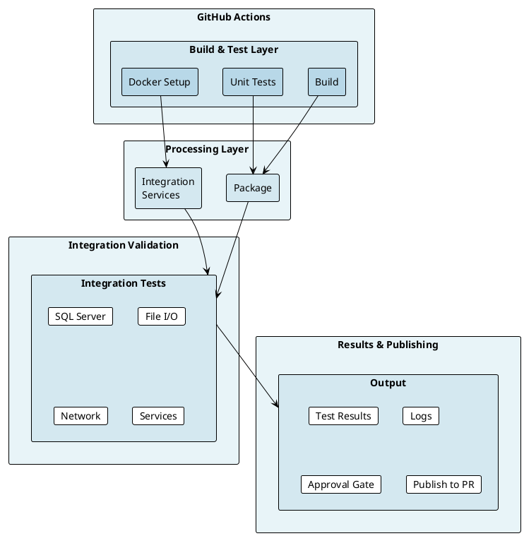

# Integration Testing Implementation Plan

**Status:** Planning - Ready for Review
**Target:** Ready when you decide to implement
**Effort:** Medium complexity, phased approach

## Executive Summary

Integration testing adds a third layer of validation beyond Unit and Simulate tests. Unlike mocked tests, Integration tests run against **real external dependencies** (databases, file system, network, etc.).

For OoBDev, this means:
- Testing database projects against actual SQL databases
- Testing I/O operations against real file systems
- Testing network features with actual communication
- Validating third-party service integrations

## Architecture Overview



## Implementation Phases

### Phase 0: Planning & Setup (CURRENT)
**Status:** ✅ Starting
**Duration:** This is happening now
**Deliverables:**
- [ ] Plan documents (README.md, TEST_CATEGORIES.md, DOCKER_SETUP.md)
- [ ] Docker configuration examples
- [ ] Service container templates
- [ ] Example integration test
- [ ] GitHub Actions workflow template

### Phase 1: Docker Infrastructure
**Status:** ⏳ Pending your decision
**Duration:** 2-4 hours
**Steps:**
1. Create docker-compose.yml with required services
2. Add .env.example for configuration
3. Test Docker setup locally
4. Document service startup/teardown
5. Create health check scripts

**Deliverables:**
```
Features/Integration/Workflows/
├── docker-compose.yml
├── docker-compose.override.yml (local development)
├── services/
│   ├── sqlserver/
│   ├── postgres/
│   └── ...
└── scripts/
    ├── start-services.sh
    └── wait-for-services.sh
```

**Services to Consider:**
- SQL Server (for SQLCLR projects)
- PostgreSQL (for extension compatibility)
- File system (volume mounts)
- Network isolation layer

### Phase 2: Test Project Structure
**Status:** ⏳ Pending Phase 1
**Duration:** 2-3 hours
**Steps:**
1. Create `*.Integration.Tests` projects for each domain
2. Set up test fixtures/helpers
3. Create database initialization code
4. Add service container helpers
5. Write first integration test example

**Project Structure:**
```
src/Framework/OoBDev.IO.Integration.Tests/
├── OoBDev.IO.Integration.Tests.csproj
├── Fixtures/
│   ├── DatabaseFixture.cs
│   └── FileSystemFixture.cs
├── Integration/
│   └── FileOperationsTests.cs
└── appsettings.Integration.json
```

### Phase 3: CI/CD Integration
**Status:** ⏳ Pending Phase 2
**Duration:** 2-3 hours
**Steps:**
1. Create `integration-tests.yml` workflow
2. Add service container definitions
3. Set up test environment variables
4. Configure test result publishing
5. Add approval gates if needed

**Workflow Changes:**
```yaml
jobs:
  integration-test:
    runs-on: ubuntu-latest
    if: github.ref == 'refs/heads/main' # Main branch only
    services:
      sqlserver:
        image: mcr.microsoft.com/mssql/server:2019-latest
      postgres:
        image: postgres:15
    steps:
      - run: dotnet test --filter TestCategory=Integration
```

### Phase 4: DevLocal Test Evaluation
**Status:** ⏳ Pending Phase 3
**Duration:** 1-2 hours
**Steps:**
1. Audit all DevLocal tests
2. Determine if any should move to Integration
3. Document why others remain DevLocal
4. Create policy: when to use each category

**Decisions Needed:**
- Can DevLocal tests run in CI with Docker?
- Which are truly local-only?
- Should they ever run in CI?

## Test Categories Decision Tree

```
┌─ Does the test mock all external dependencies?
│  YES → UNIT or SIMULATE
│  NO  ├─ Does it need Docker/external service?
│       │  YES → INTEGRATION
│       │  NO  ├─ Is it specific to local development?
│       │       │  YES → DEVLOCAL
│       │       │  NO  → INTEGRATION
│
└─ Should it run in CI?
   UNIT/SIMULATE: YES (every push)
   INTEGRATION: MAYBE (main only, or scheduled)
   DEVLOCAL: NO (unless converted to Integration)
```

## Service Container Decisions

### SQL Server (Likely Needed)
**Why:**
- SQLCLR projects (compiled SQL)
- Database migrations testing
- Stored procedure validation
- Schema validation

**Container:** `mcr.microsoft.com/mssql/server`
**Time to start:** 10-15 seconds
**Usage:** Database operations, SQLCLR tests

### PostgreSQL (Maybe Needed)
**Why:**
- Extension layer compatibility testing
- Multi-database testing
- Open-source DB support

**Container:** `postgres:15`
**Time to start:** 5-10 seconds
**Usage:** Extension tests, compatibility

### Custom Volumes (Likely Needed)
**Why:**
- File I/O testing
- Path operations
- Directory structure testing

**Docker Volume:** Named volume or tmpfs
**Time to setup:** < 1 second
**Usage:** File system tests

## CI/CD Strategy

### When to Run Integration Tests

```
Event: Push to main
├─ Build & test (Unit + Simulate) → Must pass
├─ Create package → If tests pass
└─ Run integration tests (optional)
    ├─ If database tests → Start SQL Server
    ├─ If file I/O tests → Setup volumes
    └─ Run tests & report results

Event: PR to main
├─ Build & test (Unit + Simulate) → Must pass
└─ Report: "Integration tests pending on merge"

Event: Merge to main
├─ Full test suite (Unit + Simulate + Integration)
└─ Create release (if all pass)
```

### Approval Strategy

**Option A: Separate Job (Recommended)**
```yaml
dotnet.yml:
  - Unit + Simulate (fast, every push)

integration-tests.yml:
  - Integration tests (slow, main branch only)
  - Runs in parallel with build
  - Results visible on commit
```

**Option B: Inline (Simpler)**
```yaml
dotnet.yml:
  - Unit + Simulate (fast, every push)
  - if: github.ref == 'refs/heads/main'
    - Integration tests (slow)
```

**Recommendation:** Option A (separate workflow)
- Doesn't block fast feedback on PRs
- Can run in parallel
- Easier to debug failures
- Can be scheduled independently

## Resource Requirements

### GitHub Actions
**Cost:** FREE for public repositories
- Unlimited minutes on Linux/macOS
- Unlimited minutes on Windows
- No external services needed

**Machine:** Ubuntu runner (standard)
- CPU: 2-core
- Memory: 7 GB
- Disk: Sufficient for containers

**Time Budget:**
- Unit/Simulate tests: 3-5 minutes
- Integration tests: 5-15 minutes
- Total per push: 8-20 minutes
- **No cost impact for public repo**

### Local Development
**Docker Desktop:** Required for local testing
- Windows/macOS: ~5 GB disk
- Linux: Docker daemon

**Minimum resources:**
- 4 GB RAM (2 for containers)
- 10 GB disk
- Multi-core CPU (2+)

## Data Management Strategy

### Test Data
**Approach:** Seed during fixture setup
```csharp
public class DatabaseFixture : IAsyncLifetime
{
    public async Task InitializeAsync()
    {
        // Create database
        // Run migrations
        // Seed test data
        // Verify setup
    }
}
```

**Benefits:**
- Isolated per test
- No data leakage
- Reproducible
- Easy to debug

### Database Cleanup
**Strategy:** Drop after each test run
```csharp
public async Task DisposeAsync()
{
    // Delete test data
    // Drop test database
    // Close connections
}
```

## Naming & Organization

### File Structure
```
src/Framework/
├── OoBDev.System/
│   ├── ...
│   └── Tests/
│       ├── Unit/
│       └── Integration/              ← New
│           ├── Math/
│           └── Collections/
├── OoBDev.IO/
│   ├── ...
│   └── Tests/
│       ├── Unit/
│       └── Integration/              ← New
│           ├── File/
│           └── Network/
└── ...
```

### Test Class Naming
```
// Unit tests
[TestClass]
public class FileReaderTests { }

// Integration tests
[TestClass]
public class FileReaderIntegrationTests { }
// OR
[TestClass]
[TestCategory("Integration")]
public class FileReaderTests { }
```

## Testcontainers Alternative

**Optional: Testcontainers for .NET**

Instead of docker-compose, use Testcontainers library:
```csharp
public async Task TestWithDatabase()
{
    var container = new MsSqlContainer();
    await container.StartAsync();

    // Use container

    await container.StopAsync();
}
```

**Pros:**
- Container per test
- Automatic cleanup
- No docker-compose needed
- Language-native

**Cons:**
- Slower (each test starts container)
- More complex setup
- Less familiar for team

**Recommendation:** Start with docker-compose, evaluate Testcontainers later.

## Timeline & Effort

| Phase | Effort | Duration | Blocker |
|-------|--------|----------|---------|
| Phase 0 | Low | Now | None |
| Phase 1 | Low | 2-4h | Decide to proceed |
| Phase 2 | Medium | 4-6h | Phase 1 done |
| Phase 3 | Medium | 2-3h | Phase 2 done |
| Phase 4 | Low | 1-2h | Phase 3 done |
| **Total** | **Medium** | **9-18h** | **Your decision** |

## Rollout Strategy

### Recommended Approach

1. **Start Small**
   - Choose one Framework project (e.g., OoBDev.IO)
   - Add 5-10 integration tests
   - Get workflow working
   - Document findings

2. **Expand Gradually**
   - Add more projects incrementally
   - Grow test coverage
   - Refine fixtures/helpers
   - Evaluate performance

3. **Optimize Performance**
   - Parallel test execution
   - Shared containers vs per-test
   - Test grouping strategies
   - Artifact cleanup

4. **Document & Train**
   - Document testing patterns
   - Create examples for other maintainers
   - Write best practices guide
   - Update contributing guide

## Decision Points

### Before Starting Phase 1
**Questions to Answer:**

1. **Which projects need integration tests?**
   - [ ] All Framework layer?
   - [ ] Specific domains (Database, IO, etc.)?
   - [ ] ExternalServices layer?

2. **What databases are required?**
   - [ ] SQL Server (SQLCLR)?
   - [ ] PostgreSQL (compatibility)?
   - [ ] Others?

3. **When should integration tests run?**
   - [ ] Every push (more thorough, slower)?
   - [ ] Main branch only (faster, less thorough)?
   - [ ] Scheduled nightly?
   - [ ] Manual trigger?

4. **Should we use service containers or Testcontainers?**
   - [ ] docker-compose (simpler, shared resources)?
   - [ ] Testcontainers (more isolated, slower)?
   - [ ] Hybrid approach?

### Before Starting Phase 3
**Questions to Answer:**

1. **Separate workflow or inline in dotnet.yml?**
   - [ ] Separate (cleaner, parallel)?
   - [ ] Inline (simpler, sequential)?

2. **Approval gates needed?**
   - [ ] Auto-publish to NuGet after integration tests pass?
   - [ ] Manual approval still needed?
   - [ ] Different approval for integration vs NuGet?

## Success Metrics

Once implemented, you'll have:

✅ **Real-world validation**
- Database schema correctness
- I/O operation reliability
- Cross-service interactions
- Performance characteristics

✅ **Comprehensive coverage**
- Unit: isolated functionality (exists)
- Simulate: component interactions with mocks (exists)
- Integration: real dependencies (new)
- DevLocal: developer-specific (evaluated)

✅ **Confidence in releases**
- Full test coverage
- Real-world scenarios tested
- Regression detection
- Production readiness

## Next Steps

1. **Review this plan** - Understand the approach
2. **Review TEST_CATEGORIES.md** - Define scope
3. **Review DOCKER_SETUP.md** - Understand containers
4. **Review EXAMPLES/** - See working code
5. **Make decision** - When to start Phase 1
6. **Answer decision points** - Clarify requirements
7. **Start Phase 1** - Build Docker infrastructure

## Questions?

For now, this is planning. When you're ready to implement:
- Start with Phase 0 documents
- Answer the decision point questions
- Proceed phase by phase
- Iterate and refine

The good news: **Everything is free for public open-source projects**, so you can be thorough without worrying about CI/CD minutes.
