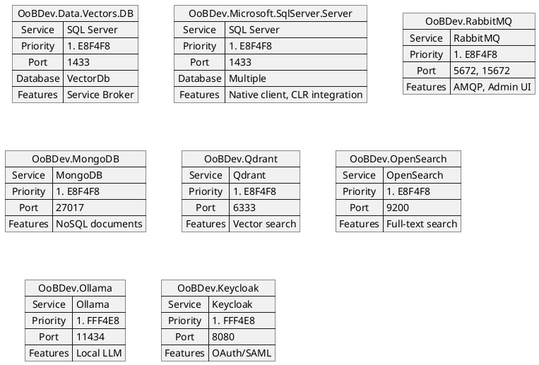
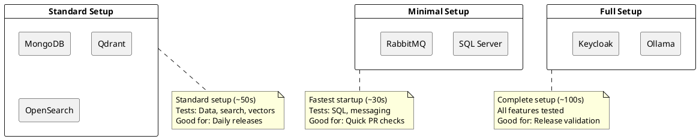
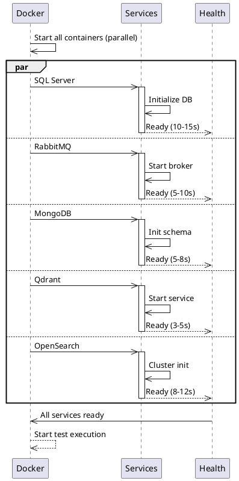

# Service Container Specifications

**Purpose:** Detailed configuration for each Docker service used in integration testing

## Executive Summary

This document provides comprehensive specifications for all Docker containers used in integration testing OoBDev. It details six required services (SQL Server, RabbitMQ, MongoDB, Qdrant, OpenSearch) and two optional services (Ollama, Keycloak) with complete configuration, environment variables, volumes, health checks, initialization scripts, and cleanup procedures. A requirements diagram shows which OoBDev projects depend on each service. The document includes a container composition matrix for choosing between minimal (SQL only), standard (essential services), and full (all services) setups, startup optimization strategies, memory and CPU limits with resource constraints, and next steps for implementation. All configurations are production-ready for GitHub Actions runners.

## Table of Contents

- [Service Requirements by OoBDev Project](#service-requirements-by-oodev-project)
- [SQL Server 2019+ (REQUIRED)](#sql-server-2019-required)
- [RabbitMQ 3.12 (REQUIRED)](#rabbitmq-312-required)
- [MongoDB 7.0 (REQUIRED)](#mongodb-70-required)
- [Qdrant Vector Database (REQUIRED)](#qdrant-vector-database-required)
- [OpenSearch 2.0 (REQUIRED)](#opensearch-20-required)
- [Ollama (OPTIONAL)](#ollama-optional)
- [Container Composition Matrix](#container-composition-matrix)
- [Container Startup Optimization](#container-startup-optimization)
- [Memory & CPU Limits](#memory--cpu-limits)
- [Next Steps](#next-steps)

## Service Requirements by OoBDev Project



**View diagram:** Copy code above to https://www.plantuml.com/plantuml/uml/

---

## SQL Server 2019+ (REQUIRED)

### Purpose
- Database backend for all data projects
- SQL Server Native Client support
- SQLCLR integration (compiled SQL)
- Service Broker messaging
- DAC Framework deployment

### Container Image
```
mcr.microsoft.com/mssql/server:2019-latest
mcr.microsoft.com/mssql/server:2022-latest  (alternative)
```

### Ports
- **1433/TCP** - SQL Server (client connections)

### Environment Variables
```yaml
ACCEPT_EULA: Y                           # Required - agree to license
MSSQL_SA_PASSWORD: L0c@lD3v             # SA password
MSSQL_PID: Developer                     # Edition (Developer is free)
MSSQL_MEMORY_LIMIT_MB: 2048             # Memory limit
MSSQL_COLLATION: SQL_Latin1_General_CP1_CI_AS  # Collation
```

### Volumes
```yaml
volumes:
  # Data files (for persistence)
  - sqlserver-data:/var/opt/mssql/data

  # Log files (for diagnostics)
  - sqlserver-log:/var/opt/mssql/log

  # Backup directory (optional)
  - sqlserver-backup:/var/opt/mssql/backup
```

### Health Check
```yaml
healthcheck:
  test: [
    "CMD",
    "/opt/mssql-tools/bin/sqlcmd",
    "-S", "localhost",
    "-U", "sa",
    "-P", "L0c@lD3v",
    "-Q", "SELECT 1"
  ]
  interval: 10s
  timeout: 3s
  retries: 5
  start_period: 40s
```

### Initialization

**Create Test Databases:**
```sql
CREATE DATABASE [VectorDb];
CREATE DATABASE [ExampleDb];
CREATE DATABASE [test_integration];

-- Enable Service Broker (required for messaging)
ALTER DATABASE [VectorDb] SET ENABLE_BROKER;
ALTER DATABASE [ExampleDb] SET ENABLE_BROKER;
```

**Initialize Database Schema:**
```sql
-- Run migrations via OoBDev.DacFx
-- Load schema from dacpac files
-- Create Service Broker artifacts
```

### Cleanup
```sql
-- Drop test databases
DROP DATABASE [test_integration];

-- Clear transaction logs
DBCC SHRINKFILE (VectorDb_log, 1);
DBCC SHRINKFILE (ExampleDb_log, 1);
```

### Resource Requirements
- **Disk:** 5-10 GB minimum
- **Memory:** 2-4 GB recommended
- **CPU:** 2 cores minimum
- **Startup Time:** 10-15 seconds

### Notes
- Developer edition is free for testing
- SA authentication is acceptable for testing
- Service Broker is required for messaging features

---

## RabbitMQ 3.12 (REQUIRED)

### Purpose
- AMQP message broker
- Message queue implementation
- Test message publishing/consuming
- Queue declaration and management

### Container Image
```
rabbitmq:3.12-management        # Includes management plugin
rabbitmq:3.12-management-alpine # Smaller image
```

### Ports
- **5672/TCP** - AMQP protocol (message broker)
- **15672/TCP** - Management HTTP API

### Environment Variables
```yaml
RABBITMQ_DEFAULT_USER: guest
RABBITMQ_DEFAULT_PASS: guest
RABBITMQ_DEFAULT_VHOST: /
```

### Volumes
```yaml
volumes:
  # RabbitMQ data directory
  - rabbitmq-data:/var/lib/rabbitmq

  # Configuration file
  - ./services/rabbitmq/rabbitmq.conf:/etc/rabbitmq/rabbitmq.conf:ro

  # Definitions (queues, exchanges, bindings)
  - ./services/rabbitmq/definitions.json:/etc/rabbitmq/definitions.json:ro
```

### Health Check
```yaml
healthcheck:
  test: [
    "CMD",
    "rabbitmq-diagnostics",
    "-q", "ping"
  ]
  interval: 10s
  timeout: 3s
  retries: 5
  start_period: 30s
```

### Initialization

**definitions.json Template:**
```json
{
  "version": 2,
  "vhosts": [
    {
      "name": "/"
    }
  ],
  "users": [
    {
      "name": "guest",
      "password": "guest",
      "tags": "administrator"
    }
  ],
  "permissions": [
    {
      "user": "guest",
      "vhost": "/",
      "configure": ".*",
      "write": ".*",
      "read": ".*"
    }
  ],
  "queues": [
    {
      "name": "test.queue.1",
      "vhost": "/",
      "durable": true,
      "arguments": {}
    },
    {
      "name": "test.queue.2",
      "vhost": "/",
      "durable": true,
      "arguments": {}
    }
  ],
  "exchanges": [
    {
      "name": "test.exchange",
      "vhost": "/",
      "type": "direct",
      "durable": true,
      "auto_delete": false
    }
  ],
  "bindings": [
    {
      "source": "test.exchange",
      "destination": "test.queue.1",
      "destination_type": "queue",
      "routing_key": "test.1"
    },
    {
      "source": "test.exchange",
      "destination": "test.queue.2",
      "destination_type": "queue",
      "routing_key": "test.2"
    }
  ]
}
```

### Cleanup
```bash
# Delete test queues
curl -i -u guest:guest -X DELETE \
  http://localhost:15672/api/queues/%2F/test.queue.1

# Purge all messages
curl -i -u guest:guest -X POST \
  http://localhost:15672/api/queues/%2F/test.queue.1/contents

# Or use RabbitMQ CLI
docker exec rabbitmq rabbitmqctl purge_queue test.queue.1
```

### Resource Requirements
- **Disk:** 500 MB
- **Memory:** 512 MB minimum
- **CPU:** 1 core minimum
- **Startup Time:** 5-10 seconds

---

## MongoDB 7.0 (REQUIRED)

### Purpose
- NoSQL document database
- OoBDev.MongoDB tests
- Document storage validation
- Collection management testing

### Container Image
```
mongo:7.0
mongo:7.0-alpine  # Smaller image
```

### Ports
- **27017/TCP** - MongoDB default port

### Environment Variables
```yaml
MONGO_INITDB_ROOT_USERNAME: root
MONGO_INITDB_ROOT_PASSWORD: root
MONGO_INITDB_DATABASE: test_oodev
```

### Volumes
```yaml
volumes:
  # MongoDB data directory
  - mongodb-data:/data/db

  # Initialization script
  - ./services/mongodb/init.js:/docker-entrypoint-initdb.d/init.js:ro
```

### Health Check
```yaml
healthcheck:
  test: [
    "CMD",
    "mongosh",
    "--eval",
    "db.adminCommand('ping')"
  ]
  interval: 10s
  timeout: 3s
  retries: 5
  start_period: 30s
```

### Initialization

**init.js Script:**
```javascript
// Switch to test database
db = db.getSiblingDB('test_oodev');

// Create collections
db.createCollection("documents");
db.createCollection("vectors");
db.createCollection("logs");

// Create indices
db.documents.createIndex({ "createdAt": 1 });
db.vectors.createIndex({ "embedding": "text" });
db.logs.createIndex({ "timestamp": 1 }, { expireAfterSeconds: 86400 });

// Insert sample data
db.documents.insertOne({
  "_id": ObjectId(),
  "name": "test_document",
  "content": "Test content",
  "createdAt": new Date()
});

print("MongoDB initialization complete");
```

### Cleanup
```javascript
// Drop entire test database
db.dropDatabase();

// Or drop specific collections
db.documents.drop();
db.vectors.drop();
db.logs.drop();
```

### Resource Requirements
- **Disk:** 2-5 GB
- **Memory:** 512 MB minimum
- **CPU:** 1 core minimum
- **Startup Time:** 5-8 seconds

---

## Qdrant Vector Database (REQUIRED)

### Purpose
- Vector similarity search
- Embedding storage
- OoBDev.Qdrant tests
- AI/ML vector operations

### Container Image
```
qdrant/qdrant:latest
qdrant/qdrant:v1.7.0  # Pinned version
```

### Ports
- **6333/TCP** - REST API
- **6334/TCP** - gRPC API (optional)

### Environment Variables
```yaml
QDRANT_API_KEY: test_key_12345
```

### Volumes
```yaml
volumes:
  # Vector storage
  - qdrant-storage:/qdrant/storage

  # Configuration (optional)
  - ./services/qdrant/config.yaml:/qdrant/config/config.yaml:ro
```

### Health Check
```yaml
healthcheck:
  test: [
    "CMD",
    "curl",
    "-f",
    "http://localhost:6333/health"
  ]
  interval: 10s
  timeout: 3s
  retries: 5
  start_period: 20s
```

### API Initialization

**Create Test Collection:**
```bash
curl -X PUT http://localhost:6333/collections/test_vectors \
  -H "Content-Type: application/json" \
  -d '{
    "vectors": {
      "size": 384,
      "distance": "Cosine"
    }
  }'
```

### Cleanup
```bash
# Delete test collection
curl -X DELETE http://localhost:6333/collections/test_vectors
```

### Resource Requirements
- **Disk:** 1-5 GB (depends on vectors)
- **Memory:** 256 MB minimum
- **CPU:** 1 core minimum
- **Startup Time:** 3-5 seconds

---

## OpenSearch 2.0 (REQUIRED)

### Purpose
- Full-text search
- Semantic search
- OoBDev.OpenSearch tests
- Index management

### Container Image
```
opensearchproject/opensearch:2.0.0
opensearchproject/opensearch:latest
```

### Ports
- **9200/TCP** - REST API
- **9600/TCP** - Performance Analyzer

### Environment Variables
```yaml
discovery.type: single-node
OPENSEARCH_JAVA_OPTS: "-Xms512m -Xmx512m"
DISABLE_SECURITY_PLUGIN: "true"  # OK for testing
```

### Volumes
```yaml
volumes:
  # OpenSearch data
  - opensearch-data:/usr/share/opensearch/data
```

### Health Check
```yaml
healthcheck:
  test: [
    "CMD",
    "curl",
    "-f",
    "http://localhost:9200/_cluster/health"
  ]
  interval: 10s
  timeout: 3s
  retries: 5
  start_period: 30s
```

### Initialization

**Create Test Index:**
```bash
curl -X PUT http://localhost:9200/test_index \
  -H "Content-Type: application/json" \
  -d '{
    "settings": {
      "index": {
        "number_of_shards": 1,
        "number_of_replicas": 0
      }
    }
  }'
```

### Cleanup
```bash
# Delete test indices
curl -X DELETE "http://localhost:9200/test_*"
```

### Resource Requirements
- **Disk:** 2-10 GB
- **Memory:** 1-2 GB recommended
- **CPU:** 2 cores recommended
- **Startup Time:** 8-12 seconds

---

## Ollama (OPTIONAL)

### Purpose
- Local LLM inference
- OoBDev.Ollama tests
- AI model evaluation

### Container Image
```
ollama/ollama:latest
```

### Ports
- **11434/TCP** - API port

### Volumes
```yaml
volumes:
  # Model cache (large!)
  - ollama-models:/root/.ollama
```

### Model Setup

**Pull Minimal Model:**
```bash
# Mistral 7B (~4GB) - smallest reasonable model
docker exec ollama ollama pull mistral

# Or use tiny model for testing
docker exec ollama ollama pull tinyllama  # ~400MB
```

### Health Check
```yaml
healthcheck:
  test: [
    "CMD",
    "curl",
    "-f",
    "http://localhost:11434/api/tags"
  ]
  interval: 10s
  timeout: 3s
  retries: 5
  start_period: 60s
```

### Resource Requirements
- **Disk:** 4-20 GB (model dependent)
- **Memory:** 4-8 GB (model dependent)
- **CPU:** Multi-core strongly recommended
- **Startup Time:** 2-3 seconds (model load: minutes)

### Note
Ollama is optional due to high resource usage. Consider skipping in CI or using smaller models (tinyllama).

---

## Container Composition Matrix

Which containers to run for different test scenarios:



**View diagram:** Copy code above to https://www.plantuml.com/plantuml/uml/

---

## Container Startup Optimization



**View diagram:** Copy code above to https://www.plantuml.com/plantuml/uml/

---

## Memory & CPU Limits

Recommended resource constraints:

```yaml
services:
  sqlserver:
    deploy:
      resources:
        limits:
          memory: 3G
          cpus: '2.0'
        reservations:
          memory: 2G
          cpus: '1.5'

  rabbitmq:
    deploy:
      resources:
        limits:
          memory: 512M
          cpus: '1.0'
        reservations:
          memory: 256M
          cpus: '0.5'

  mongodb:
    deploy:
      resources:
        limits:
          memory: 1G
          cpus: '1.0'
        reservations:
          memory: 512M
          cpus: '0.5'

  qdrant:
    deploy:
      resources:
        limits:
          memory: 2G
          cpus: '2.0'
        reservations:
          memory: 512M
          cpus: '0.5'

  opensearch:
    deploy:
      resources:
        limits:
          memory: 2G
          cpus: '2.0'
        reservations:
          memory: 1G
          cpus: '1.0'
```

**Total Resources:**
- **Memory:** ~10 GB (can reduce with constraints)
- **CPU:** ~8 cores (parallel startup)
- **Disk:** ~10-20 GB

---

## Next Steps

When you implement:

1. Start with SQL Server + RabbitMQ (most critical)
2. Add MongoDB for document tests
3. Add Qdrant + OpenSearch for search
4. Evaluate Ollama (optional, resource-heavy)

Each can be added incrementally without breaking existing tests.
