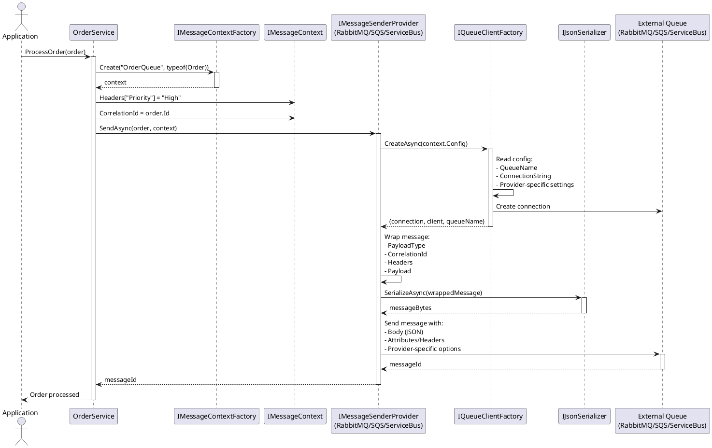
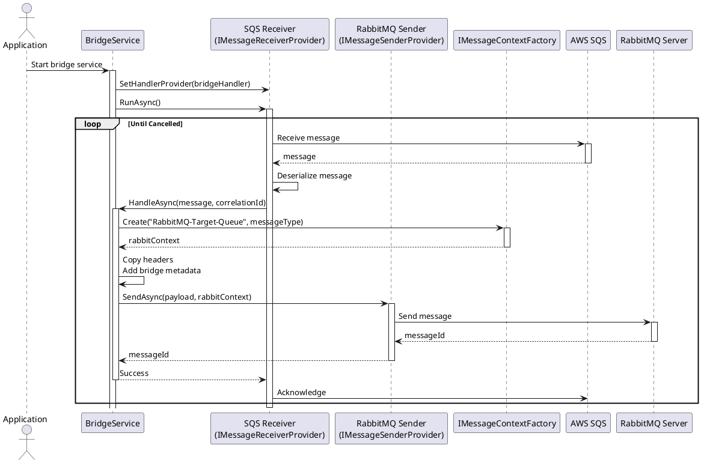

# Message Queue Provider Architecture

**Date:** 2026-01-20
**Pattern:** Context-Based (Non-Generic Interface)
**Status:** ✅ Active Implementation

---

## Overview

This directory contains the documentation for message queue provider architecture used throughout the OoBDev framework. The context-based pattern provides a flexible, configuration-driven approach to message queue integration.

---

## Active Documentation

### [Context-Based Pattern](./pattern-context-based.md) ⭐ **PRIMARY REFERENCE**

**The official pattern used by all message queue providers.**

- Architecture and interfaces
- Implementation guide (RabbitMQ, AWS SQS, Azure Service Bus)
- Configuration patterns
- Usage examples
- Multi-provider scenarios
- Native platform feature access

**Interface:**
```csharp
public interface IMessageSenderProvider
{
    Task<string?> SendAsync(object message, IMessageContext context);
}
```

**Key Characteristics:**
- ⭐⭐⭐⭐⭐ Runtime flexibility
- ⭐⭐⭐⭐⭐ Multi-provider support
- ⭐⭐⭐⭐⭐ Native platform features
- ⭐⭐ Low complexity
- ✅ Uses existing infrastructure (IJsonSerializer, IMessageContext)
- ✅ Proven in production (RabbitMQ)

---

## Current Providers

### ✅ Production (Context Pattern)
- **RabbitMQ** - `src/ExternalServices/RabbitMQ/OoBDev.RabbitMQ/`
  - Full implementation with send/receive
  - Background service integration
  - Production-ready

- **AWS SQS** - `src/ExternalServices/Amazon/OoBDev.Amazon.Sqs/`
  - FIFO queues, message attributes, dead-letter queues
  - LocalStack emulator support for integration testing
  - Latest package: AWSSDK.SQS 4.0.2.11
  - Status: ✅ Complete (2026-01-20)

- **Azure Service Bus** - `src/ExternalServices/Microsoft/OoBDev.Microsoft.Azure.ServiceBus/`
  - Topics, sessions, scheduled messages, dead-letter queues
  - Azure Service Bus Emulator support for integration testing
  - Latest package: Azure.Messaging.ServiceBus 7.20.1
  - Status: ✅ Complete (2026-01-20)

---

## Pattern Benefits

### ✅ **Flexibility**
```csharp
// Dynamic queue selection at runtime
var queueName = $"tenant-{tenantId}-orders";
var context = _factory.Create(queueName, typeof(Order).FullName);
await _sender.SendAsync(order, context);
```

### ✅ **Multi-Provider Support**
```csharp
// Easy to use multiple providers simultaneously
public class BridgeService
{
    public BridgeService(
        [FromKeyedServices("sqs")] IMessageSenderProvider sqsSender,
        [FromKeyedServices("rabbitmq")] IMessageSenderProvider rabbitSender)
    {
        // Bridge messages between providers
    }
}
```

### ✅ **Native Platform Features**
```csharp
// Full access to provider-specific features via context.Config
{
  "OrderQueue": {
    "Provider": "sqs",
    "QueueUrl": "https://sqs.../orders.fifo",
    "MessageGroupId": "order-processing",    // ✅ SQS FIFO
    "DeduplicationId": "use-content-hash"    // ✅ SQS-specific
  }
}
```

### ✅ **Simple Configuration**
```csharp
// Change provider without code changes
{
  "OrderQueue": {
    "Provider": "sqs",        // Change to "rabbitmq" - no code change!
    "QueueName": "orders-v2"
  }
}
```

---

## Quick Start

### 1. Register Provider

```csharp
using Microsoft.Extensions.DependencyInjection;
using OoBDev.Amazon.Sqs;

services.TryAddAmazonSqsServices();
// or
services.AddKeyedSingleton<IMessageSenderProvider, AmazonSqsMessageProvider>("sqs");
```

### 2. Configure Queue

```json
{
  "MessageQueuing": {
    "OrderQueue": {
      "Provider": "sqs",
      "QueueUrl": "https://sqs.us-east-1.amazonaws.com/123/orders",
      "DelaySeconds": 0
    }
  }
}
```

### 3. Send Messages

```csharp
public class OrderService
{
    private readonly IMessageSenderProvider _sender;
    private readonly IMessageContextFactory _contextFactory;

    public async Task ProcessOrder(Order order)
    {
        var context = _contextFactory.Create("OrderQueue", typeof(Order).FullName);
        context.Headers["Priority"] = "High";

        var messageId = await _sender.SendAsync(order, context);
    }
}
```

---

## Architecture

### Core Abstractions

**Location:** `src/Framework/OoBDev.MessageQueueing.Abstractions/`

```csharp
namespace OoBDev.MessageQueueing.Services
{
    // Message sending
    public interface IMessageSenderProvider
    {
        Task<string?> SendAsync(object message, IMessageContext context);
    }

    // Message receiving
    public interface IMessageReceiverProvider
    {
        IMessageReceiverProvider SetHandlerProvider(IMessageHandlerProvider handlerProvider);
        Task RunAsync(CancellationToken cancellationToken = default);
    }

    // Context with configuration and metadata
    public interface IMessageContext
    {
        string? CorrelationId { get; set; }
        Dictionary<string, object?> Headers { get; }
        IConfigurationSection Config { get; }  // Queue configuration
    }

    // Provider selection
    public interface IMessageSenderProviderFactory
    {
        IMessageSenderProvider GetProvider(IMessageContext context);
    }
}
```

### Existing Infrastructure (Already Available)

```csharp
// JSON serialization
namespace OoBDev.System.Text.Json.Serialization
{
    public interface IJsonSerializer
    {
        Task SerializeAsync(object obj, Stream stream, CancellationToken ct);
        Task<T?> DeserializeAsync<T>(Stream stream, CancellationToken ct);
    }
}

// Configuration
namespace Microsoft.Extensions.Configuration
{
    public interface IConfiguration { }
    public interface IConfigurationSection { }
}
```

### Component Architecture

The following diagram shows the high-level architecture of the message queue system:

```plantuml
@startuml Message Queue Component Architecture

!define FRAMEWORK_COLOR #E1F5FE
!define PROVIDER_COLOR #FFF3E0
!define APPLICATION_COLOR #F3E5F5
!define EXTERNAL_COLOR #E8F5E9

package "Application Layer" APPLICATION_COLOR {
    component [OrderService] as OrderSvc
    component [PaymentService] as PaymentSvc
    component [NotificationService] as NotifySvc
}

package "OoBDev.MessageQueueing.Abstractions" FRAMEWORK_COLOR {
    interface IMessageSenderProvider
    interface IMessageReceiverProvider
    interface IMessageContext
    interface IMessageContextFactory
    interface IMessageSenderProviderFactory
}

package "OoBDev.MessageQueueing" FRAMEWORK_COLOR {
    component [MessageContextFactory]
    component [MessageSenderProviderFactory]
}

package "OoBDev.System" FRAMEWORK_COLOR {
    interface IJsonSerializer
    interface ILogger
    interface IConfiguration
}

package "Provider: RabbitMQ" PROVIDER_COLOR {
    component [RabbitMQQueueMessageProvider] as RabbitMQ
    component [QueueClientFactory] as RabbitFactory
    interface IQueueClientFactory as RabbitIFactory
}

package "Provider: AWS SQS" PROVIDER_COLOR {
    component [AmazonSqsMessageProvider] as SQS
    component [SqsClientFactory] as SqsFactory
    interface ISqsClientFactory as SqsIFactory
}

package "Provider: Azure Service Bus" PROVIDER_COLOR {
    component [AzureServiceBusMessageProvider] as ServiceBus
    component [ServiceBusClientFactory] as SbFactory
    interface IServiceBusClientFactory as SbIFactory
}

package "External Services" EXTERNAL_COLOR {
    component [RabbitMQ Server] as RabbitMQExt
    component [AWS SQS] as SQSExt
    component [Azure Service Bus] as ServiceBusExt
}

' Application dependencies
OrderSvc ..> IMessageSenderProvider : uses
OrderSvc ..> IMessageContextFactory : uses
PaymentSvc ..> IMessageSenderProvider : uses
NotifySvc ..> IMessageSenderProviderFactory : uses

' Framework implementations
MessageContextFactory ..|> IMessageContextFactory
MessageSenderProviderFactory ..|> IMessageSenderProviderFactory

' Provider implementations
RabbitMQ ..|> IMessageSenderProvider
RabbitMQ ..|> IMessageReceiverProvider
RabbitMQ ..> RabbitIFactory : uses
RabbitFactory ..|> RabbitIFactory

SQS ..|> IMessageSenderProvider
SQS ..> SqsIFactory : uses
SqsFactory ..|> SqsIFactory

ServiceBus ..|> IMessageSenderProvider
ServiceBus ..> SbIFactory : uses
SbFactory ..|> SbIFactory

' Provider dependencies on framework
RabbitMQ ..> IJsonSerializer : uses
RabbitMQ ..> ILogger : uses
SQS ..> IJsonSerializer : uses
SQS ..> ILogger : uses
ServiceBus ..> IJsonSerializer : uses
ServiceBus ..> ILogger : uses

RabbitFactory ..> IConfiguration : uses
SqsFactory ..> IConfiguration : uses
SbFactory ..> IConfiguration : uses

' External communication
RabbitMQ --> RabbitMQExt : sends/receives
SQS --> SQSExt : sends/receives
ServiceBus --> ServiceBusExt : sends/receives

note right of IMessageSenderProvider
  Non-generic interface:
  SendAsync(object message,
            IMessageContext context)
end note

note right of IMessageContext
  Contains:
  - CorrelationId
  - Headers (Dictionary)
  - Config (IConfigurationSection)
end note

@enduml
```



### Send Message Flow

The following sequence diagram shows how messages are sent through the system:



### Multi-Provider Bridge Flow

The context pattern makes it easy to bridge messages between different queue providers:



### Dependency Injection Flow

The system supports both simple single-provider and complex multi-provider scenarios:

```plantuml
@startuml Dependency Injection

package "Startup/Program.cs" {
    component [ServiceCollection] as SC
}

package "Service Registration Extensions" {
    component [TryAddRabbitMQServices]
    component [TryAddAmazonSqsServices]
    component [TryAddAzureServiceBusServices]
}

package "Registered Services" {
    component [IMessageSenderProvider\n(non-keyed)] as Sender1
    component [IMessageSenderProvider\n(keyed: "rabbitmq")] as Sender2
    component [IMessageSenderProvider\n(keyed: "sqs")] as Sender3
    component [IMessageSenderProvider\n(keyed: "servicebus")] as Sender4
    component [IMessageContextFactory] as Factory1
    component [IJsonSerializer] as Json
}

package "Application Services" {
    component [OrderService] as App1
    component [BridgeService] as App2
}

SC -> TryAddRabbitMQServices : services.TryAddRabbitMQServices()
SC -> TryAddAmazonSqsServices : services.TryAddAmazonSqsServices()
SC -> TryAddAzureServiceBusServices : services.TryAddAzureServiceBusServices()

TryAddRabbitMQServices --> Sender1 : AddTransient<IMessageSenderProvider,\nRabbitMQQueueMessageProvider>()
TryAddRabbitMQServices --> Sender2 : AddKeyedTransient<IMessageSenderProvider,\nRabbitMQQueueMessageProvider>("rabbitmq")

TryAddAmazonSqsServices --> Sender3 : AddKeyedTransient<IMessageSenderProvider,\nAmazonSqsMessageProvider>("sqs")

TryAddAzureServiceBusServices --> Sender4 : AddKeyedTransient<IMessageSenderProvider,\nAzureServiceBusMessageProvider>("servicebus")

SC --> Factory1 : TryAddSingleton<IMessageContextFactory>
SC --> Json : TryAddSingleton<IJsonSerializer>

App1 ..> Sender1 : Inject (first registered)
App1 ..> Factory1 : Inject

App2 ..> Sender2 : Inject [FromKeyedServices("rabbitmq")]
App2 ..> Sender3 : Inject [FromKeyedServices("sqs")]
App2 ..> Sender4 : Inject [FromKeyedServices("servicebus")]

note right of App1
  Simple injection:
  Gets first registered provider
end note

note right of App2
  Multi-provider injection:
  Uses keyed services to get
  specific providers
end note

@enduml
```



**See Also:** [architecture-diagrams.md](./architecture-diagrams.md) for complete diagram collection including:
- Receive Message Sequence
- Factory Pattern Details
- Configuration Flow
- Message Structure
- Error Handling Flow
- Testing Architecture
- Provider Features Comparison

---

## Advanced Scenarios

### Multi-Provider Bridge

```csharp
// Read from SQS, write to RabbitMQ
public class QueueBridgeService : BackgroundService
{
    private readonly IMessageReceiverProvider _sqsReceiver;
    private readonly IMessageSenderProvider _rabbitSender;

    protected override async Task ExecuteAsync(CancellationToken stoppingToken)
    {
        var handler = new BridgeHandler(_rabbitSender, _contextFactory);
        _sqsReceiver.SetHandlerProvider(handler);
        await _sqsReceiver.RunAsync(stoppingToken);
    }
}
```

### Fan-Out Pattern

```csharp
// Send same message to multiple providers
public async Task BroadcastOrder(Order order)
{
    var tasks = new[]
    {
        _sqsSender.SendAsync(order, sqsContext),
        _rabbitSender.SendAsync(order, rabbitContext),
        _serviceBusSender.SendAsync(order, serviceBusContext)
    };
    await Task.WhenAll(tasks);
}
```

### Multi-Tenant Queues

```csharp
// Dynamic queue names per tenant
public async Task SendTenantMessage(string tenantId, Order order)
{
    var queueName = $"tenant-{tenantId}-orders";
    var context = _factory.Create(queueName, typeof(Order).FullName);
    await _sender.SendAsync(order, context);
}
```

---

## Migration Guide

### Adapting Providers to Context Pattern

**Step 1: Remove Generic Parameters**
```diff
- public class AmazonSqsMessageSender<TChannel> : IMessageSenderProvider<TChannel>
+ public class AmazonSqsMessageProvider : IMessageSenderProvider
```

**Step 2: Update Method Signature**
```diff
- public async Task<string> SendAsync<T>(T message, string messageId, IDictionary<string, object> properties)
+ public async Task<string?> SendAsync(object message, IMessageContext context)
```

**Step 3: Read Configuration from Context**
```diff
- var queueName = _resolver.GetQueueName();
- var (contentType, data) = _serializer.Serialize(message);
+ var queueName = context.Config["QueueName"];
+ using var stream = new MemoryStream();
+ await _serializer.SerializeAsync(message, stream, default);
```

**Step 4: Use Context Headers**
```diff
- foreach (var property in properties.Where(p => p.Value != null))
-     request.MessageAttributes.Add(property.Key, ...);
+ foreach (var header in context.Headers)
+     request.MessageAttributes[header.Key] = new MessageAttributeValue { ... };
```

---

## Testing

### Unit Tests

```csharp
[TestMethod]
public async Task SendAsync_ValidMessage_ReturnsMessageId()
{
    // Arrange
    var mockSerializer = new Mock<IJsonSerializer>();
    var mockContext = new Mock<IMessageContext>();
    mockContext.Setup(c => c.Config["QueueUrl"]).Returns("https://sqs.../test");

    var provider = new AmazonSqsMessageProvider(mockSerializer.Object, ...);

    // Act
    var messageId = await provider.SendAsync(new Order(), mockContext.Object);

    // Assert
    Assert.IsNotNull(messageId);
}
```

### Integration Tests

```csharp
[TestMethod]
[TestCategory(TestCategories.DevLocal)]  // Requires local queue
public async Task SendAsync_ToActualQueue_Succeeds()
{
    var context = _contextFactory.Create("TestQueue", typeof(Order).FullName);
    var order = new Order { Id = 123, Total = 99.99m };

    var messageId = await _sender.SendAsync(order, context);

    Assert.IsNotNull(messageId);
}
```

---

## Pattern Archive

### Alternative Patterns (For Reference)

The [archive](./archive/) folder contains comprehensive analysis of alternative patterns considered during the design decision process. These are preserved for:
- Historical reference
- Future architectural decisions
- Educational value
- Understanding trade-offs

**Archived Documents:**
- [Pattern Comparison](./archive/pattern-comparison.md) - Executive summary and recommendation
- [Generic Channel-Based Pattern](./archive/pattern-generic-channel-based.md) - Alternative with compile-time queue type safety
- [Multi-Provider Examples](./archive/multi-provider-bridge-example.md) - Advanced scenarios
- [Native Features & Layering](./archive/pattern-native-features-and-layering.md) - Deep dive into platform features
- [HttpClient-Style Pattern](./archive/pattern-httpclient-style.md) - Hybrid approach analysis

**See:** [archive/README.md](./archive/README.md) for complete archive documentation.

---

## References

### Documentation
- [TODO-archive/TODO-migrations-message-queues.md](../../TODO-archive/TODO-migrations-message-queues.md) - Migration tracking
- [OoBDev.MessageQueueing.Abstractions](../../src/Framework/OoBDev.MessageQueueing.Abstractions/) - Core interfaces
- [OoBDev.RabbitMQ](../../src/ExternalServices/RabbitMQ/OoBDev.RabbitMQ/) - Reference implementation

### Source Code
- **Abstractions:** `src/Framework/OoBDev.MessageQueueing.Abstractions/`
- **Core:** `src/Framework/OoBDev.MessageQueueing/`
- **RabbitMQ:** `src/ExternalServices/RabbitMQ/OoBDev.RabbitMQ/`
- **Incoming SQS:** `src/Incoming/SharedFramework/OoBDev.Amazon.Sqs/`
- **Incoming Service Bus:** `src/Incoming/SharedFramework/OoBDev.Microsoft.Azure.ServiceBus/`

---

**Last Updated:** 2026-01-20
**Pattern:** Context-Based (Active)
**Status:** Production-ready (RabbitMQ), Migrating (SQS, Service Bus)
**Next Step:** Implement AWS SQS and Azure Service Bus providers
