# Message Queue Architecture Diagrams

**Date:** 2026-01-20
**Pattern:** Context-Based Message Queue Provider Architecture

---

## Component Architecture

### High-Level Component Diagram

```plantuml
@startuml Message Queue Component Architecture

!define FRAMEWORK_COLOR #E1F5FE
!define PROVIDER_COLOR #FFF3E0
!define APPLICATION_COLOR #F3E5F5
!define EXTERNAL_COLOR #E8F5E9

package "Application Layer" APPLICATION_COLOR {
    component [OrderService] as OrderSvc
    component [PaymentService] as PaymentSvc
    component [NotificationService] as NotifySvc
}

package "OoBDev.MessageQueueing.Abstractions" FRAMEWORK_COLOR {
    interface IMessageSenderProvider
    interface IMessageReceiverProvider
    interface IMessageContext
    interface IMessageContextFactory
    interface IMessageSenderProviderFactory
}

package "OoBDev.MessageQueueing" FRAMEWORK_COLOR {
    component [MessageContextFactory]
    component [MessageSenderProviderFactory]
}

package "OoBDev.System" FRAMEWORK_COLOR {
    interface IJsonSerializer
    interface ILogger
    interface IConfiguration
}

package "Provider: RabbitMQ" PROVIDER_COLOR {
    component [RabbitMQQueueMessageProvider] as RabbitMQ
    component [QueueClientFactory] as RabbitFactory
    interface IQueueClientFactory as RabbitIFactory
}

package "Provider: AWS SQS" PROVIDER_COLOR {
    component [AmazonSqsMessageProvider] as SQS
    component [SqsClientFactory] as SqsFactory
    interface ISqsClientFactory as SqsIFactory
}

package "Provider: Azure Service Bus" PROVIDER_COLOR {
    component [AzureServiceBusMessageProvider] as ServiceBus
    component [ServiceBusClientFactory] as SbFactory
    interface IServiceBusClientFactory as SbIFactory
}

package "External Services" EXTERNAL_COLOR {
    component [RabbitMQ Server] as RabbitMQExt
    component [AWS SQS] as SQSExt
    component [Azure Service Bus] as ServiceBusExt
}

' Application dependencies
OrderSvc ..> IMessageSenderProvider : uses
OrderSvc ..> IMessageContextFactory : uses
PaymentSvc ..> IMessageSenderProvider : uses
NotifySvc ..> IMessageSenderProviderFactory : uses

' Framework implementations
MessageContextFactory ..|> IMessageContextFactory
MessageSenderProviderFactory ..|> IMessageSenderProviderFactory

' Provider implementations
RabbitMQ ..|> IMessageSenderProvider
RabbitMQ ..|> IMessageReceiverProvider
RabbitMQ ..> RabbitIFactory : uses
RabbitFactory ..|> RabbitIFactory

SQS ..|> IMessageSenderProvider
SQS ..> SqsIFactory : uses
SqsFactory ..|> SqsIFactory

ServiceBus ..|> IMessageSenderProvider
ServiceBus ..> SbIFactory : uses
SbFactory ..|> SbIFactory

' Provider dependencies on framework
RabbitMQ ..> IJsonSerializer : uses
RabbitMQ ..> ILogger : uses
SQS ..> IJsonSerializer : uses
SQS ..> ILogger : uses
ServiceBus ..> IJsonSerializer : uses
ServiceBus ..> ILogger : uses

RabbitFactory ..> IConfiguration : uses
SqsFactory ..> IConfiguration : uses
SbFactory ..> IConfiguration : uses

' External communication
RabbitMQ --> RabbitMQExt : sends/receives
SQS --> SQSExt : sends/receives
ServiceBus --> ServiceBusExt : sends/receives

note right of IMessageSenderProvider
  Non-generic interface:
  SendAsync(object message,
            IMessageContext context)
end note

note right of IMessageContext
  Contains:
  - CorrelationId
  - Headers (Dictionary)
  - Config (IConfigurationSection)
end note

@enduml
```

---

## Sequence Diagrams

### Send Message Flow (Generic)

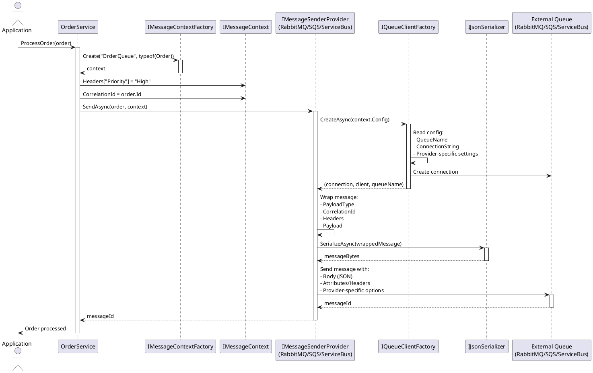

### Receive Message Flow (Generic)

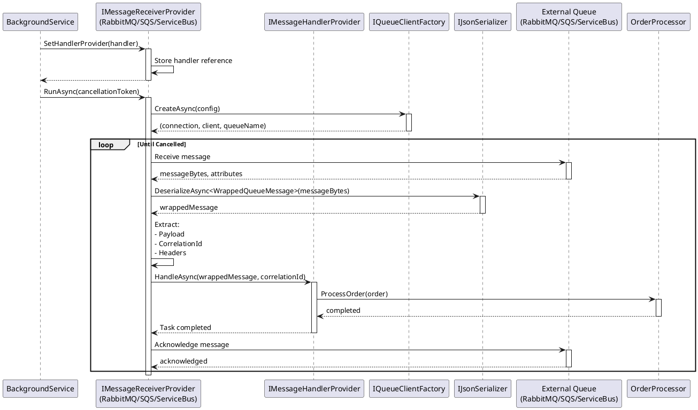

### Multi-Provider Bridge Flow

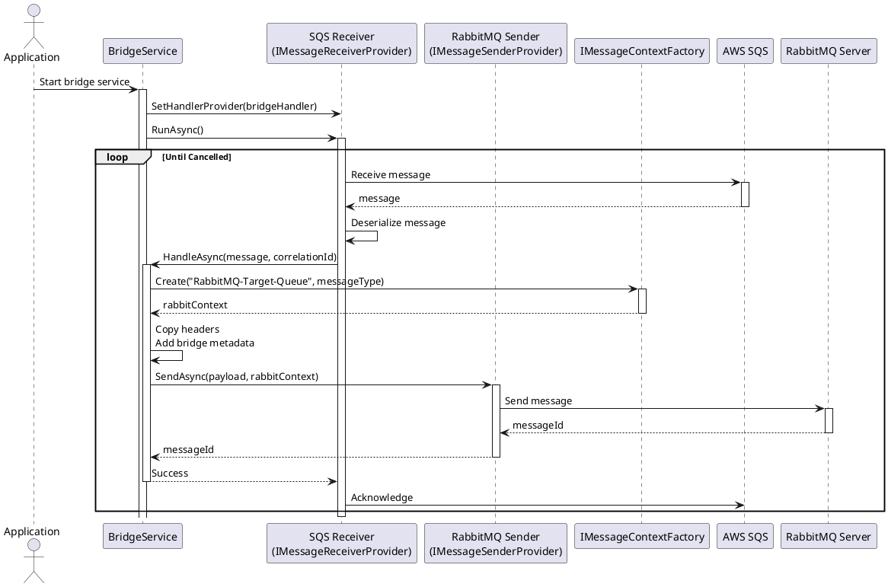

### Factory Pattern Details

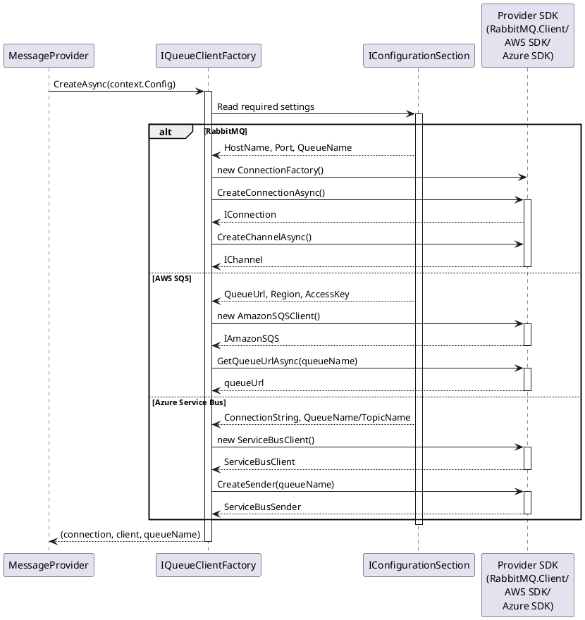

---

## Dependency Injection Flow

```plantuml
@startuml Dependency Injection

package "Startup/Program.cs" {
    component [ServiceCollection] as SC
}

package "Service Registration Extensions" {
    component [TryAddRabbitMQServices]
    component [TryAddAmazonSqsServices]
    component [TryAddAzureServiceBusServices]
}

package "Registered Services" {
    component [IMessageSenderProvider\n(non-keyed)] as Sender1
    component [IMessageSenderProvider\n(keyed: "rabbitmq")] as Sender2
    component [IMessageSenderProvider\n(keyed: "sqs")] as Sender3
    component [IMessageSenderProvider\n(keyed: "servicebus")] as Sender4
    component [IMessageContextFactory] as Factory1
    component [IJsonSerializer] as Json
}

package "Application Services" {
    component [OrderService] as App1
    component [BridgeService] as App2
}

SC -> TryAddRabbitMQServices : services.TryAddRabbitMQServices()
SC -> TryAddAmazonSqsServices : services.TryAddAmazonSqsServices()
SC -> TryAddAzureServiceBusServices : services.TryAddAzureServiceBusServices()

TryAddRabbitMQServices --> Sender1 : AddTransient<IMessageSenderProvider,\nRabbitMQQueueMessageProvider>()
TryAddRabbitMQServices --> Sender2 : AddKeyedTransient<IMessageSenderProvider,\nRabbitMQQueueMessageProvider>("rabbitmq")

TryAddAmazonSqsServices --> Sender3 : AddKeyedTransient<IMessageSenderProvider,\nAmazonSqsMessageProvider>("sqs")

TryAddAzureServiceBusServices --> Sender4 : AddKeyedTransient<IMessageSenderProvider,\nAzureServiceBusMessageProvider>("servicebus")

SC --> Factory1 : TryAddSingleton<IMessageContextFactory>
SC --> Json : TryAddSingleton<IJsonSerializer>

App1 ..> Sender1 : Inject (first registered)
App1 ..> Factory1 : Inject

App2 ..> Sender2 : Inject [FromKeyedServices("rabbitmq")]
App2 ..> Sender3 : Inject [FromKeyedServices("sqs")]
App2 ..> Sender4 : Inject [FromKeyedServices("servicebus")]

note right of App1
  Simple injection:
  Gets first registered provider
end note

note right of App2
  Multi-provider injection:
  Uses keyed services to get
  specific providers
end note

@enduml
```

---

## Configuration Flow

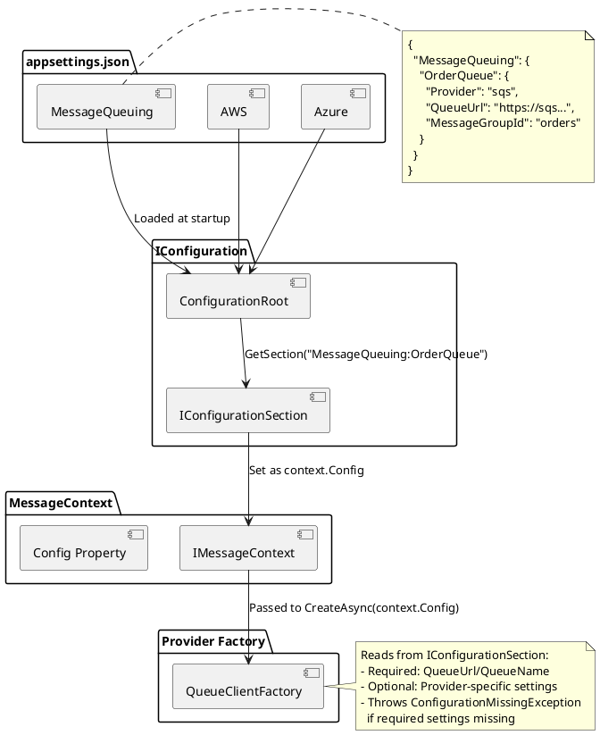

---

## Message Structure

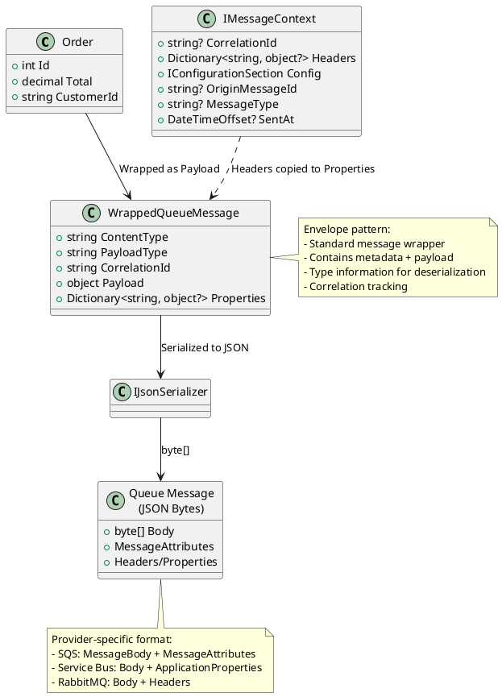

---

## Error Handling Flow

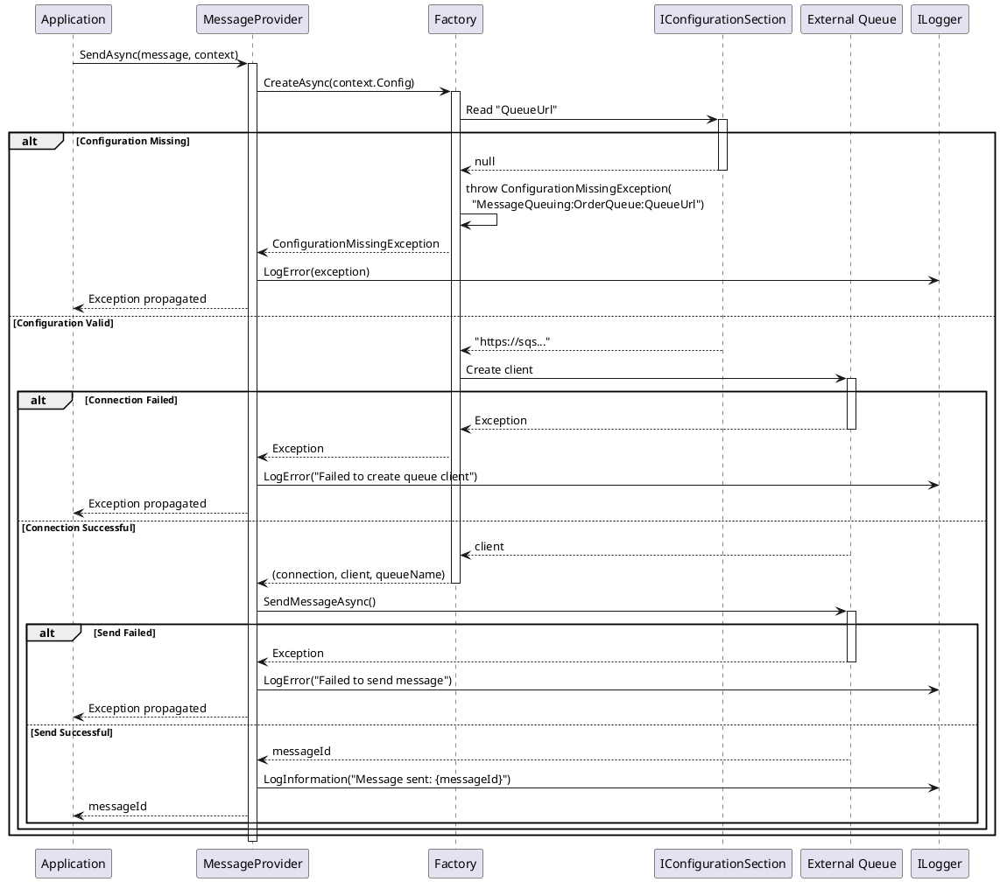

---

## Testing Architecture

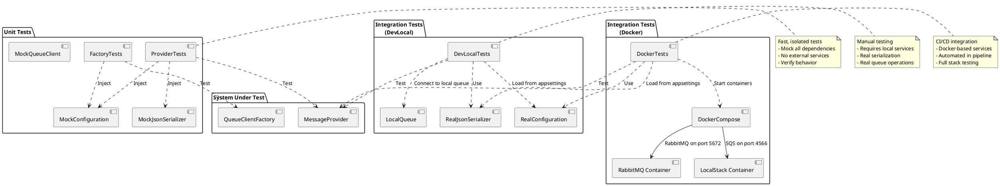

---

## Provider Comparison Matrix

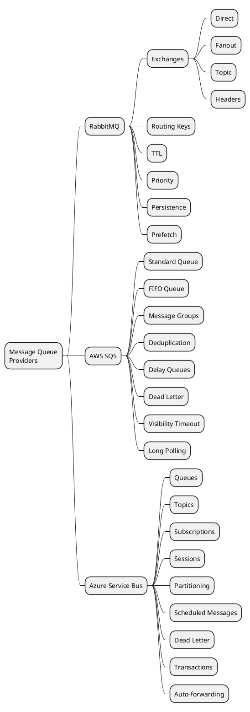

---

## Usage Notes

### Rendering PlantUML Diagrams

These diagrams use PlantUML syntax and can be rendered using:

1. **PlantUML Online Server:** http://www.plantuml.com/plantuml/uml/
2. **VS Code Extension:** PlantUML extension by jebbs
3. **IntelliJ/Rider Plugin:** PlantUML integration
4. **Command Line:** `plantuml architecture-diagrams.md`

### Diagram Purposes

| Diagram | Purpose | Audience |
|---------|---------|----------|
| **Component Architecture** | Overall system structure | Architects, developers |
| **Send Message Sequence** | Message sending flow | Developers implementing senders |
| **Receive Message Sequence** | Message receiving flow | Developers implementing receivers |
| **Multi-Provider Bridge** | Bridge pattern example | Integration developers |
| **Factory Pattern Details** | Factory implementation | Provider implementers |
| **Dependency Injection** | DI setup | Application developers |
| **Configuration Flow** | Config loading | DevOps, developers |
| **Message Structure** | Message format | All developers |
| **Error Handling** | Exception flow | Developers, support |
| **Testing Architecture** | Test strategy | QA, developers |
| **Provider Features** | Feature comparison | Architects, decision makers |

---

## See Also

- [Pattern Context-Based](./pattern-context-based.md) - Detailed pattern documentation
- [Migration Checklist](./migration-checklist.md) - Step-by-step migration guide
- [README](./README.md) - Overview and quick start

---

**Last Updated:** 2026-01-20
**Format:** PlantUML
**Status:** Active Documentation
