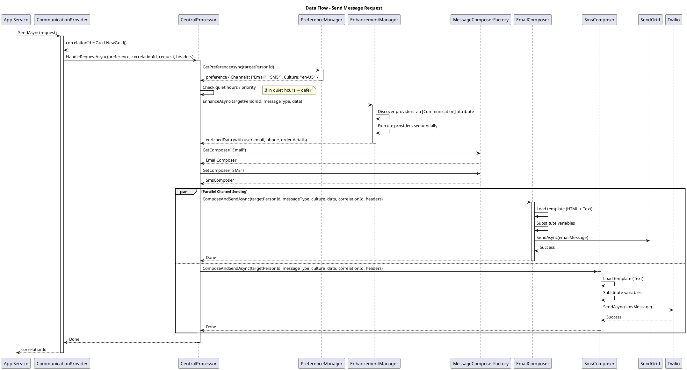

# Architecture: Communications Core Orchestration

**Feature:** Communications Core
**Epic:** Communications Platform
**Last Updated:** 2026-01-22

---

## Overview

The Communications Core uses a **layered architecture** with **provider pattern** for extensibility. The system orchestrates multi-channel message delivery through a pipeline of enhancement, composition, and provider execution.

**Key Architectural Patterns:**
- **Facade Pattern** - `ICommunicationProvider` provides simple interface to complex subsystem
- **Provider Pattern** - Pluggable email/SMS providers
- **Factory Pattern** - `MessageComposerFactory` creates channel composers
- **Attribute-Based Discovery** - Enhancement providers discovered via `[Communication]` attribute
- **Strategy Pattern** - Different composers for Email/SMS/Push channels
- **Template Method** - Common message composition flow with channel-specific steps

---

## C4 Context Diagram

```plantuml
@startuml C4_Context
!include https://raw.githubusercontent.com/plantuml-stdlib/C4-PlantUML/master/C4_Context.puml

title System Context - Communications Platform

Person(user, "User", "Receives notifications")
System(app, "Application Services", "Order Service, User Service, etc.")

System_Boundary(communications, "Communications Platform") {
    System(core, "Communications Core", "Multi-channel message orchestration")
}

System_Ext(sendgrid, "SendGrid", "Cloud email service")
System_Ext(twilio, "Twilio", "SMS service")
System_Ext(preference_db, "Preference Store", "User channel preferences")
System_Ext(template_store, "Template Store", "Message templates")

Rel(app, core, "Sends messages via", "ICommunicationProvider")
Rel(core, preference_db, "Looks up preferences", "ITargetPreferenceManager")
Rel(core, template_store, "Loads templates", "ITemplateProvider")
Rel(core, sendgrid, "Sends emails", "SendGrid SDK")
Rel(core, twilio, "Sends SMS", "Twilio SDK")
Rel_Back(user, sendgrid, "Receives emails")
Rel_Back(user, twilio, "Receives SMS")

@enduml
```

---

## C4 Container Diagram

```plantuml
@startuml C4_Container
!include https://raw.githubusercontent.com/plantuml-stdlib/C4-PlantUML/master/C4_Container.puml

title Container Diagram - Communications Platform

Person(user, "User")
System(app, "Application Services")

System_Boundary(communications, "Communications Platform") {
    Container(abstractions, "Abstractions", ".NET Library", "Interfaces and contracts")
    Container(core, "Core Orchestration", ".NET Library", "Multi-channel coordination")
    Container(sendgrid_provider, "SendGrid Provider", ".NET Library", "Email via SendGrid")
    Container(twilio_provider, "Twilio Provider", ".NET Library", "SMS via Twilio")
    Container(deferral_queue, "Deferral Queue", "Message Queue", "Scheduled message storage")
}

System_Ext(sendgrid, "SendGrid API")
System_Ext(twilio, "Twilio API")
System_Ext(preference_db, "Preference DB")
System_Ext(template_store, "Template Store")

Rel(app, core, "Sends via", "ICommunicationProvider")
Rel(core, abstractions, "Uses contracts")
Rel(sendgrid_provider, abstractions, "Implements", "ISendEmailProvider")
Rel(twilio_provider, abstractions, "Implements", "ISendSmsProvider")

Rel(core, preference_db, "Reads preferences", "SQL/API")
Rel(core, template_store, "Loads templates", "Files/DB")
Rel(core, sendgrid_provider, "Sends email", "ISendEmailProvider")
Rel(core, twilio_provider, "Sends SMS", "ISendSmsProvider")
Rel(core, deferral_queue, "Enqueues deferred", "Message Queue")

Rel(sendgrid_provider, sendgrid, "HTTPS", "SendGrid SDK")
Rel(twilio_provider, twilio, "HTTPS", "Twilio SDK")
Rel_Back(user, sendgrid, "Email")
Rel_Back(user, twilio, "SMS")

@enduml
```

---

## C4 Component Diagram

```plantuml
@startuml C4_Component
!include https://raw.githubusercontent.com/plantuml-stdlib/C4-PlantUML/master/C4_Component.puml

title Component Diagram - Communications Core

Container_Boundary(core, "Communications Core") {
    Component(provider, "Communication Provider", "Facade", "Main entry point")
    Component(processor, "Central Processor", "Orchestrator", "Multi-channel coordinator")
    Component(preference_mgr, "Preference Manager", "Service", "User preference lookup")
    Component(enhancement_mgr, "Enhancement Manager", "Service", "Data enrichment coordinator")
    Component(composer_factory, "Composer Factory", "Factory", "Creates channel composers")
    Component(email_composer, "Email Composer", "Strategy", "Email message generation")
    Component(sms_composer, "SMS Composer", "Strategy", "SMS message generation")
    Component(template_provider, "Template Provider", "Service", "Template loading")
    Component(deferral_mgr, "Deferral Manager", "Service", "Scheduled delivery")
}

Container_Ext(abstractions, "Abstractions", "Interfaces")
Container_Ext(email_provider, "Email Provider", "ISendEmailProvider")
Container_Ext(sms_provider, "SMS Provider", "ISendSmsProvider")
Container_Ext(enhancement_providers, "Enhancement Providers", "[Communication] attributed")

Rel(provider, processor, "Delegates to")
Rel(processor, preference_mgr, "Looks up preferences")
Rel(processor, enhancement_mgr, "Enhances data")
Rel(processor, composer_factory, "Gets composers")
Rel(processor, deferral_mgr, "Defers requests")

Rel(composer_factory, email_composer, "Creates")
Rel(composer_factory, sms_composer, "Creates")

Rel(email_composer, template_provider, "Loads templates")
Rel(email_composer, email_provider, "Sends via")
Rel(sms_composer, template_provider, "Loads templates")
Rel(sms_composer, sms_provider, "Sends via")

Rel(enhancement_mgr, enhancement_providers, "Discovers via attributes")
Rel(processor, abstractions, "Uses contracts")

@enduml
```

---

## Layer Architecture

```plantuml
@startuml Layers
!define RECTANGLE class

skinparam rectangle {
    BackgroundColor<<framework>> LightBlue
    BackgroundColor<<externalservices>> LightGreen
    BackgroundColor<<application>> LightYellow
    BorderColor Black
}

rectangle "Application Layer" <<application>> {
    [Order Service]
    [User Service]
    [Marketing Service]
}

rectangle "Framework Layer" <<framework>> {
    package "OoBDev.Communications.Abstractions" {
        [ICommunicationProvider]
        [ISendEmailProvider]
        [ISendSmsProvider]
        [IMessageComposer]
    }

    package "OoBDev.Communications" {
        [CommunicationProvider]
        [CentralProcessor]
        [EmailMessageComposer]
        [SmsMessageComposer]
        [EnhancementManager]
        [PreferenceManager]
        [DeferralManager]
    }
}

rectangle "ExternalServices Layer" <<externalservices>> {
    package "OoBDev.Twilio.SendGrid" {
        [SendGridEmailProvider]
    }

    package "OoBDev.Twilio.SmsMessaging" {
        [TwilioSmsProvider]
    }
}

rectangle "External APIs" {
    [SendGrid Cloud]
    [Twilio Cloud]
}

[Order Service] --> [ICommunicationProvider]
[User Service] --> [ICommunicationProvider]
[Marketing Service] --> [ICommunicationProvider]

[CommunicationProvider] ..|> [ICommunicationProvider]
[CommunicationProvider] --> [CentralProcessor]
[EmailMessageComposer] --> [ISendEmailProvider]
[SmsMessageComposer] --> [ISendSmsProvider]

[SendGridEmailProvider] ..|> [ISendEmailProvider]
[TwilioSmsProvider] ..|> [ISendSmsProvider]

[SendGridEmailProvider] --> [SendGrid Cloud]
[TwilioSmsProvider] --> [Twilio Cloud]

@enduml
```



---

## Component Responsibilities

### 1. CommunicationProvider (Facade)
**Responsibility:** Simple entry point for sending messages
**Pattern:** Facade

**Public Interface:**
```csharp
public interface ICommunicationProvider
{
    Task<Guid> SendAsync(ISendRequest request, IDictionary<string, object>? headers = null);
    Task DeferAsync(ISendRequest request, DateTimeOffset until, IDictionary<string, object>? headers = null);
}
```

**Implementation:**
```
SendAsync(request)
    ├─ Generate correlation ID
    ├─ Delegate to CentralProcessor.HandleRequestAsync()
    └─ Return correlation ID

DeferAsync(request, until)
    ├─ Generate correlation ID
    ├─ Delegate to DeferralManager.PostAsync()
    └─ Return correlation ID
```

**Dependencies:**
- `ICommunicationCentralProcessor`
- `IDeferralManager`
- `ILogger<CommunicationProvider>`

---

### 2. CommunicationCentralProcessor (Orchestrator)
**Responsibility:** Coordinate multi-channel delivery
**Pattern:** Orchestrator

**Workflow:**
```
HandleRequestAsync(request)
    ├─ Lookup user preferences → ITargetPreferenceManager
    ├─ Check quiet hours / priority filters
    │   └─ If deferred → DeferralManager.PostAsync()
    ├─ Enhance data → DataEnhancementManager.EnhanceAsync()
    ├─ Route to channel composers (parallel)
    │   ├─ Email: EmailMessageComposer.ComposeAndSendAsync()
    │   └─ SMS: SmsMessageComposer.ComposeAndSendAsync()
    └─ Log completion
```

**Dependencies:**
- `ITargetPreferenceManager`
- `IDataEnhancementManager`
- `IMessageComposerFactory`
- `IDeferralManager`
- `ILogger<CommunicationCentralProcessor>`

**Concurrency:**
- Parallel channel sending via `Task.WhenAll(channels.Select(...))`
- Each channel composer runs concurrently

---

### 3. DataEnhancementManager (Service)
**Responsibility:** Discover and execute enhancement providers
**Pattern:** Attribute-based discovery

**Discovery:**
```
STARTUP:
    Scan assemblies for [Communication(MessageType="X")] attributes
    Build dictionary: MessageType → List<IDataEnhancementProvider>

RUNTIME:
    EnhanceAsync(targetPersonId, messageType, data)
        ├─ Look up providers for messageType
        ├─ Execute each provider sequentially
        │   └─ provider.EnhanceAsync(targetPersonId, messageType, data)
        ├─ Each provider enriches data (mutates JObject)
        └─ Return enriched data
```

**Example:**
```csharp
// Provider registration
[Communication(MessageType = "order.confirmation")]
public class OrderEnhancementProvider : IDataEnhancementProvider
{
    public async Task<JObject> EnhanceAsync(Guid targetPersonId, string messageType, JObject data)
    {
        var orderId = data["OrderId"].Value<int>();
        var order = await _orderRepository.GetByIdAsync(orderId);

        data["LineItems"] = JArray.FromObject(order.LineItems);
        data["Total"] = order.Total;
        return data;
    }
}

// Registration in DI
services.AddEnhancementProvider<OrderEnhancementProvider>();
```

**Dependencies:**
- `IServiceProvider` (for resolving providers)
- `ILogger<DataEnhancementManager>`

---

### 4. MessageComposerFactory (Factory)
**Responsibility:** Create channel-specific message composers
**Pattern:** Factory

**Implementation:**
```
GetComposer(channelName)
    ├─ channelName == "Email" → EmailMessageComposer
    ├─ channelName == "SMS" → SmsMessageComposer
    ├─ channelName == "Push" → PushMessageComposer (future)
    └─ No match → NoMessageComposer (null object)
```

**Registration:**
```csharp
services.AddSingleton<IMessageComposer, EmailMessageComposer>("Email");
services.AddSingleton<IMessageComposer, SmsMessageComposer>("SMS");
services.AddSingleton<IMessageComposerFactory, MessageComposerFactory>();
```

**Dependencies:**
- `IServiceProvider` (keyed service lookup)

---

### 5. EmailMessageComposer (Strategy)
**Responsibility:** Compose and send email messages
**Pattern:** Template Method + Strategy

**Workflow:**
```
ComposeAndSendAsync(targetPersonId, messageType, culture, data, correlationId, headers)
    ├─ Load template → ITemplateProvider.GetEmailTemplateAsync(messageType, culture)
    ├─ Substitute variables → IStringFormatter.Format(template, data)
    │   └─ "Hi {{FirstName}}" → "Hi John"
    ├─ Build IEmailMessage
    │   ├─ FromAddress (from config)
    │   ├─ ToAddresses (from enhanced data)
    │   ├─ Subject (from template)
    │   ├─ HtmlContent (from template)
    │   ├─ TextContent (from template)
    │   ├─ RequestId = correlationId
    │   └─ Headers
    ├─ Send → ISendEmailProvider.SendAsync(emailMessage)
    └─ Log success
```

**Dependencies:**
- `ITemplateProvider`
- `IStringFormatter`
- `ISelectedService<ISendEmailProvider>` (picks SendGrid vs SMTP)
- `ILogger<EmailMessageComposer>`

---

### 6. SmsMessageComposer (Strategy)
**Responsibility:** Compose and send SMS messages
**Pattern:** Template Method + Strategy

**Workflow:**
```
ComposeAndSendAsync(targetPersonId, messageType, culture, data, correlationId, headers)
    ├─ Load template → ITemplateProvider.GetSmsTemplateAsync(messageType, culture)
    ├─ Substitute variables → IStringFormatter.Format(template, data)
    │   └─ "Your code: {{Code}}" → "Your code: 123456"
    ├─ Validate length (SMS limit: 160 chars standard, 1600 chars extended)
    ├─ Build ISmsMessage
    │   ├─ FromNumber (from config)
    │   ├─ ToNumber (from enhanced data)
    │   ├─ Content (from template)
    │   ├─ RequestId = correlationId
    │   └─ Headers
    ├─ Send → ISendSmsProvider.SendAsync(smsMessage)
    └─ Log success
```

**Dependencies:**
- `ITemplateProvider`
- `IStringFormatter`
- `ISelectedService<ISendSmsProvider>` (picks Twilio vs custom)
- `ILogger<SmsMessageComposer>`

---

### 7. TemplateProvider (Service)
**Responsibility:** Load message templates by type and culture
**Pattern:** Repository

**Storage Options:**
```
Option 1: File-Based
    Templates/
        └── email/
            └── order.confirmation/
                ├── en-US.html
                ├── en-US.txt
                ├── es-MX.html
                └── es-MX.txt

Option 2: Database
    TemplatesTable:
        MessageType | Culture | TemplateType | Content
        "order.confirmation" | "en-US" | "EmailHtml" | "<html>..."
        "order.confirmation" | "en-US" | "EmailText" | "Plain text..."

Option 3: Embedded Resources
    Assembly.GetManifestResourceStream("Templates.Email.OrderConfirmation.en-US.html")
```

**Caching:**
```csharp
private readonly MemoryCache _cache = new();

public async Task<string> GetTemplateAsync(string messageType, CultureInfo culture, TemplateType type)
{
    var key = $"{messageType}:{culture.Name}:{type}";

    if (_cache.TryGetValue(key, out string? cached))
        return cached!;

    var content = await LoadFromStorageAsync(messageType, culture, type);
    _cache.Set(key, content, TimeSpan.FromHours(1));
    return content;
}
```

**Fallback Logic:**
```
GetTemplateAsync("order.confirmation", "es-MX", EmailHtml)
    ├─ Try es-MX → NOT FOUND
    ├─ Try es (parent culture) → NOT FOUND
    ├─ Try en-US (default) → FOUND
    └─ Return en-US template
```

**Dependencies:**
- `IConfiguration` (template storage location)
- `ILogger<TemplateProvider>`

---

### 8. TargetPreferenceManager (Service)
**Responsibility:** Lookup user channel preferences
**Pattern:** Repository

**Interface:**
```csharp
public interface ITargetPreferenceManager
{
    Task<ITargetPreference?> GetPreferenceAsync(Guid targetPersonId);
}

public interface ITargetPreference
{
    Guid TargetPersonId { get; }
    string[] Channels { get; }           // ["Email", "SMS"]
    CultureInfo Culture { get; }         // en-US
    TimeZoneInfo Timezone { get; }       // America/Los_Angeles
    RequestPriorities MinimumPriority { get; }  // Only High/Critical
    TimeOnly? QuietHoursStart { get; }   // 22:00 (10 PM)
    TimeOnly? QuietHoursEnd { get; }     // 08:00 (8 AM)
}
```

**Quiet Hours Logic:**
```csharp
public bool IsInQuietHours(ITargetPreference preference, DateTimeOffset now)
{
    if (preference.QuietHoursStart == null || preference.QuietHoursEnd == null)
        return false;

    var localTime = TimeZoneInfo.ConvertTime(now, preference.Timezone);
    var currentTime = TimeOnly.FromDateTime(localTime.DateTime);

    // Example: QuietHours = 22:00 - 08:00
    if (preference.QuietHoursStart > preference.QuietHoursEnd)
    {
        // Crosses midnight: 22:00 today - 08:00 tomorrow
        return currentTime >= preference.QuietHoursStart || currentTime < preference.QuietHoursEnd;
    }
    else
    {
        // Same day: 08:00 - 22:00 (inverted quiet hours)
        return currentTime >= preference.QuietHoursStart && currentTime < preference.QuietHoursEnd;
    }
}
```

**Implementation Options:**
```
Option 1: Database
    SELECT Channels, Culture, Timezone, MinimumPriority, QuietHoursStart, QuietHoursEnd
    FROM UserPreferences
    WHERE UserId = @targetPersonId

Option 2: API Call
    GET /api/users/{targetPersonId}/communication-preferences

Option 3: Cache Layer
    Try Redis cache → On miss, load from DB → Store in cache
```

**Dependencies:**
- Database or API client
- `ILogger<TargetPreferenceManager>`

---

### 9. DeferralManager (Service)
**Responsibility:** Schedule messages for future delivery
**Pattern:** Queue + Background Processor

**Interface:**
```csharp
public interface IDeferralManager
{
    Task PostAsync(DeferralRequestModel request);
}

public class DeferralRequestModel
{
    public Guid CorrelationId { get; set; }
    public Guid TargetPersonId { get; set; }
    public string MessageType { get; set; }
    public string ExtendedData { get; set; }  // Serialized JObject
    public DateTimeOffset HoldUntil { get; set; }
}
```

**Storage:**
```
Option 1: Message Queue (RabbitMQ, Azure Service Bus, SQS)
    Enqueue message with visibility timeout = HoldUntil - Now
    Worker polls queue, processes when visible

Option 2: Database Table
    DeferredMessages:
        CorrelationId | TargetPersonId | MessageType | Data | HoldUntil | Processed

    Background worker:
        SELECT * FROM DeferredMessages
        WHERE HoldUntil <= GETUTCDATE()
          AND Processed = 0
        ORDER BY HoldUntil

Option 3: Hangfire/Quartz Scheduler
    _scheduler.ScheduleAsync(
        job: ProcessDeferredMessage,
        trigger: TriggerBuilder.Create().StartAt(holdUntil).Build()
    )
```

**Processing:**
```
Background Worker:
    LOOP every 1 minute:
        ├─ Fetch deferred requests with HoldUntil <= Now
        ├─ FOR EACH request:
        │   ├─ Deserialize ExtendedData → JObject
        │   ├─ Recreate ISendRequest
        │   ├─ Call ICommunicationProvider.SendAsync(request)
        │   └─ Mark as Processed
        └─ SLEEP 1 minute
```

**Dependencies:**
- Message queue OR database
- `IObjectSerializer` (serialize/deserialize JObject)
- `ICommunicationProvider` (re-send deferred requests)
- `ILogger<DeferralManager>`

---

## Data Flow Diagram



---

## Concurrency Model

### Parallel Channel Processing
```csharp
private Task ProcessChannelsAsync(
    string[] channels,
    ITargetPreference preference,
    Guid correlationId,
    ISendRequest request,
    JObject data,
    IDictionary<string, object> headers)
{
    return Task.WhenAll(
        channels.Select(channel =>
            BuildAndProcessChannelAsync(channel, preference, correlationId, request, data, headers)
        )
    );
}
```

**Concurrency Characteristics:**
- Email and SMS sent **simultaneously** (not sequential)
- Each composer runs on separate task
- Failures in one channel don't block others
- All channels complete before `HandleRequestAsync` returns

### Enhancement Provider Sequencing
```csharp
public async Task<JObject> EnhanceAsync(Guid targetPersonId, string messageType, JObject data)
{
    var providers = _discoveredProviders.GetValueOrDefault(messageType, []);

    foreach (var provider in providers)
    {
        // SEQUENTIAL execution (each provider sees previous provider's output)
        data = await provider.EnhanceAsync(targetPersonId, messageType, data);
    }

    return data;
}
```

**Enhancement Characteristics:**
- Providers execute **sequentially** (not parallel)
- Each provider receives output of previous provider
- Allows providers to build on each other's enhancements
- Order determined by registration order

---

## Configuration Architecture

```csharp
public class CommunicationsOptions
{
    public string DefaultCulture { get; set; } = "en-US";
    public string DefaultFromEmail { get; set; } = "noreply@example.com";
    public string DefaultFromName { get; set; } = "Example App";
    public TemplateStorageType TemplateStorage { get; set; } = TemplateStorageType.Files;
    public string TemplateStoragePath { get; set; } = "./Templates";
    public TimeSpan TemplateCacheDuration { get; set; } = TimeSpan.FromHours(1);
    public bool EnableDeferral { get; set; } = true;
    public string? DeferralQueueConnectionString { get; set; }
}

public class SendGridOptions
{
    public string ApiKey { get; set; } = "";
    public string? FromAddress { get; set; }
    public string? FromName { get; set; }
}

public class TwilioOptions
{
    public string AccountSid { get; set; } = "";
    public string AuthToken { get; set; } = "";
    public string FromNumber { get; set; } = "";
}
```

**Registration:**
```csharp
services.AddOptions<CommunicationsOptions>()
    .Bind(configuration.GetSection("OoBDev:Communications"))
    .ValidateDataAnnotations()
    .ValidateOnStart();

services.AddOptions<SendGridOptions>()
    .Bind(configuration.GetSection("SendGrid"))
    .ValidateDataAnnotations()
    .ValidateOnStart();
```

---

## Error Handling Architecture

### Exception Hierarchy
```
Exception
    └── CommunicationsException (base)
        ├── TemplateNotFoundException
        ├── EnhancementException
        ├── PreferenceNotFoundException
        └── ChannelSendException
            ├── EmailSendException
            └── SmsSendException
```

### Error Handling Strategy

**Level 1: Channel Composer (Catch)**
```csharp
// EmailMessageComposer
try
{
    await _emailProvider.SendAsync(emailMessage);
}
catch (Exception ex)
{
    _logger.LogError(ex, "Failed to send email for correlation {CorrelationId}", correlationId);
    throw new EmailSendException($"Email send failed for {messageType}", ex);
}
```

**Level 2: Central Processor (Log & Continue)**
```csharp
// CommunicationCentralProcessor
private async Task BuildAndProcessChannelAsync(...)
{
    try
    {
        var composer = _message.GetComposer(channel);
        await composer.ComposeAndSendAsync(...);
    }
    catch (Exception ex)
    {
        // Log but DON'T throw - let other channels succeed
        _logger.LogError(ex, "Channel {Channel} failed for correlation {CorrelationId}", channel, correlationId);
    }
}
```

**Level 3: Data Enhancement (Fail Fast)**
```csharp
// EnhancementManager
public async Task<JObject> EnhanceAsync(...)
{
    try
    {
        foreach (var provider in providers)
        {
            data = await provider.EnhanceAsync(targetPersonId, messageType, data);
        }
        return data;
    }
    catch (Exception ex)
    {
        // Throw - enhancement failures prevent sending
        throw new EnhancementException($"Data enhancement failed for {messageType}", ex);
    }
}
```

**Rationale:**
- **Channel failures** shouldn't block other channels (Email fails → SMS still succeeds)
- **Enhancement failures** should prevent sending (incomplete data → don't send)
- **Preference failures** should bubble up (can't determine where to send → caller retries)

---

## Performance Considerations

### Template Caching
```csharp
// Cache templates to avoid repeated file/DB access
private readonly IMemoryCache _cache;

public async Task<string> GetTemplateAsync(string messageType, CultureInfo culture, TemplateType type)
{
    var key = $"{messageType}:{culture.Name}:{type}";

    return await _cache.GetOrCreateAsync(key, async entry =>
    {
        entry.AbsoluteExpirationRelativeToNow = _options.TemplateCacheDuration;
        return await LoadFromStorageAsync(messageType, culture, type);
    });
}
```

### Connection Pooling
```csharp
// SendGrid: Single HttpClient instance (reuse connections)
services.AddHttpClient<ISendEmailProvider, SendGridEmailProvider>()
    .ConfigurePrimaryHttpMessageHandler(() => new HttpClientHandler
    {
        MaxConnectionsPerServer = 20,
        PooledConnectionLifetime = TimeSpan.FromMinutes(5)
    });

// Twilio: SDK handles connection pooling internally
```

### Async Throughout
```csharp
// NO blocking calls (.Result, .Wait(), .GetAwaiter().GetResult())
// YES async all the way
public async Task<Guid> SendAsync(ISendRequest request, IDictionary<string, object>? headers = null)
{
    var correlationId = Guid.NewGuid();
    await _processor.HandleRequestAsync(preference, correlationId, request, headers);
    return correlationId;
}
```

---

## Security Architecture

### API Key Protection
```csharp
// Configuration (appsettings.json - NOT checked into source control)
{
  "SendGrid": {
    "ApiKey": "SG.xxx"  // Environment variable in production
  },
  "Twilio": {
    "AccountSid": "ACxxx",
    "AuthToken": "xxx"  // Environment variable in production
  }
}

// Usage via IOptions
public class SendGridEmailProvider
{
    private readonly SendGridOptions _options;

    public SendGridEmailProvider(IOptions<SendGridOptions> options)
    {
        _options = options.Value;

        if (string.IsNullOrWhiteSpace(_options.ApiKey))
            throw new InvalidOperationException("SendGrid API key not configured");
    }
}
```

### PII Protection
```csharp
// DON'T log email addresses or phone numbers
_logger.LogInformation("Sending email for correlation {CorrelationId}", correlationId);

// NOT this:
_logger.LogInformation("Sending email to {Email}", emailAddress); // ❌
```

### Template Injection Prevention
```csharp
// Sanitize data before template substitution
private string SanitizeValue(object? value)
{
    if (value == null) return "";

    var str = value.ToString()!;

    // HTML encode for email templates
    return WebUtility.HtmlEncode(str);
}
```

---

## Related Documentation

- [Requirements](./requirements.md)
- [API Design](./api-design.md)
- [Business Rules](./business-rules.md)
- [Configuration](./configuration.md)
- [Testing Strategy](./testing-strategy.md)
