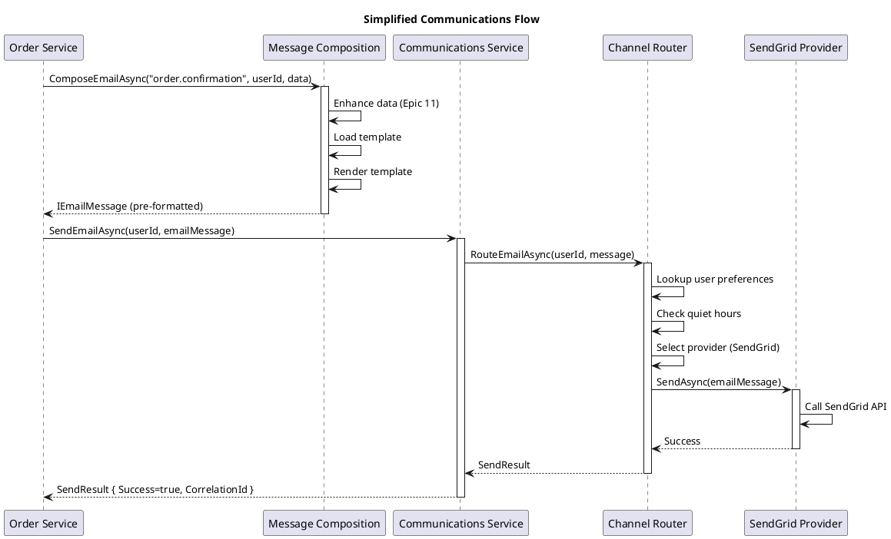

# Epic 2: Communications Platform (REVISED)

**Priority:** HIGH
**Status:** 📋 Design Phase (Architecture Revised)
**Complexity:** MEDIUM (reduced from HIGH)
**Impact:** ~800 LOC (down from ~2,500 LOC)

---

## Overview

The Communications Platform is a **channel routing and delivery system** that sends pre-formatted messages to users via their preferred channels (Email, SMS, Push Notifications).

**Key Principle:** This component is **ONLY responsible for routing and sending**. It does NOT handle:
- ❌ Data enhancement (handled by Data Enhancement Pipeline - Epic 11)
- ❌ Template composition (handled by Message Composition Service)
- ❌ Message formatting (receives pre-formatted IEmailMessage, ISmsMessage)

**Responsibilities:**
1. **Channel Preference Lookup** - Determine which channels user wants
2. **Channel Routing** - Route messages to Email/SMS/Push based on preferences
3. **Provider Selection** - Choose SendGrid vs SMTP, Twilio vs custom
4. **Message Delivery** - Send via providers
5. **Correlation Tracking** - Track messages across channels
6. **Deferral** - Schedule messages for future delivery
7. **Quiet Hours** - Respect user quiet hours preferences

---

## Architecture Simplified

### OLD Architecture (Overly Complex)
```
Application Service
    ↓
Communications (does EVERYTHING)
    ├─ Data Enhancement
    ├─ Template Loading
    ├─ Variable Substitution
    ├─ Channel Routing
    └─ Provider Sending
```

### NEW Architecture (Separation of Concerns)
```
Application Service
    ↓
Message Composition Service
    ├─ Data Enhancement Pipeline (Epic 11)
    ├─ Template Engine (Epic 10)
    ├─ Variable Substitution
    └─ Produces: IEmailMessage, ISmsMessage
    ↓
Communications Platform (THIS EPIC)
    ├─ Lookup User Preferences
    ├─ Channel Routing
    └─ Provider Sending
```

---

## Simplified Interface

### ICommunicationsService (NEW - Simplified)

```csharp
/// <summary>
/// Routes and sends pre-formatted messages to user's preferred channels.
/// </summary>
public interface ICommunicationsService
{
    /// <summary>
    /// Sends an email message immediately.
    /// </summary>
    /// <param name="userId">Target user</param>
    /// <param name="message">Pre-formatted email message</param>
    /// <param name="options">Optional send options (correlation ID, headers, etc.)</param>
    Task<SendResult> SendEmailAsync(
        Guid userId,
        IEmailMessage message,
        SendOptions? options = null);

    /// <summary>
    /// Sends an SMS message immediately.
    /// </summary>
    Task<SendResult> SendSmsAsync(
        Guid userId,
        ISmsMessage message,
        SendOptions? options = null);

    /// <summary>
    /// Sends message to user's preferred channels (Email, SMS, Push).
    /// </summary>
    /// <param name="userId">Target user</param>
    /// <param name="messages">Messages for each channel (Email, SMS, Push)</param>
    Task<SendResult> SendMultiChannelAsync(
        Guid userId,
        MultiChannelMessage messages,
        SendOptions? options = null);

    /// <summary>
    /// Defers email delivery until specified time.
    /// </summary>
    Task<SendResult> DeferEmailAsync(
        Guid userId,
        IEmailMessage message,
        DateTimeOffset deliveryTime,
        SendOptions? options = null);

    /// <summary>
    /// Defers SMS delivery until specified time.
    /// </summary>
    Task<SendResult> DeferSmsAsync(
        Guid userId,
        ISmsMessage message,
        DateTimeOffset deliveryTime,
        SendOptions? options = null);
}
```

### Usage Example

```csharp
public class OrderService
{
    private readonly IMessageCompositionService _composition;
    private readonly ICommunicationsService _communications;

    public async Task SendOrderConfirmationAsync(Order order)
    {
        // 1. Compose message (handles enhancement + templating)
        var emailMessage = await _composition.ComposeEmailAsync(
            messageType: "order.confirmation",
            userId: order.CustomerId,
            data: MessageDataFactory.Create(new { OrderId = order.Id })
        );

        // 2. Send message (just routing + delivery)
        var result = await _communications.SendEmailAsync(
            userId: order.CustomerId,
            message: emailMessage
        );

        if (!result.Success)
        {
            _logger.LogWarning("Failed to send order confirmation: {Error}", result.ErrorMessage);
        }
    }
}
```

---

## Components

### Layer 1: Abstractions
**Project:** `OoBDev.Communications.Abstractions`
**LOC:** ~150 (down from 695)

**Interfaces:**
- `ICommunicationsService` - Main entry point
- `IChannelPreferenceManager` - User channel preference lookup
- `ISendEmailProvider` - Email provider abstraction
- `ISendSmsProvider` - SMS provider abstraction

**Models:**
- `IEmailMessage` - Pre-formatted email (from composition service)
- `ISmsMessage` - Pre-formatted SMS (from composition service)
- `IChannelPreference` - User's channel preferences
- `SendResult` - Delivery result
- `SendOptions` - Optional parameters (correlation ID, headers)

### Layer 2: Core Implementation
**Project:** `OoBDev.Communications`
**LOC:** ~300 (down from 1,145)

**Components:**
1. **CommunicationsService** - Main facade
2. **ChannelRouter** - Routes to Email/SMS/Push based on preferences
3. **ChannelPreferenceManager** - Looks up user preferences
4. **QuietHoursManager** - Checks quiet hours, defers if needed
5. **DeferralManager** - Schedules future delivery

### Layer 3: Email Providers
**Project:** `OoBDev.Twilio.SendGrid`
**LOC:** ~200 (down from 267 - no template logic)

**Components:**
- `SendGridEmailProvider` - Sends via SendGrid API

### Layer 4: SMS Providers
**Project:** `OoBDev.Twilio.SmsMessaging`
**LOC:** ~150

**Components:**
- `TwilioSmsProvider` - Sends via Twilio API

---

## Feature Breakdown

### Feature 1: Channel Routing
**Path:** `./ChannelRouting/`
**Description:** Routes messages to appropriate channels based on user preferences

**Documentation:**
- [Requirements](./ChannelRouting/requirements.md)
- [Architecture](./ChannelRouting/architecture.md)
- [API Design](./ChannelRouting/api-design.md)
- [Configuration](./ChannelRouting/configuration.md)
- [Testing Strategy](./ChannelRouting/testing-strategy.md)

### Feature 2: SendGrid Email Provider
**Path:** `./SendGridProvider/`
**Description:** Email delivery via SendGrid API

**Documentation:**
- [Requirements](./SendGridProvider/requirements.md)
- [Architecture](./SendGridProvider/architecture.md)
- [API Design](./SendGridProvider/api-design.md)
- [Configuration](./SendGridProvider/configuration.md)
- [Testing Strategy](./SendGridProvider/testing-strategy.md)

### Feature 3: Twilio SMS Provider
**Path:** `./TwilioSmsProvider/`
**Description:** SMS delivery via Twilio API

**Documentation:**
- [Requirements](./TwilioSmsProvider/requirements.md)
- [Architecture](./TwilioSmsProvider/architecture.md)
- [API Design](./TwilioSmsProvider/api-design.md)
- [Configuration](./TwilioSmsProvider/configuration.md)
- [Testing Strategy](./TwilioSmsProvider/testing-strategy.md)

### Feature 4: Deferral Management
**Path:** `./DeferralManagement/`
**Description:** Scheduled message delivery

**Documentation:**
- [Requirements](./DeferralManagement/requirements.md)
- [Architecture](./DeferralManagement/architecture.md)

---

## User Journeys (Revised)

### Journey 1: Send Pre-Formatted Email
```
GIVEN order confirmation email already composed
  AND email has subject, HTML, text content
  AND user prefers Email channel
WHEN OrderService calls ICommunicationsService.SendEmailAsync()
THEN system:
  1. Looks up user channel preferences
  2. Checks if Email is enabled
  3. Checks quiet hours (defers if needed)
  4. Sends via SendGrid provider
  5. Returns SendResult with correlation ID
```

### Journey 2: Multi-Channel Delivery
```
GIVEN password reset message composed for Email and SMS
  AND user prefers BOTH Email and SMS
WHEN SecurityService calls SendMultiChannelAsync()
THEN system:
  1. Looks up user preferences → [Email, SMS]
  2. Routes email message to SendGrid
  3. Routes SMS message to Twilio
  4. Sends BOTH in parallel
  5. Returns SendResult with correlation ID
```

### Journey 3: Quiet Hours Deferral
```
GIVEN promotional email composed
  AND user has quiet hours 10 PM - 8 AM
  AND current time is 11 PM
WHEN MarketingService calls SendEmailAsync()
THEN system:
  1. Looks up user preferences
  2. Detects current time in quiet hours
  3. Automatically defers until 8 AM
  4. Returns SendResult indicating deferred
```

---

## Simplified Data Flow



---

## What Was Removed

### ❌ Removed from Communications
1. **Data Enhancement** → Moved to Epic 11: Data Enhancement Pipeline
2. **Template Loading** → Moved to Epic 10: Text Templating / Message Composition
3. **Variable Substitution** → Moved to Epic 10: Text Templating
4. **Message Composition** → New Message Composition Service

### ✅ Kept in Communications
1. Channel routing based on user preferences
2. Provider selection (SendGrid vs SMTP, Twilio vs custom)
3. Quiet hours management
4. Deferral scheduling
5. Correlation tracking
6. Multi-channel parallel sending

---

## Dependencies

### OoBDev Framework
- **Epic 11: Data Enhancement Pipeline** - Used by Message Composition, NOT Communications
- **Epic 10: Text Templating** - Used by Message Composition, NOT Communications
- **OoBDev.System** - `ISelectedService<T>` for provider selection

### External Services
- **SendGrid API** - Cloud email delivery
- **Twilio API** - SMS delivery
- **User Preference Store** - Database/API for channel preferences
- **Deferral Queue** - Message queue or database for scheduled delivery

---

## Success Metrics

### Simplified Scope
- ✅ Sends pre-formatted IEmailMessage via SendGrid or SMTP
- ✅ Sends pre-formatted ISmsMessage via Twilio
- ✅ Routes to multiple channels in parallel
- ✅ Respects user channel preferences
- ✅ Handles quiet hours automatically
- ✅ Defers messages for scheduled delivery
- ✅ 80%+ test coverage
- ✅ < 200ms routing time (excluding provider API calls)

### Out of Scope (Handled by Other Epics)
- ❌ Data enhancement (Epic 11)
- ❌ Template loading (Epic 10)
- ❌ Message composition (Message Composition Service)

---

## Migration from SharedFramework

**Source:**
- `Incoming/SharedFramework/OoBDev.Communications` (~1,145 LOC)
  - Extract: Channel routing, preference lookup, deferral (~300 LOC)
  - **Discard:** Enhancement, composition, template logic (~845 LOC → Epic 11, Epic 10)

**Target:**
- `src/Framework/OoBDev.Communications.Abstractions/` (~150 LOC)
- `src/Framework/OoBDev.Communications/` (~300 LOC)
- `src/ExternalServices/Twilio/OoBDev.Twilio.SendGrid/` (~200 LOC)
- `src/ExternalServices/Twilio/OoBDev.Twilio.SmsMessaging/` (~150 LOC)

**Total:** ~800 LOC (down from ~2,500 LOC)

---

## Related Epics

- **Epic 11: Data Enhancement Pipeline** - Enriches data BEFORE composition
- **Epic 10: Text Templating** - Loads and renders templates
- **Message Composition Service** (NEW) - Combines Epic 11 + Epic 10 to produce IEmailMessage/ISmsMessage

---

## Next Steps

1. Complete documentation for ChannelRouting feature
2. Complete documentation for SendGrid/Twilio providers
3. Design Message Composition Service (uses Epic 11 + Epic 10)
4. Update requirements to reflect simplified scope
