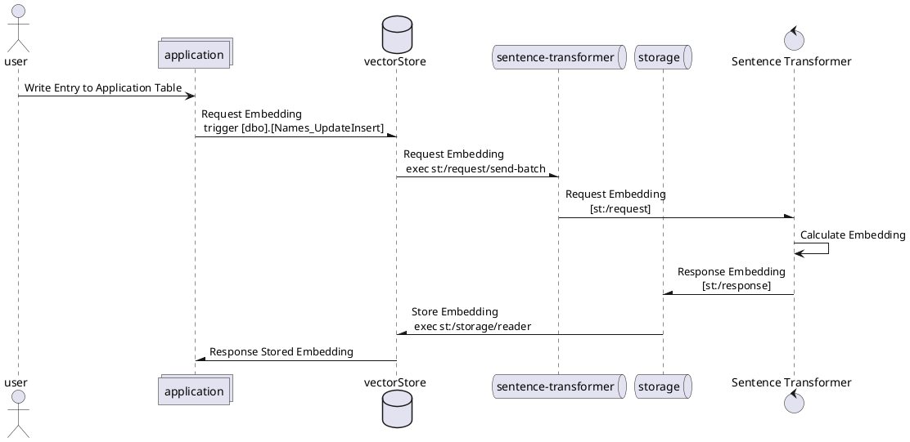

# Out-of-Band Development - SQLCLR Vector Support

## Summary

This page adds support to MS SQL Server for Vector Search Functionality.

## Design

```plantuml
@startuml

actor user
collections application
database vectorStore
queue "sentence-transformer" as est
queue "storage" as es
control "Sentence Transformer" as stqr

user -> application : Write Entry to Application Table
application -\ vectorStore : Request Embedding \n trigger [dbo].[Names_UpdateInsert]
 vectorStore -\ est : Request Embedding \n exec st:/request/send-batch
 est -\ stqr : Request Embedding \n\t [st:/request]
 stqr -> stqr: Calculate Embedding 
 stqr -\ es : Response Embedding \n\t [st:/response]
 es -\ vectorStore : Store Embedding \n exec st:/storage/reader
 vectorStore -\ application : Response Stored Embedding

@enduml
```
