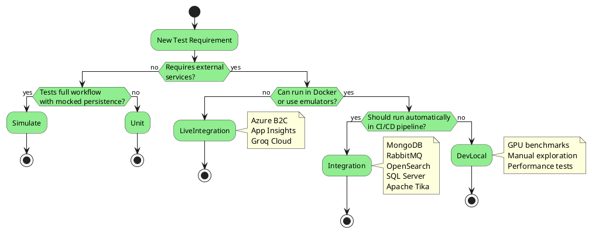

# Testing Guidelines

**Last Updated:** 2026-01-19

Comprehensive testing standards and best practices for the OoBDev framework.

> **Quick Reference:** [TEST_VARIABLES.md](../../TEST_VARIABLES.md) - All test properties and configuration

---

## Table of Contents

1. [Test Categories](#test-categories)
2. [Test Category Decision Tree](#test-category-decision-tree)
3. [Writing Integration Tests](#writing-integration-tests)
4. [Test Configuration](#test-configuration)
5. [Test Isolation and Cleanup](#test-isolation-and-cleanup)
6. [Test Patterns](#test-patterns)
7. [CI/CD Integration](#cicd-integration)
8. [Best Practices](#best-practices)

---

## Test Categories

OoBDev uses **5 test categories** to organize tests by execution environment, dependencies, and purpose.

### Category Definitions

| Category | Runs In CI/CD | External Services | Execution Speed | Use Case |
|----------|---------------|-------------------|-----------------|----------|
| **Unit** | ✅ YES (every PR/push) | Mocked | < 100ms | Pure logic, algorithms, utilities |
| **Simulate** | ✅ YES (every PR/push) | Mocked | < 1s | End-to-end workflows with in-memory persistence |
| **Integration** | ✅ YES (daily at 4 PM UTC) | Docker containers | < 30s/test | External services (DBs, queues, search engines) |
| **DevLocal** | ❌ NO (manual only) | Local services | Varies | Performance benchmarks, GPU tests, manual exploration |
| **LiveIntegration** | ❌ NO (manual only) | Live cloud services | Varies | Azure B2C, Application Insights, Groq Cloud |

### Category Usage

```csharp
using OoBDev.TestUtilities;
using Microsoft.VisualStudio.TestTools.UnitTesting;

[TestClass]
public class MyTests
{
    [TestMethod]
    [TestCategory(TestCategories.Unit)]
    public void PureLogicTest()
    {
        // No external dependencies, fast, isolated
    }

    [TestMethod]
    [TestCategory(TestCategories.Simulate)]
    public async Task EndToEndWorkflowTest()
    {
        // Full stack with mocked persistence (in-memory DB, mocked queue)
    }

    [TestMethod]
    [TestCategory(TestCategories.Integration)]
    public async Task DockerServiceTest()
    {
        // Real Docker service (MongoDB, RabbitMQ, OpenSearch, etc.)
    }

    [TestMethod]
    [TestCategory(TestCategories.DevLocal)]
    public async Task PerformanceBenchmark()
    {
        // Manual execution only, may use local GPU/hardware
    }

    [TestMethod]
    [TestCategory(TestCategories.LiveIntegration)]
    public async Task AzureB2CTest()
    {
        // Requires live Azure credentials, manual execution only
    }
}
```

---

## Test Category Decision Tree



**Decision Questions:**

1. **Does it require external services?**
   - NO → Check if it tests full workflows...
     - YES → **Simulate** (end-to-end with in-memory DB/mocked services)
     - NO → **Unit** (pure logic, mocked dependencies)
   - YES → Continue...

2. **Can it run in Docker or use emulators?**
   - NO → **LiveIntegration** (Azure B2C, Groq Cloud, Application Insights)
   - YES → Continue...

3. **Should it run automatically in CI/CD?**
   - YES → **Integration** (MongoDB, RabbitMQ, OpenSearch, SQL Server, Apache Tika)
   - NO → **DevLocal** (GPU benchmarks, manual tests, performance analysis)

---

## Writing Integration Tests

### Test Property Pattern

**✅ CORRECT - Use TestContext.GetProperty:**

```csharp
[TestClass]
public class MongoDBIntegrationTests
{
    public required TestContext TestContext { get; set; }

    private string? _databaseName;
    private IMongoClient? _mongoClient;

    [TestInitialize]
    public void TestInitialize()
    {
        // Create unique database name for test isolation
        _databaseName = $"IntegrationTest_{Guid.NewGuid():N}";
    }

    [TestCleanup]
    public async Task TestCleanup()
    {
        // Always cleanup test resources
        if (_mongoClient != null && _databaseName != null)
        {
            await _mongoClient.DropDatabaseAsync(_databaseName);
        }
    }

    [TestMethod]
    [TestCategory(TestCategories.Integration)]
    public async Task TestMongoDBCRUD()
    {
        // ✅ CORRECT: Use TestContext.GetProperty<T>()
        var connectionString = TestContext.GetProperty<string>("MONGODB_CONNECTION_STRING")
            ?? "mongodb://localhost:27017";

        var config = new ConfigurationBuilder()
            .AddInMemoryCollection(new Dictionary<string, string?>
            {
                { "MongoDB:ConnectionString", connectionString },
                { "MongoDB:DatabaseName", _databaseName },
            })
            .Build();

        var services = new ServiceCollection();
        services.TryAddMongoServices(config, "MongoDB");

        var serviceProvider = services.BuildServiceProvider();
        _mongoClient = serviceProvider.GetRequiredService<IMongoClient>();

        // Test logic...
    }
}
```

**❌ WRONG - Don't use Environment.GetEnvironmentVariable:**

```csharp
// ❌ WRONG: Don't do this!
var connectionString = Environment.GetEnvironmentVariable("MONGODB_CONNECTION_STRING")
    ?? "mongodb://localhost:27017";
```

**Why TestContext.GetProperty is better:**
- Integrates with `.runsettings` files
- Works with MSTest test deployment context
- Supports test parameter overrides
- Better IDE integration (Test Explorer)
- Clearer test configuration management

### Test Isolation Patterns

#### 1. Unique Resource Names

Always use unique names to prevent test interference:

```csharp
// Database names
var databaseName = $"IntegrationTest_{Guid.NewGuid():N}";

// Collection/table names
var collectionName = $"test_collection_{Guid.NewGuid():N}";

// Index names
var indexName = $"integrationtest_{Guid.NewGuid():N}";

// Queue names
var queueName = $"test_queue_{Guid.NewGuid():N}";
```

#### 2. Cleanup Logic

**Always implement cleanup**, even if tests fail:

```csharp
[TestCleanup]
public async Task TestCleanup()
{
    // Cleanup databases
    if (_mongoClient != null && _databaseName != null)
    {
        await _mongoClient.DropDatabaseAsync(_databaseName);
    }

    // Cleanup indices
    if (_searchClient != null && _indexName != null)
    {
        try
        {
            await _searchClient.Indices.DeleteAsync(_indexName);
        }
        catch
        {
            // Ignore cleanup errors (index may not exist)
        }
    }

    // Cleanup message queues
    _channel?.QueueDelete(_queueName);
    _channel?.Close();
    _connection?.Close();
}
```

#### 3. Stateless vs Stateful Services

**Stateless Services** (no cleanup needed):
- Apache Tika (document conversion)
- SBert (embeddings)
- SMTP4Dev (email testing - resets on restart)

**Stateful Services** (cleanup required):
- MongoDB (databases/collections)
- SQL Server (databases/tables)
- RabbitMQ (queues)
- OpenSearch (indices)
- Qdrant (collections)

---

## Test Configuration

### .runsettings File

**Location:** `/current/src/.runsettings` (solution-wide)

**Example:**

```xml
<?xml version="1.0" encoding="utf-8"?>
<RunSettings>
  <TestRunParameters>
    <!-- MongoDB -->
    <Parameter name="MONGODB_CONNECTION_STRING" value="mongodb://localhost:27017" />

    <!-- SQL Server -->
    <Parameter name="SQL_CONNECTION_STRING" value="Server=localhost,1433;User Id=sa;Password=IntegrationTest123!;TrustServerCertificate=True" />

    <!-- RabbitMQ -->
    <Parameter name="RABBITMQ_HOST" value="localhost" />
    <Parameter name="RABBITMQ_PORT" value="5672" />

    <!-- OpenSearch -->
    <Parameter name="OPENSEARCH_URL" value="http://localhost:9200" />
    <Parameter name="OPENSEARCH_USERNAME" value="admin" />
    <Parameter name="OPENSEARCH_PASSWORD" value="admin" />

    <!-- See TEST_VARIABLES.md for complete list -->
  </TestRunParameters>
</RunSettings>
```

### Visual Studio Configuration

1. **Test → Configure Run Settings → Select Solution Wide runsettings File**
2. Select `/current/src/.runsettings`
3. Tests will automatically use configured parameters

### Command Line Configuration

```bash
# Use custom settings file
dotnet test --settings integration.runsettings --filter "TestCategory=Integration"

# Override specific parameters
dotnet test --settings integration.runsettings -- TestRunParameters.Parameter\(name=\"MONGODB_CONNECTION_STRING\",value=\"mongodb://custom:27017\"\)
```

### Test Variable Reference

See [TEST_VARIABLES.md](../../TEST_VARIABLES.md) for:
- Complete list of 30+ test properties
- Default values for all services
- Docker container information
- Service-specific notes

---

## Test Patterns

### 1. Repository Test Pattern

```csharp
[TestClass]
public class UserRepositoryIntegrationTests
{
    public required TestContext TestContext { get; set; }

    private string? _databaseName;
    private IMongoClient? _mongoClient;
    private IUserRepository? _repository;

    [TestInitialize]
    public void TestInitialize()
    {
        _databaseName = $"IntegrationTest_{Guid.NewGuid():N}";

        var connectionString = TestContext.GetProperty<string>("MONGODB_CONNECTION_STRING")
            ?? "mongodb://localhost:27017";

        var config = new ConfigurationBuilder()
            .AddInMemoryCollection(new Dictionary<string, string?>
            {
                { "MongoDB:ConnectionString", connectionString },
                { "MongoDB:DatabaseName", _databaseName },
            })
            .Build();

        var services = new ServiceCollection();
        services.TryAddMongoServices(config, "MongoDB");
        services.AddTransient<IUserRepository, UserRepository>();

        var serviceProvider = services.BuildServiceProvider();
        _mongoClient = serviceProvider.GetRequiredService<IMongoClient>();
        _repository = serviceProvider.GetRequiredService<IUserRepository>();
    }

    [TestCleanup]
    public async Task TestCleanup()
    {
        if (_mongoClient != null && _databaseName != null)
        {
            await _mongoClient.DropDatabaseAsync(_databaseName);
        }
    }

    [TestMethod]
    [TestCategory(TestCategories.Integration)]
    public async Task CreateUser_ShouldPersist()
    {
        // Arrange
        var user = new User { Name = "Test User", Email = "test@example.com" };

        // Act
        await _repository!.CreateAsync(user);
        var retrieved = await _repository.GetByIdAsync(user.Id);

        // Assert
        Assert.IsNotNull(retrieved);
        Assert.AreEqual(user.Name, retrieved.Name);
        Assert.AreEqual(user.Email, retrieved.Email);
    }
}
```

### 2. API Integration Test Pattern

```csharp
[TestClass]
public class DocumentConversionIntegrationTests
{
    public required TestContext TestContext { get; set; }

    [TestMethod]
    [TestCategory(TestCategories.Integration)]
    public async Task ConvertPdfToHtml_ShouldSucceed()
    {
        // Get Tika URL from test properties
        var tikaUrl = TestContext.GetProperty<string>("TIKA_URL")
            ?? "http://localhost:9998";

        var config = new ConfigurationBuilder()
            .AddInMemoryCollection(new Dictionary<string, string?>
            {
                { "ApacheTikaClientOptions:Url", tikaUrl }
            })
            .Build();

        var services = new ServiceCollection()
            .AddLogging()
            .TryAddApacheTikaServices(config, nameof(ApacheTikaClientOptions))
            .BuildServiceProvider();

        var converter = services.GetRequiredService<IDocumentConversionHandler>();

        // Load test resource
        using var inputStream = GetType().Assembly.GetManifestResourceStream("test.pdf");
        using var outputStream = new MemoryStream();

        // Act
        await converter.ConvertAsync(inputStream, "application/pdf", outputStream, "text/html");

        // Assert
        Assert.IsTrue(outputStream.Length > 0);
        TestContext.WriteLine($"Converted document size: {outputStream.Length} bytes");
    }
}
```

### 3. Message Queue Test Pattern

```csharp
[TestClass]
public class MessageQueueIntegrationTests
{
    public required TestContext TestContext { get; set; }

    private IConnection? _connection;
    private IModel? _channel;
    private string? _queueName;

    [TestInitialize]
    public void TestInitialize()
    {
        _queueName = $"test_queue_{Guid.NewGuid():N}";

        var host = TestContext.GetProperty<string>("RABBITMQ_HOST") ?? "localhost";
        var port = int.TryParse(TestContext.GetProperty<string>("RABBITMQ_PORT"), out var p) ? p : 5672;

        var factory = new ConnectionFactory { HostName = host, Port = port };
        _connection = factory.CreateConnection();
        _channel = _connection.CreateModel();
        _channel.QueueDeclare(_queueName, durable: false, exclusive: false, autoDelete: true);
    }

    [TestCleanup]
    public void TestCleanup()
    {
        _channel?.QueueDelete(_queueName);
        _channel?.Close();
        _connection?.Close();
    }

    [TestMethod]
    [TestCategory(TestCategories.Integration)]
    public void SendAndReceiveMessage_ShouldSucceed()
    {
        // Arrange
        var message = "Test Message";
        var body = Encoding.UTF8.GetBytes(message);

        // Act - Send
        _channel!.BasicPublish(exchange: "", routingKey: _queueName, body: body);

        // Act - Receive
        var result = _channel.BasicGet(_queueName, autoAck: true);

        // Assert
        Assert.IsNotNull(result);
        var receivedMessage = Encoding.UTF8.GetString(result.Body.ToArray());
        Assert.AreEqual(message, receivedMessage);
    }
}
```

---

## CI/CD Integration

### Local Docker Testing

Before tests run in CI/CD, they must pass locally:

```bash
# 1. Start Docker services
cd containers/testing
./scripts/integration-up.sh --wait

# 2. Run integration tests
cd ../../src
dotnet test --filter "TestCategory=Integration"

# 3. Stop and cleanup
cd ../containers/testing
./scripts/integration-down.sh --clean
```

### GitHub Actions Workflow

Integration tests run **daily at 4 PM UTC** via `.github/workflows/integration-tests.yml`:

```yaml
name: Integration Tests

on:
  schedule:
    - cron: '0 16 * * *'  # Daily at 4 PM UTC
  workflow_dispatch:      # Manual trigger

jobs:
  integration-tests:
    runs-on: ubuntu-latest

    steps:
      - name: Checkout
        uses: actions/checkout@v4

      - name: Start Docker Services
        working-directory: ./containers/testing
        run: docker compose -f docker-compose.integration-tests.yml up -d

      - name: Wait for Services
        working-directory: ./containers/testing
        run: ./scripts/wait-for-services.sh
        timeout-minutes: 5

      - name: Run Integration Tests
        working-directory: ./src
        run: |
          dotnet test \
            --configuration Release \
            --filter "TestCategory=Integration" \
            --logger "trx;LogFileName=integration-tests.trx"

      - name: Stop Docker Services
        if: always()
        working-directory: ./containers/testing
        run: docker compose -f docker-compose.integration-tests.yml down -v

      - name: Upload Test Results
        if: always()
        uses: actions/upload-artifact@v4
        with:
          name: integration-test-results
          path: '**/TestResults/**/*.trx'
```

### Test Execution Flow

```
┌─────────────────────────────────────────┐
│ Build Pipeline (dotnet.yml)             │
│ - Every PR/push                          │
│ - Unit + Simulate tests                  │
│ - Create artifacts                       │
│ - Tag: v{version}                        │
└──────────────┬──────────────────────────┘
               │
               ▼
┌─────────────────────────────────────────┐
│ Integration Tests (integration-tests.yml)│
│ - Daily at 4 PM UTC                      │
│ - Manual trigger available               │
│ - Integration tests                      │
│ - Tag: validated-v{version}              │
└──────────────┬──────────────────────────┘
               │
               ▼
┌─────────────────────────────────────────┐
│ Release Pipeline (release.yml)           │
│ - Manual trigger                         │
│ - Deploy validated builds                │
└─────────────────────────────────────────┘
```

---

## Best Practices

### 1. Test Independence

✅ **DO:**
- Each test should be runnable in isolation
- Tests should not depend on execution order
- Use unique resource names (`Guid.NewGuid()`)
- Implement proper cleanup in `[TestCleanup]`

❌ **DON'T:**
- Share state between tests
- Depend on specific execution order
- Leave test data in databases/queues
- Use hardcoded resource names

### 2. Test Performance

✅ **DO:**
- Keep Unit tests under 100ms
- Keep Integration tests under 30s
- Use parallel test execution when possible
- Mock expensive operations in Simulate tests

❌ **DON'T:**
- Put slow operations in Unit tests
- Create unnecessary test data
- Skip cleanup (it slows down future runs)
- Use Thread.Sleep() - use proper async patterns

### 3. Test Readability

✅ **DO:**
- Use descriptive test names: `MethodName_Scenario_ExpectedBehavior`
- Write clear arrange/act/assert sections
- Add comments for complex test setup
- Use TestContext.WriteLine() for debugging output

❌ **DON'T:**
- Use generic names like `Test1()`, `Test2()`
- Mix multiple scenarios in one test
- Write tests without assertions
- Leave commented-out test code

### 4. Test Coverage

**Framework Layer Requirements:**
- **Minimum:** 80% code coverage
- **Target:** 90%+ for critical components
- **Focus:** Public API surface area

**Coverage Guidelines:**
- Unit tests: Core logic, edge cases, error conditions
- Simulate tests: End-to-end workflows, integration points
- Integration tests: External service interactions, data persistence

### 5. Test Maintenance

✅ **DO:**
- Update tests when code changes
- Remove obsolete tests
- Refactor duplicated test setup into helpers
- Keep test dependencies up to date

❌ **DON'T:**
- Disable failing tests without fixing them
- Copy-paste test code excessively
- Ignore test warnings
- Let test coverage degrade

### 6. Test Documentation

✅ **DO:**
- Document complex test scenarios
- Add XML comments to test helper methods
- Reference TEST_VARIABLES.md for configuration
- Update testing docs when patterns change

❌ **DON'T:**
- Leave undocumented "magic" test data
- Use unclear variable names in tests
- Forget to document test prerequisites

---

## Common Patterns

### Testing Async Code

```csharp
[TestMethod]
[TestCategory(TestCategories.Unit)]
public async Task AsyncMethod_ShouldComplete()
{
    // Arrange
    var service = new MyService();

    // Act
    var result = await service.DoSomethingAsync();

    // Assert
    Assert.IsNotNull(result);
}
```

### Testing Exceptions

```csharp
[TestMethod]
[TestCategory(TestCategories.Unit)]
public void InvalidInput_ShouldThrowException()
{
    // Arrange
    var service = new MyService();

    // Act & Assert
    Assert.ThrowsException<ArgumentNullException>(() =>
    {
        service.ProcessData(null);
    });
}

[TestMethod]
[TestCategory(TestCategories.Unit)]
public async Task AsyncInvalidInput_ShouldThrowException()
{
    // Arrange
    var service = new MyService();

    // Act & Assert
    await Assert.ThrowsExceptionAsync<ArgumentNullException>(async () =>
    {
        await service.ProcessDataAsync(null);
    });
}
```

### Testing with Mocks

```csharp
[TestMethod]
[TestCategory(TestCategories.Unit)]
public async Task ServiceMethod_CallsDependency()
{
    // Arrange
    var mockRepo = new MockRepository(MockBehavior.Strict);
    var mockDependency = mockRepo.Create<IDependency>();

    mockDependency
        .Setup(x => x.GetDataAsync())
        .ReturnsAsync(new Data { Value = "test" });

    var service = new MyService(mockDependency.Object);

    // Act
    var result = await service.ProcessAsync();

    // Assert
    Assert.AreEqual("test", result.ProcessedValue);
    mockRepo.VerifyAll();
}
```

### Floating-Point Comparisons

```csharp
[TestMethod]
[TestCategory(TestCategories.Unit)]
public void MathOperation_ShouldReturnExpectedValue()
{
    // Arrange
    var calculator = new Calculator();

    // Act
    var result = calculator.Divide(10.0, 3.0);

    // Assert - Use NumericAsserts for floating-point
    NumericAsserts.AreSimilar(3.333333, result, tolerance: 0.000001);
}
```

---

## Related Documentation

- [TEST_VARIABLES.md](../../TEST_VARIABLES.md) - Complete test property reference
- [Local Integration Testing](../../TODO-testing-local-integration.md) - Docker testing roadmap
- [Live Integration Testing](../../TODO-testing-live-integration.md) - Cloud testing roadmap
- [TestCategories.cs](../../../src/Framework/OoBDev.TestUtilities/TestCategories.cs) - Category definitions
- [Docker Infrastructure](../../../containers/testing/README.md) - Docker setup guide

---

## Quick Reference

### Test Category Selection

```
Need external service? → NO → Unit
                       → YES → Can run in Docker? → NO → LiveIntegration
                                                  → YES → Auto in CI/CD? → YES → Integration
                                                                         → NO → DevLocal
```

### Test Property Usage

```csharp
var value = TestContext.GetProperty<string>("PROPERTY_NAME") ?? "default";
```

### Test Isolation

```csharp
var uniqueName = $"IntegrationTest_{Guid.NewGuid():N}";
```

### Cleanup

```csharp
[TestCleanup]
public async Task TestCleanup()
{
    if (_client != null && _resourceName != null)
    {
        await _client.DeleteAsync(_resourceName);
    }
}
```

---

**Maintainers:** Update this document when:
- New test categories are added
- Testing patterns change
- CI/CD pipeline is modified
- New test infrastructure is added
