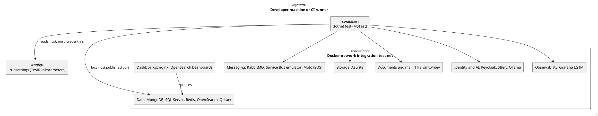
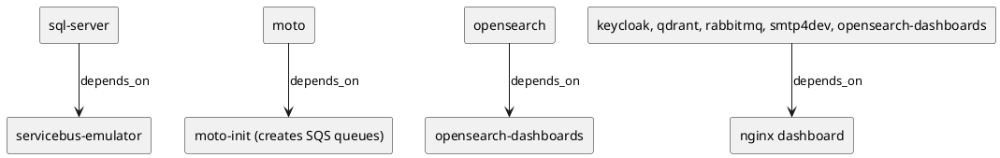

# Docker Infrastructure

[← Integration testing](README.md) · [Services →](services.md)

The stack is `containers/testing/docker-compose.integration-tests.yml` (project name `oobd-integration-tests`). It extends the per-service files in `containers/` so a single service can still be run alone, and adds the test network, volumes, health checks and container names (`oobd-test-*`).

## Contents

- [Topology](#topology)
- [Ports](#ports)
- [Volumes](#volumes)
- [Health and startup order](#health-and-startup-order)
- [Local workflow](#local-workflow)
- [CI](#ci)

## Topology



*Figure 1 — Tests reach containers through published host ports*

Tests run on the host and connect to `localhost` with the published ports; containers talk to each other by service name on the shared network (for example the Service Bus emulator uses `oobd-test-sqlserver`).

## Ports

Every host port is `${TEST_PORT_<NAME>:-default}`. Set the variable in the shell or `containers/testing/.env` to move a port; the full variable list is in the [stack readme](../../../../containers/testing/README.md#port-conflicts). Tests read ports from `.runsettings`, so an override needs a settings file with the same values.

**Table 1 — Default host ports**

| Service | Host port (container) | Notes |
|---------|-----------------------|-------|
| smtp4dev | 7777 (80), 25, 143 | web UI, SMTP, IMAP |
| Apache Tika | 9998 | |
| MongoDB | 27017 | |
| SQL Server | 1433 | |
| RabbitMQ | 5673 (5672), 15672 | AMQP shifted so it does not collide with the emulator |
| Redis | 6379 | |
| OpenSearch | 9200, 9600 | HTTPS |
| OpenSearch Dashboards | 5601 | |
| Qdrant | 6333, 6334 | REST, gRPC |
| Azurite | 10000, 10001, 10002 | blob, queue, table |
| Moto | 4566 (5000) | AWS API |
| Service Bus emulator | 5672 | AMQP |
| Grafana LGTM | 3000, 4317, 4318 | UI and Tempo/Loki proxy, OTLP gRPC, OTLP HTTP |
| Keycloak | 8081 (8080) | |
| nginx dashboard | 8080 (80) | |
| SBert | 5080 (5000) | |
| Ollama | 11435 (11434) | shifted off the usual 11434 so a local Ollama keeps working |

## Volumes

Stateful services keep named volumes (`mongodb-test-data`, `sqlserver-test-data`, `rabbitmq-test-data`, `redis-test-data`, `opensearch-test-data`, `qdrant-test-storage`, `qdrant-test-snapshots`, `azurite-test-data`, `keycloak-test-data`, `ollama-test-data`). `integration-down --clean` removes them. Config bind mounts: `keycloak-config/` (realm import), `servicebus-config/Config.json`, `moto-init/`, `nginx/`.

## Health and startup order

Every service except `moto-init` and the Service Bus emulator has a health check, and the scripts wait for them (`scripts/wait-for-services`). Checks avoid curl or wget where the image lacks them and use bash `/dev/tcp`, node or python instead.



*Figure 2 — depends_on edges*

All other services start independently.

## Local workflow

```bash
cd containers/testing
./scripts/integration-up.sh --wait     # add --build to rebuild the Ollama and SBert images
cd ../../src
dotnet test --filter "TestCategory=Integration"
cd ../containers/testing
./scripts/integration-down.sh --clean
```

Windows uses the `.bat` equivalents. First start is slow: images pull, Ollama bakes `phi3` into its image at build time, and the ONNX embedder tests download models once into the shared hub cache.

## CI

`.github/workflows/integration-tests.yml` brings the stack up on `ubuntu-latest`, runs the `Integration` category and tears it down. It runs daily at 4 PM UTC and on demand (`gh workflow run integration-tests.yml`). GitHub only runs scheduled workflows from the default branch, so the schedule starts once the workflow is on `main`; a successful run on `main` creates the `validated-v{version}` tag. It has not yet run on GitHub, so expect Linux fixes on the first runs.

[← Integration testing](README.md) · [Services →](services.md)
