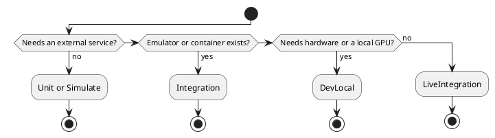

# Live Integration Testing

[Testing home](../README.md) · [Groq Cloud →](groq.md)

Live integration tests call real cloud services that cannot be run in a container or emulated. They are marked `[TestCategory(TestCategories.LiveIntegration)]`, run only by hand, and may cost money. The container-based counterpart is [Integration testing](../integration/README.md).

## Contents

- [When to use which category](#when-to-use-which-category)
- [Credentials](#credentials)
- [Cost and rate limits](#cost-and-rate-limits)
- [Writing a live test](#writing-a-live-test)
- [Services](#services)

## When to use which category

**Table 1 — Integration versus LiveIntegration**

| | `Integration` | `LiveIntegration` |
|-|---------------|-------------------|
| Target | Docker containers from `containers/testing` | The real cloud service |
| Runs in CI | Yes, daily on the default branch | Never |
| Credentials | Throwaway values in `.runsettings` | Personal keys, never committed |
| Cost | None | Possible per request |
| Missing setup | Test fails | Test reports Inconclusive |

*Figure 1 — Choosing a test category*

## Credentials

1. Set the value as an environment variable (for example `GROQ_API_KEY`). Tests read the `TestContext` property first and the environment variable second, so a `.runsettings` parameter would override it; see [writing tests](../integration/writing-tests.md#rules).
2. The committed `src/.runsettings` lists live parameters only as commented examples. Never put a real key in it.
3. A test project may ship a `.env.liveintegration.template` listing the names. The copy `.env.liveintegration` is git-ignored and is only a place to keep values; nothing loads it automatically.
4. A key pasted into chat, an issue or a commit is compromised: revoke it and create a new one.

## Cost and rate limits

Keep each test to a few small requests, never loop, and prefer the cheapest model that exercises the code path. Limits and prices change, so read them from the provider's console instead of copying numbers into the repository.

## Writing a live test

Call `Assert.Inconclusive` when the credential is missing so a clean checkout still passes. Do not catch provider errors to hide them: a decommissioned model or a revoked key should fail the test with the provider's message. Follow the structure in [Groq Cloud](groq.md).

## Services

**Table 2 — Cloud services with live tests**

| Service | Test project | Page |
|---------|--------------|------|
| Groq Cloud | `OoBDev.GroqCloud.Tests` | [Groq Cloud](groq.md) |

[Testing home](../README.md) · [Groq Cloud →](groq.md)
