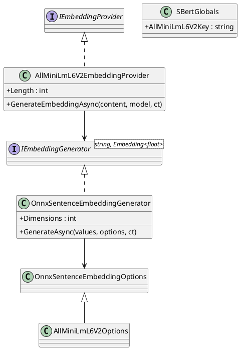

# AllMiniLmL6V2 — API Design

**Status:** Draft · 2026-10-07 · Epic: AI · Related: [README](README.md), [architecture](architecture.md), [testing strategy](testing-strategy.md)

[← Architecture](architecture.md) · [↑ Index](README.md) · [Testing strategy →](testing-strategy.md)

All members below are *Proposed*. Signatures are illustrative and will be compiled in phase 1.

## Contents

- [Generic runner](#generic-runner)
- [Model preset](#model-preset)
- [Registration](#registration)
- [Usage](#usage)
- [Class diagram](#class-diagram)

## Generic runner

Project `OoBDev.Onnx.SentenceEmbeddings`, namespace `OoBDev.Onnx.SentenceEmbeddings`.

```csharp
public sealed class OnnxSentenceEmbeddingOptions
{
    /// <summary>Folder with model.onnx and vocab.txt.</summary>
    public string ModelPath { get; set; } = "model";
    public int MaxSequenceLength { get; set; } = 256;
    public int MaxBatchSize { get; set; } = 32;
    public int MaxConcurrentInferences { get; set; } = Environment.ProcessorCount;
    /// <summary>0 lets ONNX Runtime choose.</summary>
    public int IntraOpThreads { get; set; }
    public bool LowerCase { get; set; } = true;
    public string InputIdsName { get; set; } = "input_ids";
    public string AttentionMaskName { get; set; } = "attention_mask";
    public bool Normalize { get; set; } = true;
    /// <summary>Mean (default) or Cls (for example bge models).</summary>
    public EmbeddingPooling Pooling { get; set; } = EmbeddingPooling.Mean;
    /// <summary>Optional text prepended to every value (for example "query: " for E5).</summary>
    public string? Prefix { get; set; }
    /// <summary>Null when the model has no token type ids input (mpnet).</summary>
    public string? TokenTypeIdsName { get; set; } = "token_type_ids";
    /// <summary>Output size after truncate and re-normalise; only valid for Matryoshka-trained models.</summary>
    public int? Dimensions { get; set; }
    public bool SupportsDimensionTruncation { get; set; }
}

public sealed class OnnxSentenceEmbeddingGenerator
    : IEmbeddingGenerator<string, Embedding<float>>
{
    public OnnxSentenceEmbeddingGenerator(
        IOptions<OnnxSentenceEmbeddingOptions> options,
        ILogger<OnnxSentenceEmbeddingGenerator> logger,
        TimeProvider timeProvider);

    /// <summary>Embedding dimension, read from the model metadata at construction.</summary>
    public int Dimensions { get; }

    public Task<GeneratedEmbeddings<Embedding<float>>> GenerateAsync(
        IEnumerable<string> values,
        EmbeddingGenerationOptions? options,
        CancellationToken cancellationToken);

    public object? GetService(Type serviceType, object? serviceKey);
    public void Dispose();
}
```

Behaviour:

- `GenerateAsync` tokenizes each value once, truncates to `MaxSequenceLength`, splits into batches of at most `MaxBatchSize`, pads each batch to its longest row, and runs the session under the concurrency gate.
- Pooling is a masked mean over the last hidden state followed by L2 normalisation, implemented over spans (`System.Numerics.Tensors.TensorPrimitives`), not recursive tensor loops.
- Empty or whitespace input returns an embedding of the correct length (all zeros) rather than a zero-length vector, so callers never have to special-case `Length`. This differs from the fork, which returns an empty array, and is called out in the compatibility tests as an intentional difference.
- `GetService(typeof(EmbeddingGeneratorMetadata))` reports the provider name and dimensions.

## Model preset

Project `OoBDev.SBert.AllMiniLmL6V2`, namespace `OoBDev.SBert.AllMiniLmL6V2`.

```csharp
public static class SBertGlobals
{
    public const string AllMiniLmL6V2Key = "all-minilm-l6-v2";
}

public sealed class AllMiniLmL6V2Options : OnnxSentenceEmbeddingOptions
{
    public const string ConfigPrefix = "SBert:AllMiniLmL6V2";
}

/// <summary>Adapts the generator to the existing IEmbeddingProvider contract.</summary>
public sealed class AllMiniLmL6V2EmbeddingProvider : IEmbeddingProvider
{
    public AllMiniLmL6V2EmbeddingProvider(
        IEmbeddingGenerator<string, Embedding<float>> generator,
        OnnxSentenceEmbeddingGenerator source);

    public int Length { get; }   // 384, from the model; no blocking call

    public Task<ReadOnlyMemory<float>> GenerateEmbeddingAsync(
        string content,
#if DEBUG
        string? model,
        CancellationToken cancellationToken
#else
        string? model = default,
        CancellationToken cancellationToken = default
#endif
        );
}
```

`SBertGlobals` may already exist in `OoBDev.SBert`; the constant is added there rather than duplicated.

## Registration

```csharp
public static class ServiceCollectionExtensions
{
    public static IServiceCollection TryAddAllMiniLmL6V2Services(
        this IServiceCollection services,
        IConfiguration configuration,
#if DEBUG
        string section
#else
        string section = AllMiniLmL6V2Options.ConfigPrefix
#endif
        )
    {
        services.AddValidatedOptions<AllMiniLmL6V2Options>(configuration, section);

        services.TryAddKeyedSingleton<IEmbeddingGenerator<string, Embedding<float>>>(
            SBertGlobals.AllMiniLmL6V2Key,
            (sp, _) => new EmbeddingGeneratorBuilder<string, Embedding<float>>(sp)
                .UseOpenTelemetry()
                .UseLogging()
                .Use(new OnnxSentenceEmbeddingGenerator(/* options, logger, time */)));

        services.TryAddKeyedSingleton<IEmbeddingProvider, AllMiniLmL6V2EmbeddingProvider>(
            SBertGlobals.AllMiniLmL6V2Key);
        return services;
    }
}
```

Compatibility: the method name `TryAddAllMiniLmL6V2Services` and the unkeyed `IEmbeddingProvider` default registration are kept so existing callers need no change; the legacy `ALLMINILM` key is registered as an alias for one release (`[Obsolete]` note in the readme). No breaking change to existing OoBDev APIs.

## Usage

```csharp
var embeddings = await generator.GenerateAsync(
    ["first sentence", "second sentence"], cancellationToken: ct);
ReadOnlyMemory<float> vector = embeddings[0].Vector;   // length 384, unit norm
```

## Class diagram



*Figure 1 — Public types*

[← Architecture](architecture.md) · [↑ Index](README.md) · [Testing strategy →](testing-strategy.md)
