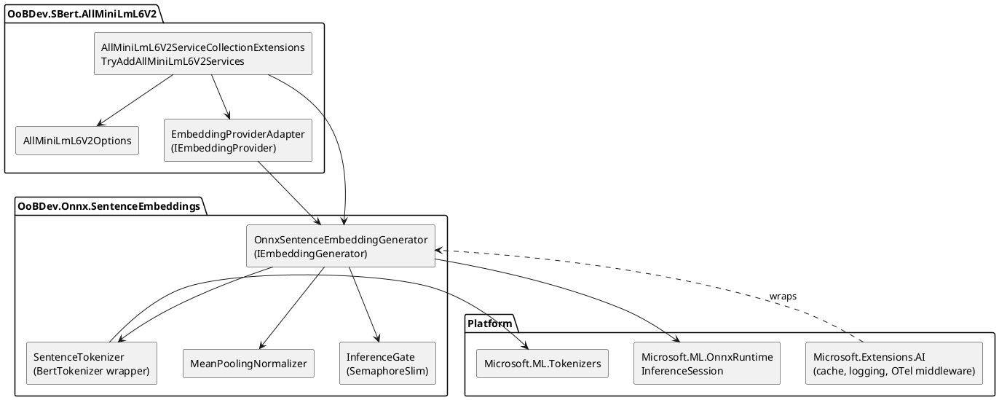
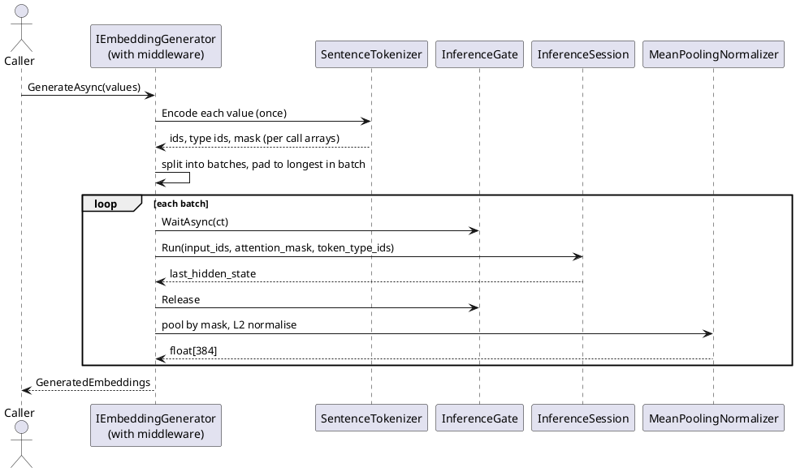

# AllMiniLmL6V2 — Architecture

**Status:** Draft · 2026-10-07 · Epic: AI · Related: [README](README.md), [requirements](requirements.md), [api-design](api-design.md)

[← Requirements](requirements.md) · [↑ Index](README.md) · [API design →](api-design.md)

## Contents

- [Layer placement and projects](#layer-placement-and-projects)
- [Components](#components)
- [Embedding flow](#embedding-flow)
- [Threading model](#threading-model)
- [Patterns used](#patterns-used)
- [Configuration](#configuration)
- [Alternatives considered](#alternatives-considered)
- [Cutover and removal plan](#cutover-and-removal-plan)

## Layer placement and projects

Both projects are ExternalServices (they wrap ONNX Runtime and a published model), following the existing `SBert` and `Ollama` vendor folders. The contract stays in `OoBDev.AI.Abstractions` (`IEmbeddingProvider`) and `Microsoft.Extensions.AI` (`IEmbeddingGenerator`), so no new abstractions project is needed.

**Table 1 — Proposed projects**

| Project | Folder | Purpose | Replaces |
|---------|--------|---------|----------|
| `OoBDev.Onnx.SentenceEmbeddings` | `ExternalServices/Onnx/` | Generic runner: tokenize, ONNX Runtime session, mean pooling, L2 normalise, `IEmbeddingGenerator` | `AllMiniLmL6V2Sharp` (embedder, tokenizer, `OnnxExtensions`) |
| `OoBDev.Onnx.SentenceEmbeddings.Tests` | `ExternalServices/Onnx/` | Unit and concurrency tests, fake session | fork tests (19) |
| `OoBDev.SBert.AllMiniLmL6V2` | `ExternalServices/SBert/` | Model preset: options, model folder, `SBertGlobals.AllMiniLmL6V2Key`, DI, `IEmbeddingProvider` adapter | `OoBDev.SBert.AllMiniLML6v2Sharp` |
| `OoBDev.SBert.AllMpnetBaseV2` (+ `.Tests`) | `ExternalServices/SBert/` | Second preset: 768 dimensions, no token type ids; key `all-mpnet-base-v2` | n/a (new) |
| `OoBDev.SBert.NomicEmbedTextV1_5` (+ `.Tests`) | `ExternalServices/SBert/` | Third preset: 768 dimensions, Matryoshka (`SupportsDimensionTruncation = true`), prefixes, long context; key `nomic-embed-text-v1-5` | n/a (new) |
| `OoBDev.SBert.AllMiniLmL6V2.Tests` | `ExternalServices/SBert/` | Compatibility (golden) tests against the fork during the transition, then against stored vectors | n/a (new) |

Naming rationale: `OoBDev.{Vendor}.{Feature}` as in `OoBDev.SBert` and `OoBDev.Ollama`; the casing `AllMiniLmL6V2` is the .NET form (the current adapter mixes `AllMiniLML6v2Sharp`, `AllMiniLmL6V2` and `ALLMINILM`). The generic runner lives under a neutral `Onnx` vendor so that later presets (other sentence models) reuse it.

During the compatibility phase only, `OoBDev.SBert.AllMiniLmL6V2.Tests` references the fork project; the production projects never do.

## Components



*Figure 1 — Components and platform dependencies*

## Embedding flow



*Figure 2 — Sequence for one call*

## Threading model

**Table 2 — Shared state and its safety**

| State | Shared across calls? | Safety rule |
|-------|----------------------|-------------|
| `InferenceSession` | Yes (singleton) | Documented as thread-safe for `Run`; one instance per model, disposed with the container |
| Tokenizer (`BertTokenizer`) | Yes | Must be verified thread-safe by test; if not, wrap in a pool of instances |
| Input arrays, `OrtValue`, output buffers | No | Allocated per batch (or rented from `ArrayPool<T>` and returned in `finally`); never stored in fields |
| `RunOptions` | No | Created per call or not used |
| Dimension (`Length`) | Yes | Read from the model output metadata at construction, immutable; no async call to discover it |
| Concurrency limit | Yes | `SemaphoreSlim(MaxConcurrentInferences)` so a burst cannot oversubscribe the machine; intra-op threads set on `SessionOptions` |

No `static` mutable state, no lazy fields without `Lazy<T>` (thread-safe mode), no `.Result` or `.Wait()` anywhere.

## Patterns used

- Provider/factory and keyed selection: the preset registers the generator and adapter under the kebab-case constant `SBertGlobals.AllMiniLmL6V2Key` (`all-minilm-l6-v2`); the selection factory picks it from a configuration path.
- `TryAdd…Services` registration, options bound from configuration, validated with `AddValidatedOptions<T>()`.
- `#if DEBUG` required parameters in public async methods (cancellation token), as elsewhere.
- Platform primitives: `Microsoft.Extensions.AI` middleware for caching, logging and OpenTelemetry instead of the fork's `CachedAllMiniLmL6V2Embedder`.
- `[LoggerMessage]` source-generated logging; `ActivitySource` and `Meter` for telemetry (see observability practices).

## Configuration

```json
{
  "SBert": {
    "AllMiniLmL6V2": {
      "ModelPath": "model",
      "MaxSequenceLength": 256,
      "MaxBatchSize": 32,
      "MaxConcurrentInferences": 4,
      "IntraOpThreads": 0
    }
  }
}
```

`ModelPath` is a folder containing `model.onnx` and `vocab.txt`, resolved relative to the application base directory (`AppContext.BaseDirectory`), not the working directory.

## Alternatives considered

**Table 3 — Alternatives**

| Option | Pros | Cons | Verdict |
|--------|------|------|---------|
| Keep the fork and patch it | No new code | Unmaintained upstream, extra dependencies, hand-written tensor maths, threading uncertainty | Rejected (owner goal is to remove it) |
| First-party runner on ONNX Runtime and `Microsoft.ML.Tokenizers` (this design) | Small, testable, same model, platform abstractions | Needs the compatibility suite to prove equivalence | **Proposed** |
| `SmartComponents.LocalEmbeddings` (ships a MiniLM ONNX behind `IEmbeddingGenerator`) | Ready-made, no code | Experimental package, model lifecycle owned by a third party, less control over threading and options | Keep as a reference for behaviour, not a dependency |
| `Microsoft.ML.OnnxRuntimeGenAI` / Foundry Local | Vendor-supported | Targets generative models; embeddings support limited | Not suitable now |
| Call the SBert container over HTTP (existing `OoBDev.SBert`) | No in-process model | Extra service and latency | Stays available as the other provider |
| New model (for example `bge-small`) | Better quality | Breaks existing stored vectors; out of scope | Later preset using the same runner (REQ-015) |

## Cutover and removal plan

**Table 4 — Phases**

| Phase | Work | Exit criterion |
|-------|------|----------------|
| 1 | Create the two projects and tests; implement runner and preset beside the fork | Builds, unit tests pass |
| 2 | Compatibility suite: token ids and embeddings versus the fork on the corpus ([testing strategy](testing-strategy.md)) | REQ-002, REQ-003, REQ-005 pass |
| 3 | Concurrency suite: stress test against the fork (reproduces the reported failure) and the new code (passes) | REQ-004 passes, fork failure documented |
| 4 | Switch `TryAddAllMiniLmL6V2Services` registrations in `OoBDev.Common.Extensions` and the example `AllMiniLMController` to the new preset; keep `ALLMINILM` alias for one release | Example app and integration tests pass |
| 5 | Remove `OoBDev.SBert.AllMiniLML6v2Sharp`, the fork folder (nested repository), and the `libtorch-cpu-win-x64` and `Microsoft.ML` references; store golden vectors in the tests so they no longer need the fork | Solution builds, no reference to the fork remains |
| 6 | Update project catalog, readmes, `TODO.md`, change record | Docs validate |

Rollback before phase 5 is a registration change. After phase 5 the fork remains in git history and in its own repository remote.

[← Requirements](requirements.md) · [↑ Index](README.md) · [API design →](api-design.md)
