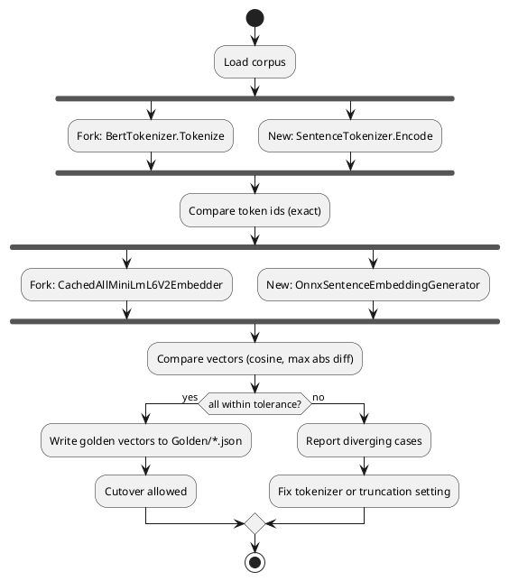

# AllMiniLmL6V2 — Testing Strategy

**Status:** Draft · 2026-10-07 · Epic: AI · Related: [README](README.md), [requirements](requirements.md), [api-design](api-design.md)

[← API design](api-design.md) · [↑ Index](README.md)

## Contents

- [Targets](#targets)
- [Compatibility (golden) suite](#compatibility-golden-suite)
- [Concurrency suite](#concurrency-suite)
- [Requirement-to-test map](#requirement-to-test-map)
- [Test data and configuration](#test-data-and-configuration)

## Targets

- Coverage of at least 80% for both new projects (Framework-layer rule applied to these adapters).
- The model-dependent tests use the real 90 MB `model.onnx`, so they carry `Simulate` (in-process, no external services) and run in CI when the model files are present. Pure logic tests use a fake session and carry `Unit`.
- Fork-comparison tests exist only until phase 5; afterwards the stored golden vectors remain.

## Compatibility (golden) suite

The corpus is a checked-in text file (one case per line, about 200 lines): English prose, short words, empty and whitespace, mixed case, accents (`café`, `naïve`), CJK, emoji, URLs, numbers, very long text that exceeds the sequence limit, repeated punctuation, and the fork's own unit-test sentences.

*Figure 1 — Compatibility check*

**Table 1 — Tolerances**

| Check | Tolerance | Reason |
|-------|-----------|--------|
| Token ids | Exact | Any difference changes the model input |
| Cosine similarity per sentence | at least 0.999 (expected at least 0.99999) | Same model and same ids differ only by float summation order |
| Max absolute element difference | at most 1e-4 (use `NumericAsserts.AreSimilar`) | Mean pooling order |
| Rank order of nearest neighbours over a 50-sentence set | identical top 3 | What retrieval actually depends on |
| Empty input | Intentional difference: new returns zeros of length 384, fork returns empty | Documented in [api design](api-design.md) |
| Inputs over the sequence limit | Compared with the fork configured with `truncate: true` at the same limit | Fork default does not truncate; recorded as a known divergence |

Golden vectors are produced once from the fork (a small console or test helper, committed with its seed corpus) and stored as JSON so the fork can be deleted. Reference vectors from the original Python `sentence-transformers` for ten sentences are added as a third source, to prove both implementations match the published model and not just each other.

## Concurrency suite

**Table 2 — Concurrency tests**

| Test | Method | Expectation |
|------|--------|-------------|
| Reproduce on the fork | 32 threads, 200 calls each, mixed lengths, one shared embedder; compare each result to the single-threaded vector | Documents the fork failure (if it reproduces); informational, not a gate |
| Parallel equality (new) | Same load against the new generator | Every result equals the single-threaded result within tolerance |
| Batch independence | Embed A alone, then A inside batches with long and short companions | Same vector (REQ-005) |
| Gate limit | `MaxConcurrentInferences = 2`, fake session counting concurrent entries | Never above 2 |
| Cancellation | Cancel while waiting for the gate and between batches | `OperationCanceledException`, gate released |
| Dispose | Dispose during idle; calls after dispose | `ObjectDisposedException`, no native crash |
| No sync-over-async | Analyzer or source check for `.Result`, `.Wait()` | None found |

## Requirement-to-test map

**Table 3 — Coverage of requirements**

| Requirement | Tests | Category |
|-------------|-------|----------|
| REQ-001 | Model file hash check against the submodule (SHA-512) | Unit |
| REQ-002 | `TokenIds_MatchFork_ForCorpus` | Simulate |
| REQ-003 | `Embeddings_MatchFork_ForCorpus`, `Embeddings_MatchPythonReference` | Simulate |
| REQ-004 | Parallel equality, gate limit | Simulate / Unit |
| REQ-005 | Batch independence | Simulate |
| REQ-006 | `Length_Is384_WithoutBlocking`, adapter maps content to vector | Unit |
| REQ-007 | Registration resolves keyed generator and provider; alias key resolves | Unit |
| REQ-008 | Options validation failures (missing folder, zero batch size) | Unit |
| REQ-009 | Cancellation tests | Unit |
| REQ-010 | Batch splitting and padding to longest row only | Unit |
| REQ-011 | `ActivityListener` and `MeterListener` observe one span and the metrics | Unit |
| REQ-012 | Cache middleware returns the cached vector on second call | Unit |
| REQ-014 | `dotnet list package` shows no `Microsoft.ML` or `libtorch`; CI build on Linux | Build check |
| REQ-016 | Coverage gate; readme present | Build check |

## Test data and configuration

- `TestContext.GetPropertyOrDefault("ALLMINILM_MODEL_PATH", "model")` locates the model folder; no raw environment variable reads.
- Golden files: `Golden/corpus.txt`, `Golden/fork-vectors.json`, `Golden/python-reference.json`.
- Mocks: a fake `IInferenceRunner` (internal seam in the generator) for batching, gate and cancellation tests so they need no model.
- Test method naming follows `Method_Scenario_Expected`.

[← API design](api-design.md) · [↑ Index](README.md)
