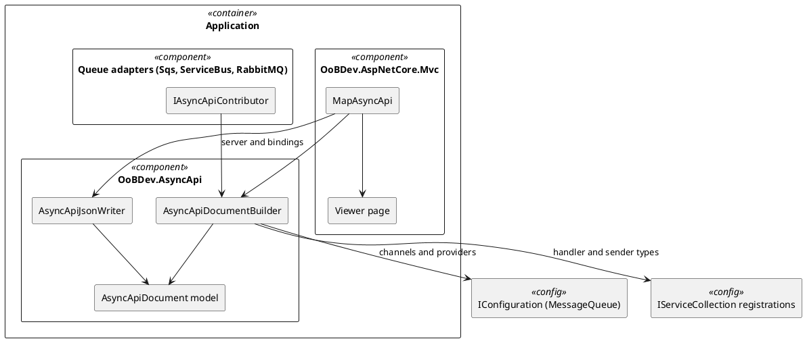
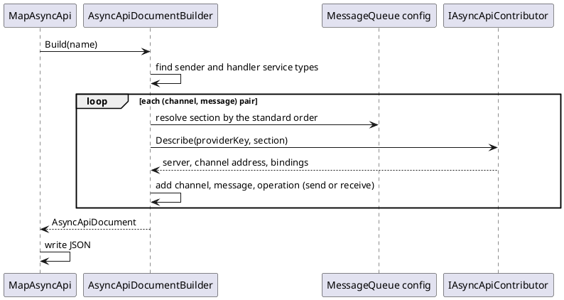

# AsyncApi — Architecture

[← Requirements](requirements.md) · [API design →](api-design.md)

## Contents

- [Components](#components)
- [Discovery flow](#discovery-flow)
- [Adapter contributions](#adapter-contributions)
- [Viewer](#viewer)

## Components

*Figure 1 — Components*

## Discovery flow

*Figure 2 — Building a document*

The builder takes the registered `IMessageQueueHandler` instances (receive channels) and reads the `MessageQueue` configuration for queues that no handler covers (send channels): `IMessageQueueSender<T>` is an open generic, so senders cannot be enumerated by type. It builds the document on each request from those inputs. Document names match OpenAPI: `all` plus one per assembly that registers handlers or senders, matched case-insensitively.

## Adapter contributions

**Table 1 — Providers**

| Provider key | Server | Channel address | Bindings |
|--------------|--------|-----------------|----------|
| `sqs` | host from `ServiceUrl` or the regional endpoint, protocol `sqs` | `QueueName` or the last segment of `QueueUrl` | `sqs` queue name; FIFO when the name ends `.fifo` (`MessageGroupId`) |
| `servicebus` | namespace host parsed from `ConnectionString` (endpoint only), protocol `amqp` | `QueueName` or `TopicName` | queue or topic; `SessionId` noted |
| `rabbit-mq` | `HostName`:`Port`, protocol `amqp` | `QueueName` | `amqp` queue |
| `in-process` | none (local) | message simple name | none |

Contributors live in the adapter projects, implement `IAsyncApiContributor` from `OoBDev.AsyncApi`, and are registered by each adapter's `TryAdd...` method with `TryAddEnumerable`. Adapters therefore reference only the small model project, and the Abstractions projects are untouched.

## Viewer

`/asyncapi/{name}` returns a small HTML page that loads the AsyncAPI web component from a pinned CDN version and points it at `/asyncapi/{name}.json`. The CDN URL is a setting so offline installs can serve the script locally.

[← Requirements](requirements.md) · [API design →](api-design.md)
