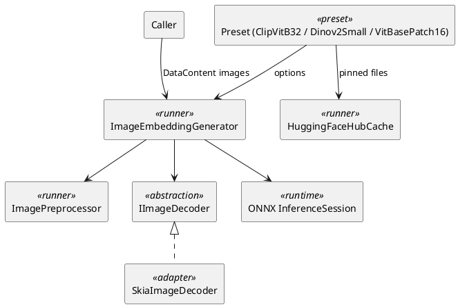

# ImageEmbeddings — Architecture

[← Requirements](requirements.md) · [API design →](api-design.md)

## Contents

- [Projects](#projects)
- [Components](#components)
- [Preprocessing](#preprocessing)
- [Alternatives considered](#alternatives-considered)

## Projects

**Table 1 — Projects**

| Project | Layer | Purpose |
|---------|-------|---------|
| `OoBDev.Onnx.ImageEmbeddings` | ExternalServices | Runner: preprocessing, session, pooling, classifier, `IImageDecoder`, options |
| `OoBDev.Onnx.ImageEmbeddings.Skia` | ExternalServices | Default `IImageDecoder` on SkiaSharp |
| `OoBDev.Vision.ClipVitB32` | ExternalServices | CLIP preset: image tower, text tower, zero-shot classifier |
| `OoBDev.Vision.Dinov2Small` | ExternalServices | DINOv2 preset: image similarity |
| `OoBDev.Vision.VitBasePatch16` | ExternalServices | ViT preset: ImageNet classifier |
| `OoBDev.Onnx.ImageEmbeddings.Tests` | Tests | Unit, conformance and comparison tests |

The CLIP text tower reuses `OoBDev.Onnx.SentenceEmbeddings` machinery only where it fits; CLIP uses a byte-pair tokenizer, so it gets its own small `ClipTokenizer` in the CLIP preset.

## Components

*Figure 1 — Components*

## Preprocessing

**Table 2 — Per-model preprocessing (from `preprocessor_config.json`)**

| Model | Resize | Crop | Mean | Std |
|-------|--------|------|------|-----|
| CLIP B/32 | shortest edge 224, bicubic | center 224 | 0.4815, 0.4578, 0.4082 | 0.2686, 0.2613, 0.2758 |
| DINOv2 small | shortest edge 256, bicubic | center 224 | 0.485, 0.456, 0.406 | 0.229, 0.224, 0.225 |
| ViT base | direct 224 by 224, bilinear | none | 0.5 | 0.5 |

Steps: decode to 8-bit RGB, resize, crop, scale by 1/255, subtract mean, divide by std, lay out as NCHW float. The resize is a separable convolution with filter support scaled by the reduction ratio (PIL behaviour), computed in 8-bit with rounding as PIL does.

## Alternatives considered

- **Resize with Skia:** rejected, it does not antialias like PIL and cosine falls short of 0.999 on photos with fine detail.
- **ImageSharp:** rejected on licence (paid commercial licence).
- **`Microsoft.ML` image transforms:** rejected, heavy and different resampling.

[API design →](api-design.md)
