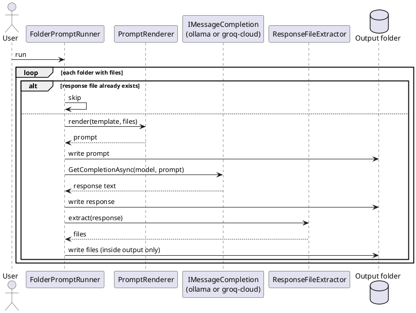

# LlmCodeGen — Architecture

[← Requirements](requirements.md) · [Overview](README.md) · [API design →](api-design.md)

## Components

**Table 2 — Reused and new pieces**

| Piece | Source | Role |
|-------|--------|------|
| `IMessageCompletion` | `OoBDev.AI.Abstractions` | Sends the prompt to a named model, returns the text |
| Ollama and Groq adapters | `OoBDev.Ollama`, `OoBDev.GroqCloud` | Register keyed `IMessageCompletion` (`ollama`, `groq-cloud`); the Ollama adapter gained an optional `ApiKey` |
| `PromptRenderer` | new, Handlebars.Net | Renders the prompt from the folder's files; resolves bundled template names |
| `FolderPromptRunner` | new | The loop: scan, render, ask, save, extract |
| `ResponseFileExtractor` | new | Pure parser from response text to `(relativePath, content)` pairs |
| Host and options | new | Generic host, `LlmCodeGenOptions` |

## Flow

*Figure 1 — one folder*

## Placement

A tool under `src/Tools/OoBDev.LlmCodeGen.Cli` with a `README.LlmCodeGen.Cli.md`, packed as a dotnet tool like the other `*.Cli` projects. The extractor and runner sit in the tool project because nothing else needs them; move them to a Framework library only if a second consumer appears.

[← Requirements](requirements.md) · [Overview](README.md) · [API design →](api-design.md)
