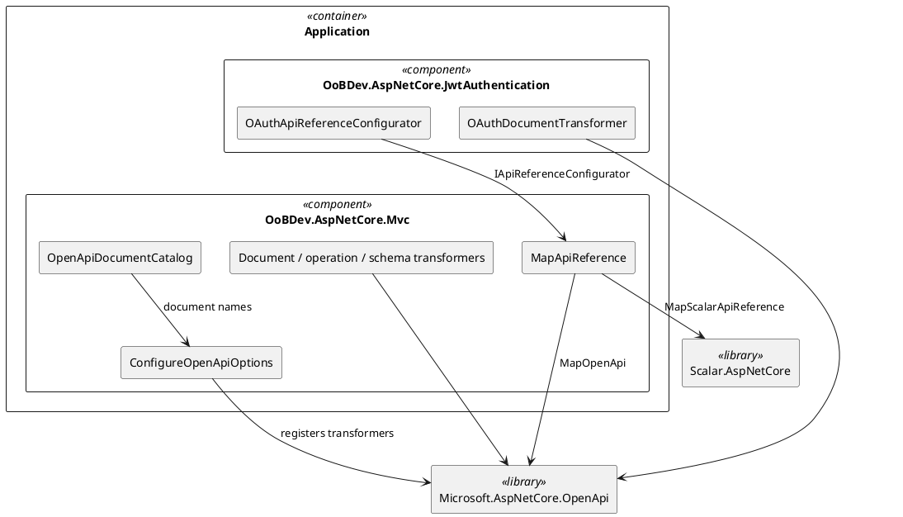

# OpenApiScalar — Architecture

[← Requirements](requirements.md) · [API design →](api-design.md)

## Contents

- [Components](#components)
- [Registration flow](#registration-flow)
- [Transformers](#transformers)
- [Phase 2 — AsyncAPI](#phase-2--asyncapi)
- [Behaviour changes](#behaviour-changes)

## Components

*Figure 1 — Components*

## Registration flow

`TryAddCommonOpenApiExtensions` discovers the assemblies that contain controllers, stores the names in `OpenApiDocumentCatalog`, registers `ConfigureOpenApiOptions` and calls `AddOpenApi(name)` for `all` and each assembly. `ApiNamespaceControllerModelConvention` sets each controller's API group to its assembly name and `ShouldInclude` keeps an operation when the document is `all` or the group matches (case-insensitive, because the framework passes the document name in lower case). `MapApiReference` maps the documents and the Scalar reference and lets every `IApiReferenceConfigurator` adjust the Scalar options.

## Transformers

**Table 1 — Replacements**

| Swashbuckle (removed) | Replacement |
|-----------------------|-------------|
| `ApplicationPermissionsApiFilter` | `ApplicationPermissionsOperationTransformer` |
| `HealthChecksDocumentFilter`, `HealthCheckSwaggerGenEndpointOptions` | `HealthChecksDocumentTransformer` |
| `AdditionalSwaggerGenEndpointsOptions` (title, version, XML docs) | `ApiInfoDocumentTransformer`, `XmlDocumentationOperationTransformer`, `XmlDocumentationSchemaTransformer`, `ConfigureOpenApiOptions` |
| `SearchQueryResultFilter` operation filter | `SearchQueryOperationTransformer`, `SearchQuerySchemaTransformer` |
| `FormFileOperationFilter` | Not needed; `IFormFile` is built in |
| `AddOperationFilterOptions<T>`, `AddSchemaFilterOptions<T>`, `AdditionalSwaggerUIEndpointsOptions` | Direct `AddOperationTransformer<T>` and `AddSchemaTransformer<T>` calls inside `ConfigureOpenApiOptions` |
| `ConfigureOAuthSwaggerGenOptions` | `OAuthDocumentTransformer` |
| `ConfigureOAuthSwaggerUIOptions` | `OAuthApiReferenceConfigurator` |
| `OAuth2SwaggerOptions` | `OAuth2OpenApiOptions` |

## Phase 2 — AsyncAPI

Designed in [AsyncApi](../AsyncApi/README.md); implementation not started. The plan:

- A small `OoBDev.AsyncApi` model (AsyncAPI 3: info, servers, channels, operations, messages) with a builder that the message queue adapters contribute to. Each adapter (SQS, Service Bus, RabbitMQ) describes its channels from configuration and the message types registered with the sender; nothing is added to the Abstractions projects.
- `/asyncapi/{name}.json` serves the document; a viewer page (the AsyncAPI web component) is served beside Scalar.
- Evaluate the `Saunter` and `LEGO.AsyncAPI` packages before writing a model by hand; the owner rule is to prefer Microsoft and first-party code, so a thin first-party model is the default if neither fits.
- Own design set (requirements, architecture, API, tests) before any code.

## Behaviour changes

**Table 2 — What callers will notice**

| Area | Before | After |
|------|--------|-------|
| URLs | `/swagger/{name}/swagger.json`, Swagger UI | `/openapi/{name}.json`, `/scalar/{name}` |
| Security flow | OAuth2 implicit | Authorization code with PKCE (Keycloak realm redirect URIs updated) |
| Config key | `OAuth2SwaggerOptions` | `OAuth2OpenApiOptions` |
| Documents | Registered by a Swagger options class | Registered at startup from the controller assemblies found |
| Search query schemas | `<Type>Filter` and `OrderBy` component schemas | Property descriptions on the `SearchQuery<T>` schema and `orderBy.<column>` string enums (`asc`, `desc`) |

[← Requirements](requirements.md) · [API design →](api-design.md)
