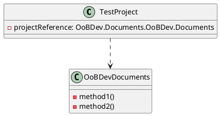
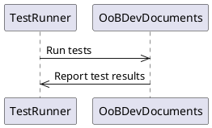

**OoBDev.Documents.Tests**
===============

**Introduction**

The OoBDev.Documents.Tests project is a test project for the OoBDev.Documents library, written in C# and targeting .NET 8.0. This project is used to test the functionality of the library and ensure that it is working as expected.

**Class Diagram**

**Properties**

The project has the following properties:

* `TargetFramework`: set to `net8.0`, indicating the target framework for the project.
* `ImplicitUsings`: set to `false`, indicating that implicit usings are disabled for the project.
* `Nullable`: set to `enable`, indicating that nullable references are enabled for the project.
* `IsPackable`: set to `false`, indicating that the project is not packable.
* `IsTestProject`: set to `true`, indicating that the project is a test project.

**Packages**

The project references the following packages:

* `coverlet.collector`: version 6.0.2, used for code coverage analysis.
* `Microsoft.NET.Test.Sdk`: version 17.10.0, used as the test framework.
* `MSTest.TestAdapter`: version 3.4.3, used as the test adapter.
* `MSTest.TestFramework`: version 3.4.3, used as the test framework.

**Project Reference**

The project references the `OoBDev.Documents` project, which is located in the `..\OoBDev.Documents` directory.

**Sequence Diagram**

In this sequence diagram, the `TestRunner` participant runs the tests against the `OoBDevDocuments` participant, which reports the test results back to the `TestRunner`.