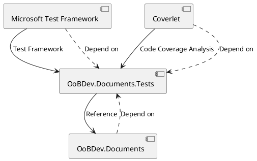

Here is a README file that summarizes the functionality and technical details of the provided source files:

**README**

This repository contains a C# project for testing OoBDev.Documents, a .NET library for document manipulation. The project is designed to test the functionality of OoBDev.Documents using the Microsoft Test Framework and Coverlet for code coverage analysis.

**Summary**

The project consists of a test project, OoBDev.Documents.Tests, which references the OoBDev.Documents library. The tests are written using the Microsoft Test Framework and cover various aspects of the library's functionality. The project uses Coverlet to collect code coverage data and report on the test results.

**Technical Summary**

The project uses the following design patterns and architectural patterns:

* **MVC (Model-View-Controller)**: The OoBDev.Documents library is designed as a .NET library, which can be used as a Model component in an MVC application. The tests can be seen as a View component, exercising the functionality of the library and verifying the expected results.
* **Dependency Injection**: The project references the OoBDev.Documents library, which can be seen as a dependency that needs to be injected into the test project.

**Component Diagram**

In this diagram, the OoBDev.Documents library is the central component, which is referenced by the OoBDev.Documents.Tests project. The tests project uses the Microsoft Test Framework and Coverlet to exercise the functionality of the library and collect code coverage data.