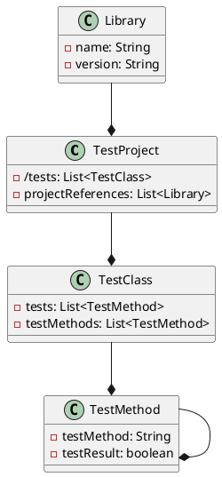

# OoBDev.Search.Tests Documentation

## Overview

The OoBDev.Search.Tests is a .NET Standard test project that provides integration and unit tests for the OoBDev.Search library.

### Class Diagram



## Files

### `OoBDev.Search.Tests.csproj`

This is the project file for the OoBDev.Search.Tests test project. It defines the project settings and references the necessary libraries and projects.

```md
**OoBDev.Search.Tests.csproj**

This file defines the project settings for the OoBDev.Search.Tests test project.

* `TargetFramework`: The target framework for the project is set to `net8.0`.
* `ImplicitUsings`: Implicit usings are disabled to ensure explicit usage of namespaces.
* `Nullable`: Nullable reference types are enabled to ensure type safety.
* `IsPackable`: The project is not packable, as it is a test project.
* `IsTestProject`: The project is marked as a test project.

The project also references the following packages:

* `Microsoft.NET.Test.Sdk`: The Microsoft.NET.Test.Sdk package provides the test runner.
* `MSTest.TestAdapter`: The MSTest.TestAdapter package provides the test adapter for running MSTests.
* `MSTest.TestFramework`: The MSTest.TestFramework package provides the test framework for writing tests.
* `coverlet.collector`: The coverlet.collector package provides the coverage collector for measuring test coverage.

The project also references the following projects:

* `OoBDev.Search`: The OoBDev.Search project provides the library being tested.
* `OoBDev.TestUtilities`: The OoBDev.TestUtilities project provides utility classes for testing.

```