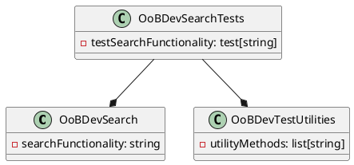

**README.md**

**Summary**

The provided files are part of a .NET 8.0 project for testing search functionality. The project contains a test project (`OoBDev.Search.Tests.csproj`) that uses MSTest as the testing framework. The project references two other projects: `OoBDev.Search` and `OoBDev.TestUtilities`. The purpose of this project is to test the search functionality and provide coverage reports using Coverlet.

**Technical Summary**

The design pattern used in this project is the Test-Driven Development (TDD) approach, where tests are written before the implementation of the search functionality. The project utilizes the Model-View-Controller (MVC) architectural pattern, with the test project being responsible for testing the business logic of the search functionality.

**Component Diagram**

The component diagram shows the relationships between the classes in the project:

* `OoBDevSearch` contains the search functionality and is responsible for executing the search.
* `OoBDevTestUtilities` contains utility methods for testing and is used by the test project.
* `OoBDevSearchTests` is the test project that tests the search functionality using the TDD approach. It references `OoBDevSearch` and `OoBDevTestUtilities` to perform the tests.

The arrows indicate the relationships between the classes: `OoBDevSearchTests` uses `OoBDevSearch` and `OoBDevTestUtilities` to perform the tests, and `OoBDevSearch` uses `OoBDevSearch.searchFunctionality` to execute the search.