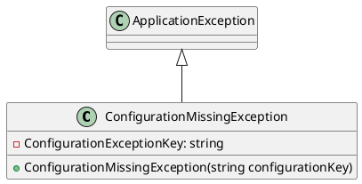
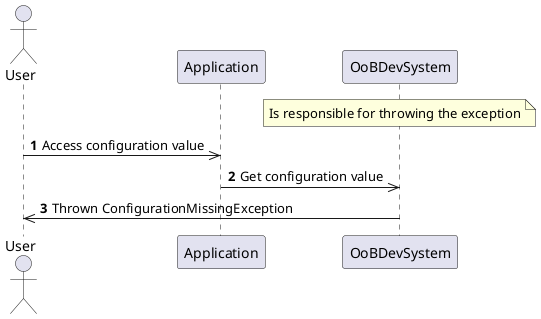

**OoBDev System Abstractions Documentation**
=====================================

**Overview**
-----------

The OoBDev System Abstractions library provides a set of interface contracts and models that serve as the foundation for the OoBDev Common Framework. This documentation provides an overview of the library's structure, classes, and exceptions.

**Classes**
---------

### `ConfigurationMissingException`

```cs
public class ConfigurationMissingException : ApplicationException
```

This exception is thrown when a required configuration is missing. It is typically thrown when attempting to access a configuration value that is not present.

* **Constructor**: Initializes a new instance of the `ConfigurationMissingException` class with the specified configuration key.
* **Message**: The exception message is set to indicate the missing configuration key.

### Diagrams
---------

#### Class Diagram



#### Component Model

```plantuml
@startuml
component ConfigurationMissingException
queue in Exception queue out
queue in ApplicationException queue out
message ConfigurationMissingException(string configurationKey)
@enduml
```

### Sequence Diagram



**Project File**
----------------

### `OoBDev.System.Abstractions.csproj`

This project file is the configuration file for the OoBDev System Abstractions library. It defines the project's target framework, implicit usings, and other settings.

* **Target Framework**: .NET 8.0
* **Explicitly Enabled Features**: Generate documentation file, Generate assembly information, and Package Readme File

**README File**
--------------

### `Readme.System.Abstractions.md`

This README file provides a summary of the OoBDev System Abstractions library.

* **Summary**: This library is the core collection of interface contracts and models to support the OoBDev Common Framework.

**Abstractions Library**
------------------------

The OoBDev System Abstractions library provides a set of abstract classes and interfaces that define the core contracts for the OoBDev Common Framework. This library is responsible for defining the fundamental concepts and behaviors that are shared across multiple components and subsystems.

Overall, the OoBDev System Abstractions library provides a solid foundation for building robust and scalable software systems using the OoBDev Common Framework.