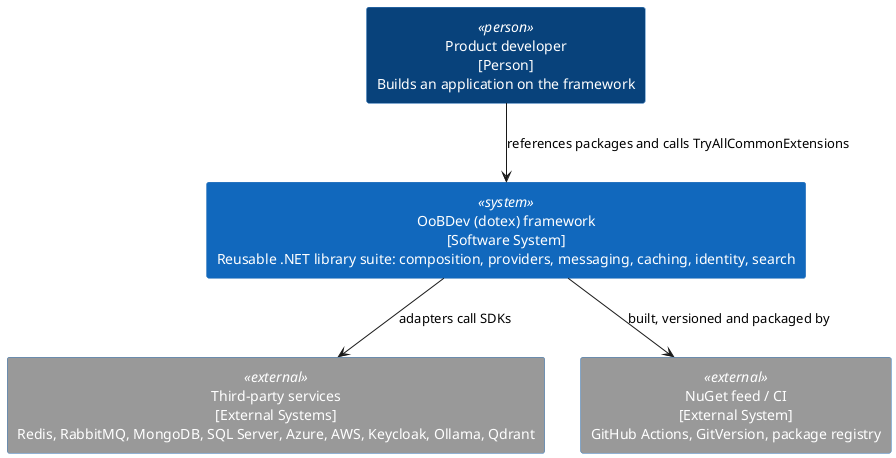
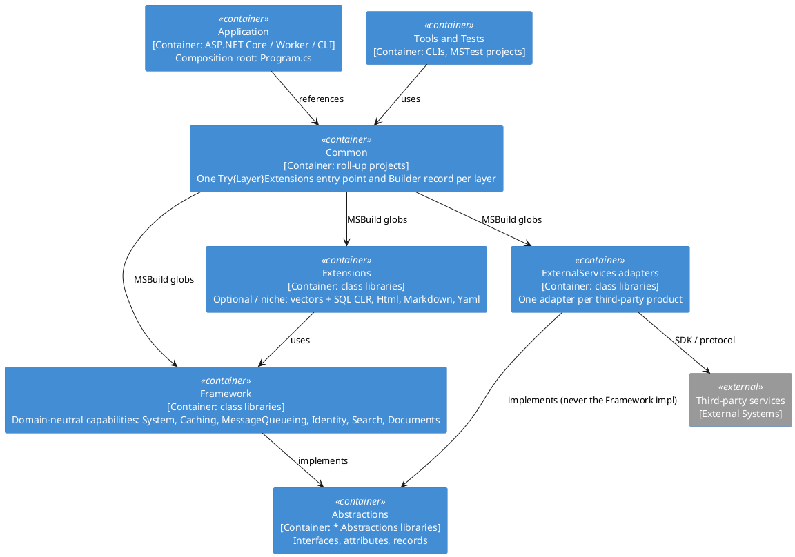

# Architecture § 1 — The Shape in One Page

<!-- nav -->
[↑ 01 — Architecture: How the Solution Is Put Together](./README.md) · [← Index](./README.md) · [Architecture § 2 — The Five Source Layers →](./02-five-source-layers.md)
<!-- nav -->

C4 style, drawn with plain PlantUML (rectangles + stereotypes, no `!include` of the C4 library).

*Figure 1 — System context (C4 level 1)*

*Figure 2 — Container view of the solution layers (C4 level 2)*

**Scale (measured):** 123 `.csproj`, ≈1,060 `.cs` files, 42 test projects, 120 projects on `net10.0`
(2 × `netstandard2.1` and 1 × `net48` exist only for the SQL CLR / DacFx vector work).

---

<!-- nav -->
[↑ 01 — Architecture: How the Solution Is Put Together](./README.md) · [← Index](./README.md) · [Architecture § 2 — The Five Source Layers →](./02-five-source-layers.md)
<!-- nav -->
