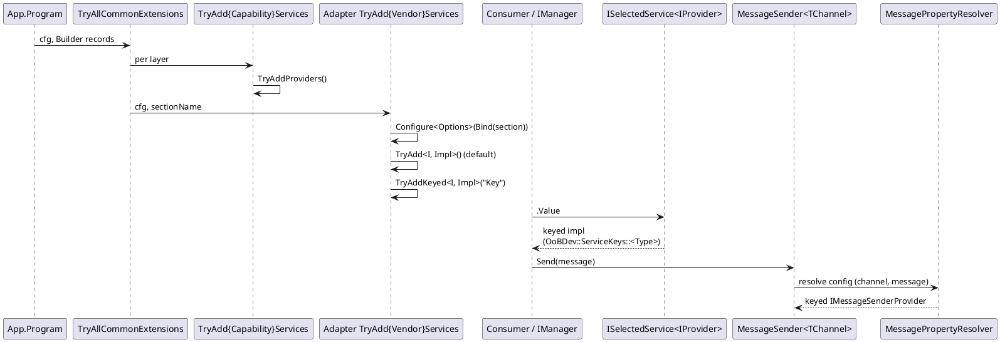

# Pattern Interaction Cheat-Sheet

<!-- nav -->
[↑ 02 — Design Patterns (As Practiced in the Code)](./README.md) · [← Index](./README.md) · [Pattern 1 — Abstractions + Implementation + Registration Extension →](./01-abstractions-implementation-registration.md)
<!-- nav -->

*Figure 1 — Pattern interaction (registration and runtime resolution)*

---

<!-- nav -->
[↑ 02 — Design Patterns (As Practiced in the Code)](./README.md) · [← Index](./README.md) · [Pattern 1 — Abstractions + Implementation + Registration Extension →](./01-abstractions-implementation-registration.md)
<!-- nav -->
