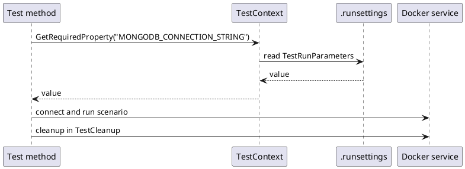

# Testing Practices

<!-- nav -->
[↑ 03 — Practices and Conventions](./README.md) · [← Documentation Practices](./03-documentation-practices.md) · [Logging, Errors and Configuration →](./05-logging-errors-and-configuration.md)
<!-- nav -->

## Stack

MSTest 4 (`MSTest.TestAdapter` and `MSTest.TestFramework`), `Microsoft.NET.Test.Sdk`, `coverlet.collector`, Moq in **strict** mode, and `OoBDev.TestUtilities` for shared helpers. Parallelization is class-level with automatic worker count (`TestAssemblyInfo.cs`).

## Categories

**Table 5 — Test categories**

| Category | Runs in CI | Dependencies | Purpose |
|----------|-----------|--------------|---------|
| `Unit` | every push / PR | mocked | pure logic, fast |
| `Simulate` | every push / PR | in-memory | end-to-end with fake persistence |
| `Integration` | `integration-tests.yml` (daily 16:00 UTC is planned; the cron line is currently commented out) | Docker containers | MongoDB, SQL Server, RabbitMQ, Redis and others |
| `DevLocal` | never | local services | manual or performance |
| `LiveIntegration` | never | live cloud | Azure, AWS, GCP, Groq |

Always tag with `[TestCategory(TestCategories.X)]`.

## Structure

```csharp
[TestMethod]
public void MethodName_Scenario_ExpectedBehavior()
{
    // Stage (arrange)
    // Mock (if needed)
    // Test (act)
    // Assert
    // Verify (if using mocks)
}
```

- Floating-point comparisons use `NumericAsserts.AreSimilar(expected, actual[, tolerance])`.
- The test project mirrors the folders of the project under test; `InternalsVisibleTo` gives access to internals.

## Configuration

Test settings come from `.runsettings` through `TestContext`, never `Environment.GetEnvironmentVariable`:

```csharp
var cs   = TestContext.GetRequiredProperty<string>("MONGODB_CONNECTION_STRING");
var port = TestContext.GetPropertyOrDefault("MONGODB_PORT", 27017);
```

`OoBDev.TestUtilities` also exposes the `TestContext` as an `IConfiguration` provider, so the same option binding used in production works in tests (hierarchical keys with `:` or `__`). Use unique resource names per run (`$"IntegrationTest_{Guid.NewGuid():N}"`) and clean up in `[TestCleanup]`.

## Docker integration stack

`containers/testing` runs 15 services through compose (`integration-up` and `integration-down` scripts, `--wait`, `--build`, `--clean`). Health checks use bash TCP probes (`</dev/tcp/HOST/PORT`) so no image needs curl. Adding a service follows the integration-test-maintenance protocol (compose service, nginx routing, dashboard, `.runsettings`, docs).

*Figure 1 — how a test resolves configuration*



## Coverage

Framework layer targets 80 percent line coverage (design epics plan 85 to 90 percent). CI collects `XPlat Code Coverage`.

---

<!-- nav -->
[↑ 03 — Practices and Conventions](./README.md) · [← Documentation Practices](./03-documentation-practices.md) · [Logging, Errors and Configuration →](./05-logging-errors-and-configuration.md)
<!-- nav -->
