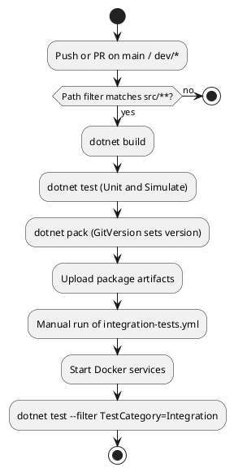

# CI/CD and Versioning

<!-- nav -->
[↑ 03 — Practices and Conventions](./README.md) · [← Logging, Errors and Configuration](./05-logging-errors-and-configuration.md) · [Known Warts (Decide Before Copying) →](./07-known-warts.md)
<!-- nav -->

## Workflows (`.github/workflows/`)

**Table 7 — Workflows**

| Workflow | Trigger | Purpose |
|----------|---------|---------|
| `dotnet.yml` | push and pull request on `main` and `dev/*` when `src/**` code, project, props, targets, `.runsettings`, `GitVersion.yml` or the workflow changes; manual dispatch | checkout (LFS submodules), .NET 10 SDK, GitVersion, restore, build, `Unit` and `Simulate` tests, publish results, `dotnet pack`, upload packages as artifacts for 90 days, tag the build |
| `integration-tests.yml` | manual (a daily 16:00 UTC cron exists but is commented out) | Docker-based `--filter "TestCategory=Integration"` tests |
| `release.yml`, `scheduled-release.yml`, `deploy-release.yml` | manual and schedule | version, publish and deploy packages |

The build workflow accepts `build-configuration` (Release or Debug) and `build-platform` (Windows, Linux, macOS) inputs, and turns off the MSBuild terminal logger.

## Versioning

`GitVersion.MsBuild` runs in every project (including tests) and derives the version from git history. The configuration file is `GitVersion.yml` at the **repository root** (older docs say `src/`; see [Doc/Code Drift](../README.md)).

## Packaging

Every non-test project produces a NuGet package on build (`GeneratePackageOnBuild`), with the project readme and license inside. The workflow packs into the runner temp `Packages` folder and uploads `packages-{FullSemVerLower}` as an artifact for the release workflows.

*Figure 2 — pipeline from commit to package*

---

<!-- nav -->
[↑ 03 — Practices and Conventions](./README.md) · [← Logging, Errors and Configuration](./05-logging-errors-and-configuration.md) · [Known Warts (Decide Before Copying) →](./07-known-warts.md)
<!-- nav -->
