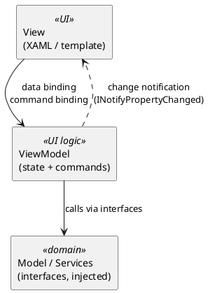

# UI Practices (MVVM and Command Binding)

<!-- nav -->
[↑ 03 — Practices and Conventions](./README.md) · [← Known Warts (Decide Before Copying)](./07-known-warts.md) · [Authentication Practices (OAuth, OIDC, JWT and Token Exchange) →](./09-authentication-practices.md)
<!-- nav -->

The current solution contains no UI projects (Windows Forms components are a planned migration from BinaryDataDecoders). This page records the author's standing preference so new UI work follows it. It is a preference carried forward, not a description of existing code.

## Rule

**Use MVVM with command binding wherever the UI technology allows it** (for example WPF). When a JavaScript or TypeScript framework is required, **prefer the framework that supports the same model most closely**, and note where it diverges.

## What MVVM means here

*Figure 3 — MVVM roles and the direction of dependencies*

**Table 9 — MVVM rules**

| Rule | Detail |
|------|--------|
| View has no logic | No business or state logic in code-behind; only view-specific concerns such as focus and animation |
| State is exposed as properties | View models raise change notification; the view binds to them |
| Actions are commands | User actions bind to `ICommand` (with `CanExecute`) instead of click handlers |
| Commands are real, retestable types | A command is a named class (for example `SaveDocumentCommand : ICommand`) with injected dependencies, unit-tested on its own (`CanExecute`, `Execute`, change notification). A bare relay/delegate command wrapping a lambda is not enough: the logic is anonymous, hard to reuse, and can only be tested through the view model |
| ViewModels do not know the view | No references to controls or windows; navigation and dialogs go through injected interfaces |
| Dependencies by interface | View models receive services through constructor injection, matching the rest of the framework ([architectural principles](../01-architecture/10-architectural-principles.md)) |
| Testable without a UI | View models are unit-tested as plain classes ([testing practices](./04-testing-practices.md)) |
| Mockups in PlantUML Salt | UI mockups follow the [design document standard](../06-design-document-standard.md) |

## Choosing a JS or TypeScript framework

Fit is judged on how close the framework gets to view-model binding plus command-style handlers. The comparison and verdict are in [UI patterns](../05-industry-alternatives/08-ui.md).

---

<!-- nav -->
[↑ 03 — Practices and Conventions](./README.md) · [← Known Warts (Decide Before Copying)](./07-known-warts.md) · [Authentication Practices (OAuth, OIDC, JWT and Token Exchange) →](./09-authentication-practices.md)
<!-- nav -->
