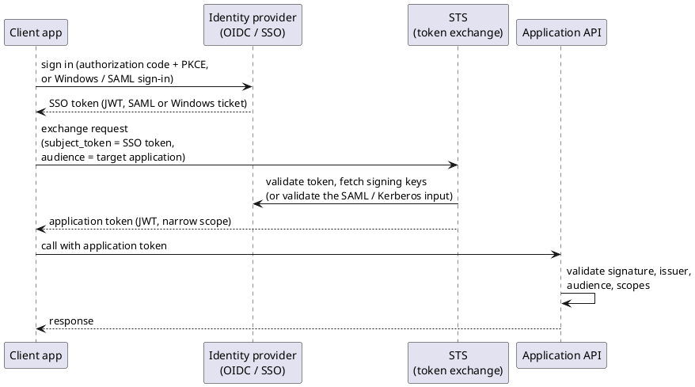

# Authentication Practices (OAuth, OIDC, JWT and Token Exchange)

<!-- nav -->
[↑ 03 — Practices and Conventions](./README.md) · [← UI Practices (MVVM and Command Binding)](./08-ui-practices.md) · [Index →](./README.md)
<!-- nav -->

This page records the author's standing preference for authentication so new products follow it. Existing pieces are `OoBDev.AspNetCore.JwtAuthentication` (JWT bearer and Swagger OAuth), `OoBDev.Identity` and the Keycloak test container; a token exchange service does not exist yet and is tracked in [`TODO.md`](../../../TODO.md).

## Rules

**Use OAuth 2.0, OpenID Connect and JWT bearer tokens wherever possible.** Where an application needs its own token, **support a security token service (STS) that performs token exchange** (RFC 8693) to convert the single sign-on (SSO) token into an application-specific token.

**Table 10 — Authentication rules**

| Rule | Detail |
|------|--------|
| Standards first | OpenID Connect for sign-in, OAuth 2.0 for authorization, JWT bearer for API calls; no custom login schemes |
| Identity provider is external | Users sign in at an identity provider (Keycloak, Azure AD or B2C, and similar); applications never store passwords |
| Applications validate, they do not issue SSO tokens | APIs validate signature, issuer, audience, lifetime and scopes with configuration-driven settings ([composition root](../01-architecture/05-composition-root.md)) |
| Services only understand JWT | A service needs to know exactly one thing: how to validate a JWT. Any other credential (Windows/Kerberos, SAML, basic auth, API keys, HMAC-signed requests, legacy bearer tokens) is converted to a JWT by the STS or an edge adapter in front of it. Services never contain per-scheme authentication code |
| Windows is no exception | Windows-integrated sign-in (Kerberos/NTLM) and SAML assertions are treated as SSO inputs: the STS accepts the Windows or SAML token and exchanges it for a JWT, so everything behind the STS speaks JWT only. Applications do not take a dependency on Windows authentication or SAML |
| Exchange, do not forward | An SSO token is not passed through to downstream services; the STS exchanges it for a token scoped to the target application |
| Token exchange when required | The exchange is optional per product: enabled by configuration, off when the SSO token is acceptable as is |
| Multiple clients per service set | One set of services accepts several client ids and audiences; validation and exchange are per client, not hard-coded |
| Narrow, short-lived tokens | Application tokens carry only the claims and scopes the application needs and expire quickly; refresh goes back through the STS |
| Claims map through one place | External claims are mapped to application claims by an injected mapper, never read ad hoc in controllers |
| Everything by interface | The STS client, token validator and claims mapper are injected interfaces so they can be faked in tests ([testing practices](./04-testing-practices.md)) |

## Non-token credentials

Callers that cannot obtain a JWT themselves (legacy clients, webhooks, device or partner integrations that sign with HMAC, simple API keys) authenticate to the STS, or to a thin adapter that fronts it, using the scheme they support. The STS verifies that credential and issues a JWT for the target service. The conversion logic lives in one place, is unit-tested there, and services stay unchanged when a new credential type is added.

## Token exchange flow

*Figure 4 — exchanging an SSO token for an application token*

The comparison with other approaches (pass-through tokens, API gateway, on-behalf-of flows) is in [Authentication approaches](../05-industry-alternatives/09-authentication.md).

---

<!-- nav -->
[↑ 03 — Practices and Conventions](./README.md) · [← UI Practices (MVVM and Command Binding)](./08-ui-practices.md) · [Index →](./README.md)
<!-- nav -->
