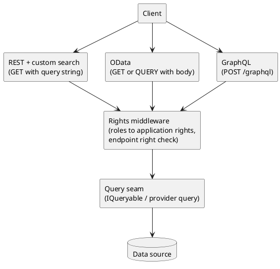

# HTTP API Practices (REST, Querying and GraphQL)

<!-- nav -->
[↑ 03 — Practices and Conventions](./README.md) · [← Authentication Practices (OAuth, OIDC, JWT and Token Exchange)](./09-authentication-practices.md) · [Authorization Practices (RBAC and Application Rights) →](./11-authorization-practices.md)
<!-- nav -->

This page records the author's preferences for HTTP APIs so new services follow them. The existing pieces are `OoBDev.AspNetCore.Mvc` (search query middleware, filters, OpenAPI and Swagger helpers) and `OoBDev.AspNetCore.Abstractions`. The query direction (OData over the HTTP QUERY verb, GraphQL) is still being evaluated and is tracked in [`TODO.md`](../../../TODO.md).

## Rules

**Prefer RESTful resource APIs wherever possible.** Resources are nouns, HTTP verbs carry the intent, status codes carry the outcome, and the OpenAPI document is the contract.

**Table 11 — HTTP API rules**

| Rule | Detail |
|------|--------|
| REST first | Resource-oriented URLs, standard verbs (`GET`, `POST`, `PUT`, `PATCH`, `DELETE`), standard status codes; no RPC-style verbs in paths unless the operation is not a resource |
| OpenAPI is the contract | Every API publishes an OpenAPI document generated from the code ([pattern 20](../02-design-patterns/20-configure-options-classes.md)); clients are generated from it |
| Errors are problem details | Failures return RFC 9457 `application/problem+json`, produced by middleware, published automatically in OpenAPI and transparent to the developer; no general response envelope on the HTTP surface |
| Auth is JWT bearer | See [authentication practices](./09-authentication-practices.md); endpoints declare application rights, see [authorization practices](./11-authorization-practices.md) |
| Queries are a separate concern | Filtering, sorting, paging and projection are handled by an injected query layer, not hand-written per controller |
| Query with a body uses `QUERY` | Where a query is too large or too structured for a URL, prefer the HTTP `QUERY` verb (safe and idempotent, with a body) over `POST` |
| OData is the query language candidate | Standard query options (`$filter`, `$orderby`, `$top`, `$skip`, `$select`, `$count`) instead of the custom search syntax, if the evaluation confirms it (see below) |
| GraphQL is an optional second surface | Offered where clients need flexible shapes across related data; it sits beside REST rather than replacing it |
| Same rights everywhere | REST, OData and GraphQL all enforce the same application rights through the same middleware |
| One endpoint, many surfaces | An `IQueryable<T>` endpoint is written once; a content header or URL convention selects the custom syntax, OData or GraphQL |
| Everything by interface | Query translators, schema builders and resolvers are injected interfaces so they can be faked in tests ([testing practices](./04-testing-practices.md)) |

## Where querying stands today

`OoBDev.AspNetCore.Mvc` has a custom search query syntax: `SearchQueryMiddleware` builds an `ISearchQuery` from the request (query string, JSON or form, see `RequestType`), and filters let a controller action return `IQueryable<T>` and have the result filtered, sorted and paged. It works and is tested, but it is a private dialect that clients, tools and generated SDKs do not know.

Its limit is that search, filter, sort and page work only at entity level, not on nested collections or related entities. The owner wants OData or GraphQL available on **every `IQueryable<T>` endpoint**, selected by a content header or a URL convention, so an endpoint is written once and the caller chooses the surface.

The intended direction is to keep that behaviour available while offering standard alternatives behind the same seam. All three surfaces translate to `IQueryable<T>` (or to a provider query) and pass through the same authorization.

*Figure 5 — one rights check and one query seam behind three API surfaces*

## Open questions (analysis before a decision)

The evaluation covers these points and ends in an ADR ([alternatives: HTTP API and querying](../05-industry-alternatives/10-http-api.md)).

- The `QUERY` verb is a recent IETF specification; confirm current status, ASP.NET Core routing support, proxy and gateway pass-through, and OpenAPI representation before relying on it. Provide a `POST` fallback.
- OData in .NET has changed considerably between versions; evaluate the current library for `$filter` safety (cost limits, allowed properties) and for AOT and trimming.
- GraphQL needs cost and depth limits and per-field authorization; evaluate HotChocolate and its rights integration.

---

<!-- nav -->
[↑ 03 — Practices and Conventions](./README.md) · [← Authentication Practices (OAuth, OIDC, JWT and Token Exchange)](./09-authentication-practices.md) · [Authorization Practices (RBAC and Application Rights) →](./11-authorization-practices.md)
<!-- nav -->
