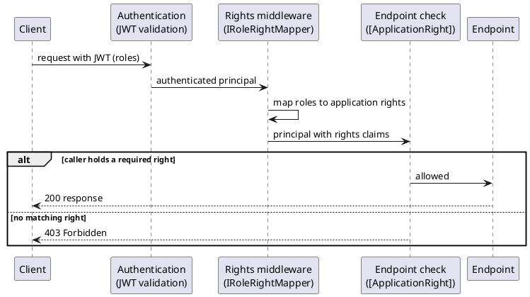

# Authorization Practices (RBAC and Application Rights)

<!-- nav -->
[↑ 03 — Practices and Conventions](./README.md) · [← HTTP API Practices (REST, Querying and GraphQL)](./10-http-api-practices.md) · [Security Practices (Beyond Authentication) →](./12-security-practices.md)
<!-- nav -->

This page records the author's preference for authorization. Authentication ([previous page](./09-authentication-practices.md)) answers who the caller is; this page covers what the caller may do. Existing pieces: `[ApplicationRight]` (`ApplicationRightAttribute` and `ApplicationRightRequirementFilter` in `OoBDev.AspNetCore.Abstractions`), `UserAuthorizationHandler` and the permissions OpenAPI extension in `OoBDev.AspNetCore.Mvc`. The role-to-right translation and the claims-exchange variant are backlog items in [`TODO.md`](../../../TODO.md).

## Rules

**Use role-based access control (RBAC) with application rights.** Users hold roles that come from the identity provider. Applications define their own rights. Each endpoint declares the rights it needs, and a translation from user roles to application rights happens in middleware.

**Table 12 — Authorization rules**

| Rule | Detail |
|------|--------|
| Rights are the application vocabulary | An application defines rights such as `orders.read` and `orders.approve`; the code never checks for role names |
| Endpoints declare rights | Each endpoint states the rights it accepts (today `[ApplicationRight("orders.read")]`, meaning at least one listed right is required); an endpoint with no declaration is a review finding |
| Roles map to rights in one place | Middleware translates the caller's roles (from the JWT) into application rights through an injected mapper; the mapping is configuration or data, not code scattered across controllers |
| Roles belong to the identity provider | Role assignment is administered outside the application; the application owns only the role-to-right mapping |
| Claims exchange is an alternative | Rights may instead be added to the application token at the [STS](./09-authentication-practices.md) during token exchange, provided token size stays small (see below) |
| Guard against token bloat | Tokens carry roles or a compact set of right identifiers, never a long list of rights; if the list grows, translate in middleware instead |
| Deny by default | A missing right, an unauthenticated caller or an unmapped role yields `403` (or `401` when unauthenticated), never access |
| Same rights on every surface | REST, OData and GraphQL share the mapper and the checks ([HTTP API practices](./10-http-api-practices.md)) |
| Everything by interface | The role-to-right mapper, the rights provider and the endpoint check are injected interfaces so they can be faked in tests |
| Rights are discoverable | Required rights are published in the OpenAPI document (the permissions extension does this today) so clients and reviewers can see them |

## Two ways to get rights onto the request

**Middleware translation (preferred default).** The token carries roles. Middleware maps them to application rights, adds the result to the request principal, and the endpoint check runs against those rights. The token stays small, the mapping can change without reissuing tokens, and rights are per application.

**Claims exchange at the STS.** The STS maps roles to rights when it exchanges the SSO token for the application token, so the rights arrive as claims. This removes the mapping from the application but grows the token and freezes rights until the token expires. Use it when the rights list is short and stable, and fall back to middleware translation when it is not.

*Figure 6 — role-to-right translation in middleware*

## Token size guidance

Treat roughly a few dozen short claims as the upper bound for a bearer token; headers over about 8 KB are rejected by many servers and proxies. Prefer role names or coarse right groups in tokens, and expand them to fine-grained rights in middleware.

---

<!-- nav -->
[↑ 03 — Practices and Conventions](./README.md) · [← HTTP API Practices (REST, Querying and GraphQL)](./10-http-api-practices.md) · [Security Practices (Beyond Authentication) →](./12-security-practices.md)
<!-- nav -->
