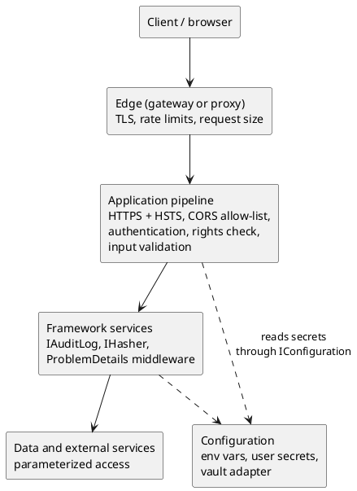

# Security Practices (Beyond Authentication)

<!-- nav -->
[↑ 03 — Practices and Conventions](./README.md) · [← Authorization Practices (RBAC and Application Rights)](./11-authorization-practices.md) · [Observability Practices (Metrics, Tracing and Health Checks) →](./13-observability-practices.md)
<!-- nav -->

Authentication ([page 9](./09-authentication-practices.md)) and authorization ([page 11](./11-authorization-practices.md)) are covered separately. This page collects the remaining security rules: secrets, input handling, transport, browser access, abuse control, auditing and the supply chain. Most of these are **not yet implemented as shared framework code**: a search of `src` found `UseHttpsRedirection` in the example web API and health check plumbing, but no shared CORS, rate limiting, secret store or audit code. The rules below are therefore the target, and the gaps are tracked in [`TODO.md`](../../../TODO.md).

## Rules

**Table 13 — Security rules**

| Rule | Detail |
|------|--------|
| No secrets in source or in committed configuration | Connection strings, keys and client secrets come from environment variables, user secrets in development, or a secret store in production, all read through `IConfiguration` |
| Secret stores are adapters | A vault (for example Azure Key Vault) is an `ExternalServices` adapter that plugs into `IConfiguration`; framework code never references a vault SDK |
| Services validate tokens and store no passwords | Restated from [authentication](./09-authentication-practices.md); password hashing is only needed by an STS or a legacy adapter |
| Default hash is SHA-512 | Use it for integrity and fingerprints; passwords need a slow, salted derivation function (never a plain hash), and only inside the STS |
| Validate at the boundary | Every request model is validated on entry (data annotations or a validator injected by interface); failures return `ProblemDetails` with `400` or `422` |
| Encode on output | Encode for the context (HTML, URL, JSON, SQL parameter); never build SQL or HTML by concatenating input; data access is parameterized |
| Cap request size and shape | Maximum body size, page size, query depth and upload size are options with safe defaults, applied on every surface ([HTTP API](./10-http-api-practices.md)) |
| Transport is HTTPS only | HTTPS redirection and HSTS in production; TLS terminates at the edge or the service, never plain HTTP between trust zones |
| CORS is an allow-list | Origins, methods and headers come from configuration; the default is deny; a wildcard origin is never combined with credentials |
| Rate limit at the edge first | The gateway or reverse proxy limits abusive callers; applications add the built-in ASP.NET Core rate limiter for per-endpoint or per-user limits, configured through options |
| Audit security-relevant events | Sign-in, denied access (`403`), rights changes, secret access and administrative actions are logged as structured events with the user, the action and the correlation identifier, never the secret or token |
| Never log sensitive data | Tokens, passwords, keys and personal data stay out of logs; the `#if DEBUG` PII switch stays a development-only convenience |
| Errors reveal nothing internal | `ProblemDetails` carries a correlation identifier, not stack traces or connection details |
| Dependencies are inventoried and patched | An SBOM is generated per build (the repository already keeps SBOM output under `docs/sbom`), vulnerable packages fail or warn the build, and central package management keeps versions in one place |
| Everything by interface | Secret readers, hashers, auditors and limiters are injected so tests can fake them |

## How the layers fit

*Figure 7 — security controls from client to secret store*

## Secrets and keys

Secrets flow only through `IConfiguration`, which already layers files, environment variables and user secrets. In production a vault adapter adds another configuration source. Options that hold secrets are bound with the [validated options](./05-logging-errors-and-configuration.md) pattern so a missing secret fails at startup. Test secrets come from `.runsettings` variables through `TestContext`, and live-service credentials from the git-ignored `.env.liveintegration` file once it exists (backlog item).

## Input handling

Validation happens once at the API boundary, before any business code runs, and again in the domain where an invariant matters. Data access uses parameters or the query provider, never string building. The custom search syntax and future OData or GraphQL surfaces need an allow-list of filterable and sortable properties so a caller cannot query arbitrary columns.

## Abuse control and auditing

Rate limiting and request size limits protect availability; auditing supports investigation. Audit events use the same structured `[LoggerMessage]` logging as everything else ([logging](./05-logging-errors-and-configuration.md)), with a dedicated category so they can be routed to a separate sink. Security events are also emitted as telemetry once the [observability](./13-observability-practices.md) page's OpenTelemetry decision is implemented.

## Supply chain

Build and package hygiene: central package management, a committed lock or pinned versions, SBOM output, and a review of new dependencies against the owner's rejected list in [`CLAUDE.md`](../../../CLAUDE.md) (third-party DI and logging, Polly). Vulnerability scanning belongs in the [CI workflow](./06-cicd-and-versioning.md).

---

<!-- nav -->
[↑ 03 — Practices and Conventions](./README.md) · [← Authorization Practices (RBAC and Application Rights)](./11-authorization-practices.md) · [Observability Practices (Metrics, Tracing and Health Checks) →](./13-observability-practices.md)
<!-- nav -->
