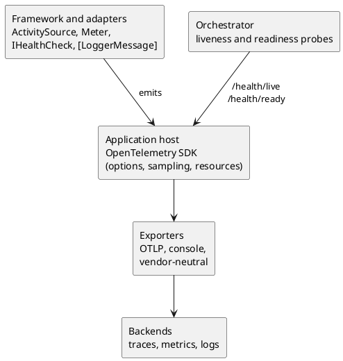

# Observability Practices (Metrics, Tracing and Health Checks)

<!-- nav -->
[↑ 03 — Practices and Conventions](./README.md) · [← Security Practices (Beyond Authentication)](./12-security-practices.md) · [Resilience Practices (Retries, Timeouts and Idempotency) →](./14-resilience-practices.md)
<!-- nav -->

Logging is covered in [page 5](./05-logging-errors-and-configuration.md). This page covers the other signals: health checks, metrics and distributed traces. Current state, from a search of `src`: health checks exist for Apache Tika, Groq Cloud, MailKit (IMAP and SMTP), Ollama and SBert, and `HealthCheckOptionsFactory` shapes the endpoint output. No `ActivitySource` or `Meter` code exists yet. The owner decision is to **add OpenTelemetry** (see [alternatives](../05-industry-alternatives/13-observability.md)).

## Rules

**Table 14 — Observability rules**

| Rule | Detail |
|------|--------|
| One health check per external dependency | Each adapter ships its own `IHealthCheck` and a registration extension (the existing Tika, Ollama and SBert checks are the model); the framework never checks a vendor it does not reference |
| Separate liveness from readiness | Liveness says the process runs and touches no dependency; readiness runs the dependency checks; orchestrators use each for different decisions |
| Tiered health detail | Anonymous callers get status only, authenticated callers get the check list, and a special claim gets descriptions and errors (the intent recorded in `HealthCheckOptionsFactory`) |
| Use platform APIs for telemetry | `ActivitySource` for traces and `Meter` for metrics from `System.Diagnostics`; framework code emits them, and OpenTelemetry exports them |
| Export through OpenTelemetry | Exporters are configured in the application host through options; libraries never reference an exporter or a vendor SDK |
| Name signals consistently | Source and meter names match the assembly name (`OoBDev.Caching`); metric names are lower-case with dots; tags are low cardinality |
| Correlate everything | The trace identifier is the correlation identifier: it appears in logs, in `ProblemDetails` responses and in message queue metadata |
| Propagate across queues | Message providers carry trace context in message headers so a request and its background processing join one trace |
| Keep cardinality low | Never tag with user identifiers, URLs with identifiers or free text |
| Everything by interface | Instrumented services take `TimeProvider` and `IMeterFactory` through injection so tests can observe and control them |
| Telemetry costs nothing when off | Instrumentation without listeners must be cheap; exporters are opt-in per environment |

## Signals and where they come from

*Figure 8 — instrumentation in libraries, export in the host*

## What to instrument first

Start where the code already has natural seams: the message queue providers (publish, receive, handler duration, failures), the caching proxy (hits, misses, load time), the search query middleware (query time, page size), and the outbound clients in the adapters (duration and status). Each gets one span or one histogram, not many.

## Relation to other practices

Correlation identifiers tie into the `ProblemDetails` middleware ([HTTP API](./10-http-api-practices.md)); audit events ([security](./12-security-practices.md)) use the logging pipeline; retry and circuit state ([resilience](./14-resilience-practices.md)) are exposed as metrics. The `docs/todo.md` wish for error handling that returns the original error location is designed together with the correlation rule.

---

<!-- nav -->
[↑ 03 — Practices and Conventions](./README.md) · [← Security Practices (Beyond Authentication)](./12-security-practices.md) · [Resilience Practices (Retries, Timeouts and Idempotency) →](./14-resilience-practices.md)
<!-- nav -->
