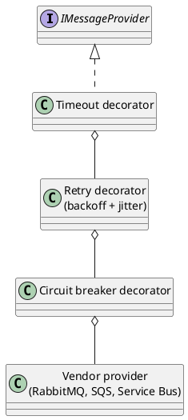

# Resilience Practices (Retries, Timeouts and Idempotency)

<!-- nav -->
[↑ 03 — Practices and Conventions](./README.md) · [← Observability Practices (Metrics, Tracing and Health Checks)](./13-observability-practices.md) · [AI, Vector and RAG Practices →](./15-ai-vector-rag-practices.md)
<!-- nav -->

Current state, from a search of `src`: there is no shared retry, timeout or circuit breaker code. Background hosts poll with fixed `Task.Delay` values, several marked `TODO: this should be configurable` (`MessageReceiverHost` 10 s, `InProcessMessageProvider` 1 s, `EmailMessageReceiverHost`, `EmbeddingSentenceTransformerQueueReaderHost`), and `TestContextExtensions` retries a file write with exponential backoff. The owner decision is to **avoid Polly** because of its license change; `Microsoft.Extensions.Resilience` must be checked first because it builds on Polly ([alternatives](../05-industry-alternatives/14-resilience.md)).

## Rules

**Table 15 — Resilience rules**

| Rule | Detail |
|------|--------|
| Every outbound call has a timeout | HTTP, database and queue calls take a `CancellationToken` and a configured timeout; there is no unbounded wait |
| Retry only what is safe | Retry transient failures (network errors, `429`, `503`) of idempotent operations; never blindly retry a non-idempotent write |
| Back off with jitter | Retries use exponential backoff with random jitter and a maximum attempt count; no tight loops |
| Delays and limits are options | Poll intervals, retry counts, timeouts and breaker thresholds are options with defaults, validated at startup; this closes the hard-coded `Task.Delay` items |
| Resilience is a decorator | Retry, timeout and breaker wrap a service behind its interface (the same seam as the caching proxy), so business code contains none of it |
| Clocks are injected | Delays and timeouts use `TimeProvider` so tests run instantly and deterministically |
| Handlers are idempotent | Message handlers tolerate redelivery: use a stable message identifier and record processed identifiers, or make the operation naturally repeatable |
| Poison messages go aside | After the retry limit a message moves to a dead-letter destination with the failure reason, never loops forever |
| Fail fast on configuration | Invalid options and missing required dependencies stop startup rather than degrade silently |
| Degrade deliberately | Where a dependency is optional (a cache, an embedding service) the fallback is explicit and logged, not an accidental swallow of an exception |
| Expose state | Retry counts, breaker state and dead-letter counts are metrics ([observability](./13-observability-practices.md)) |

## Where each control applies

*Figure 9 — resilience as decorators around an interface*

## Messaging

The message queue framework already separates providers behind interfaces, so retry and dead-letter policy belong in a decorator or in the provider options rather than in each handler. Each vendor has native features (visibility timeout, delivery count, dead-letter queue); the adapter maps them onto one options shape so handlers behave the same everywhere. Sagas are owned by the application, not the framework (owner decision).

## Idempotency for HTTP

Safe methods are retried freely. Unsafe methods accept an idempotency key header where a client may retry (payments, orders), and the server stores the key with the result for a limited time.

---

<!-- nav -->
[↑ 03 — Practices and Conventions](./README.md) · [← Observability Practices (Metrics, Tracing and Health Checks)](./13-observability-practices.md) · [AI, Vector and RAG Practices →](./15-ai-vector-rag-practices.md)
<!-- nav -->
