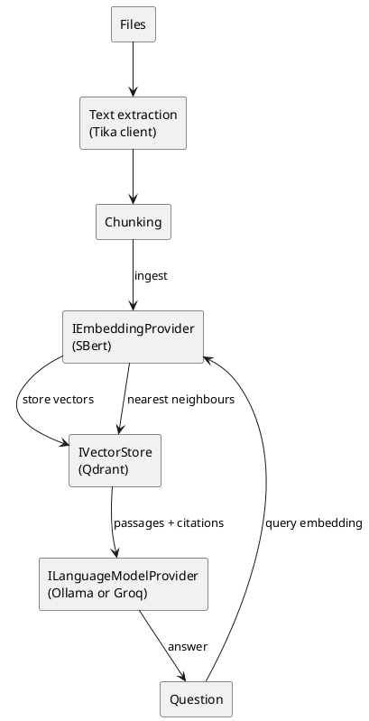

# AI, Vector and RAG Practices

<!-- nav -->
[↑ 03 — Practices and Conventions](./README.md) · [← Resilience Practices (Retries, Timeouts and Idempotency)](./14-resilience-practices.md) · [Index →](./README.md)
<!-- nav -->

How the codebase does retrieval-augmented generation (RAG) today, and the rules to carry forward. The pieces follow the standard provider pattern ([design patterns](../02-design-patterns/README.md)): an abstraction in `Framework`, a vendor adapter in `ExternalServices`, selection by configuration.

## Current pieces

**Table 16 — AI building blocks**

| Piece | Project | Role |
|-------|---------|------|
| Language model and embedding contracts | `OoBDev.AI.Abstractions` (`ILanguageModelProvider`, `IEmbeddingProvider`, `IMessageCompletion`) | Vendor-neutral prompts, streamed responses, RAG responses with citations, embeddings |
| Vector store contracts | `OoBDev.Search.Abstractions` (`IVectorStore`, `IVectorStore<T>`, `IVectorStoreProvider`, `IVectorStoreFactory`, `IVectorStoreProviderFactory`) | Store and search vectors behind the provider and factory pattern |
| Vector store adapter | `OoBDev.Qdrant` | Qdrant over gRPC, with point struct and client factories |
| Embedding adapters | `OoBDev.SBert`, `OoBDev.SBert.AllMiniLmL6V2`, `OoBDev.Onnx.SentenceEmbeddings` | Sentence embeddings from a service or in process |
| Language model adapters | `OoBDev.Ollama`, `OoBDev.GroqCloud` | Local and hosted chat completion |
| Document text extraction | `OoBDev.Apache.Tika` | Extracts text and metadata from files before chunking |
| Orchestration | `OoBDev.SemanticKernel` (plug-ins for current user and time) | Optional tool calling on top of the contracts |
| SQL vector types | `OoBDev.Data.Vectors` (SQL CLR vector, matrix, distance, aggregates) | Vector math inside SQL Server |
| Background embedding | `OoBDev.Data.Vectors.Hosting` (`EmbeddingSentenceTransformerQueueReader`) | Embeds queued content out of process |
| End to end sample | `OoBDev.FileRagEngine.Cli` | Runs RAG prompts over files |

## The flow

*Figure 10 — ingestion and query paths*

## Rules

**Table 17 — AI rules**

| Rule | Detail |
|------|--------|
| Contracts in Abstractions, vendors in adapters | Applications depend on `ILanguageModelProvider`, `IEmbeddingProvider` and `IVectorStore`, never on a vendor client |
| Provider chosen by configuration | The selection factory picks the keyed provider from a configuration path, the same way as other providers; provider keys are kebab-case constants in each adapter's `{Vendor}Globals` |
| Embedding model is part of the index | A vector store collection records the embedding model and dimension (`IEmbeddingProvider.Length`); changing the model means re-indexing, never mixing vectors |
| Citations are first class | RAG answers return the passages used (`GetRAGResponseCitiationsAsync`), so callers can show sources |
| Prompts are data | System prompts (`assistantConfinment`) come from configuration or templates, not string literals in code |
| Options, not constants | Model names, distance metric and endpoints are validated options (closes the hard-coded model and distance TODOs) |
| Streaming by `IAsyncEnumerable<string>` | Long responses stream; every call takes a `CancellationToken` |
| Treat model output as untrusted | Validate and encode output before it reaches a browser, a query or a command; tool calls run with the caller's rights ([authorization](./11-authorization-practices.md)) |
| Guard against prompt injection | Retrieved text is data, not instructions; retrieval respects the caller's access rights so a user cannot retrieve documents they could not open |
| Protect data sent to hosted models | Local providers (Ollama, SBert) are the default for sensitive content; hosted providers (Groq) need an explicit data classification decision |
| Resilience and telemetry apply | Model calls get timeouts, bounded retries and metrics for latency and token use ([resilience](./14-resilience-practices.md), [observability](./13-observability-practices.md)) |
| Tests use fakes and Docker services | Unit tests fake the contracts; Integration tests use the Qdrant, SBert, Ollama and Tika containers; hosted model tests are `LiveIntegration` |

## Known rough edges

`ILanguageModelProvider` mixes chat, embedding and RAG operations in one interface and carries a repeated `EnumeratorCancellation` warning suppression, `AssistantConfinment` is misspelled in `GenAiContextRequestModel` and the interface, and `OllamaMessageCompletion` still throws `NotImplementedException` in two places. These are owner-review items in [`TODO.md`](../../../TODO.md); per the working rule, they are recorded, not silently changed. Splitting the interface into chat, embedding and RAG contracts is worth considering before more providers are added ([alternatives](../05-industry-alternatives/15-ai-and-rag.md)).

---

<!-- nav -->
[↑ 03 — Practices and Conventions](./README.md) · [← Resilience Practices (Retries, Timeouts and Idempotency)](./14-resilience-practices.md) · [Index →](./README.md)
<!-- nav -->
