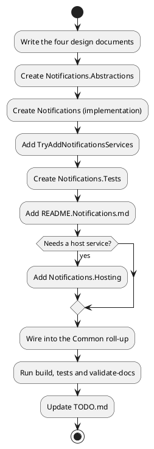

# Recipe 1 — New Framework Capability

<!-- nav -->
[↑ 04 — New Project Blueprint](./README.md) · [← Index](./README.md) · [Recipe 2 — New Vendor Adapter →](./02-new-vendor-adapter.md)
<!-- nav -->

Example: a `Notifications` capability with a default implementation and pluggable providers.

*Figure 1 — steps for a new capability*



## Steps

1. **Design first.** Requirements, architecture, API design and testing strategy, see [the design document standard](../06-design-document-standard.md).
2. **`OoBDev.Notifications.Abstractions`**: interfaces (`INotificationSender`, `INotificationProvider`), records, attributes. Depend only on `OoBDev.System.Abstractions` or nothing. No vendor types.
3. **`OoBDev.Notifications`**: default implementation (`NotificationSender`), provider factory if several providers, options record, an internal folder per role (`Providers/`, `Factories/`, `Managers/`). Add `AssemblyInfo.cs` with `InternalsVisibleTo` for the tests project.
4. **Registration**, following [patterns 1 to 4](../02-design-patterns/README.md):

```csharp
public static IServiceCollection TryAddNotificationsServices(
    this IServiceCollection services,
    IConfiguration configuration,
#if DEBUG
    NotificationsBuilder? builder
#else
    NotificationsBuilder? builder = default
#endif
)
{
    builder ??= new NotificationsBuilder();
    services.TryAddProviders();
    services.Configure<NotificationsOptions>(o => configuration.Bind(builder.OptionsSection, o));
    services.TryAddTransient<INotificationSender, NotificationSender>();
    return services;
}

public record NotificationsBuilder
{
    public string OptionsSection { get; init; } = nameof(NotificationsOptions);
}
```

5. **Tests project** `OoBDev.Notifications.Tests` with MSTest, strict Moq, the categories in [testing practices](../03-practices-and-conventions/04-testing-practices.md), and 80 percent coverage.
6. **Readme** `README.Notifications.md` with the registration call, configuration keys and a usage sample (build fails without it).
7. **Common wiring**: if the capability belongs in the batteries-included set, make sure the Common glob picks it up by suffix, and add a builder property to the layer builder record.
8. **Verify**: `dotnet build src/`, `dotnet test src/ --filter TestCategory=Unit`, `python scripts/docs/validate-docs.py docs`.
9. **Track**: update `TODO.md` and, when finished, archive to `docs/changes/`.

## Checklist

- [ ] No vendor SDK in Abstractions or default implementation
- [ ] All registrations use `TryAdd*` (collections use `Add*`)
- [ ] Options section name defaults to `nameof(Options)` and is overridable
- [ ] Time, GUIDs, identity injected (no `DateTime.Now`)
- [ ] Nullable on, implicit usings off, XML docs on public API
- [ ] README present, tests present, `TODO.md` updated

---

<!-- nav -->
[↑ 04 — New Project Blueprint](./README.md) · [← Index](./README.md) · [Recipe 2 — New Vendor Adapter →](./02-new-vendor-adapter.md)
<!-- nav -->
