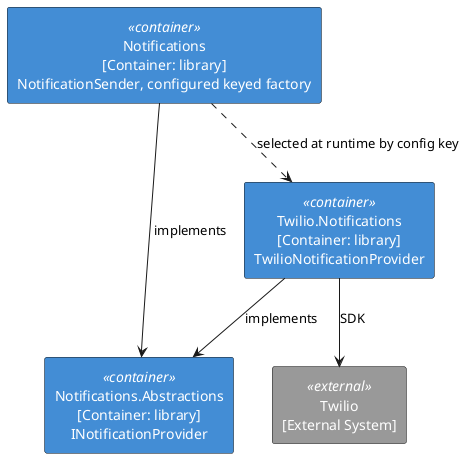

# Recipe 2 — New Vendor Adapter

<!-- nav -->
[↑ 04 — New Project Blueprint](./README.md) · [← Recipe 1 — New Framework Capability](./01-new-framework-capability.md) · [Recipe 3 — New Application →](./03-new-application.md)
<!-- nav -->

Example: `OoBDev.Twilio.Notifications` implementing `INotificationProvider`.

## Steps

1. Create the project under `src/ExternalServices/Twilio/`. Reference **`OoBDev.Notifications.Abstractions` only**, plus the vendor SDK. Never reference the Framework implementation ([the dependency rule](../01-architecture/02-five-source-layers.md)).
2. Wrap the SDK behind a small factory so it can be mocked: `ITwilioClientFactory` and `TwilioClientFactory`.
3. Implement the provider: `TwilioNotificationProvider : INotificationProvider`.
4. Put registration in an internal registrar and expose one public method:

```csharp
public static IServiceCollection TryAddTwilioNotificationServices(
    this IServiceCollection services, IConfiguration configuration, string section = nameof(TwilioOptions))
    => new TwilioNotificationRegistrar().AddServices(services, configuration, section);

// registrar
if (configuration.GetSection(section)?[nameof(TwilioOptions.AccountSid)] == null) return services; // config-gated
services.Configure<TwilioOptions>(o => configuration.Bind(section, o));
services.TryAddTransient<ITwilioClientFactory, TwilioClientFactory>();
services.TryAddTransient<INotificationProvider, TwilioNotificationProvider>();                // default
services.TryAddKeyedTransient<INotificationProvider, TwilioNotificationProvider>(TwilioGlobals.ProviderKey); // selectable
```

5. Define `TwilioGlobals.ProviderKey` as a constant.
6. Add the adapter to the `ExternalExtensionBuilder` section list and to the Common layer so `TryAllCommonExtensions` picks it up.
7. Tests: unit tests with a mocked factory; an `Integration` test only if a container exists (see the integration-test-maintenance protocol), otherwise `LiveIntegration`.
8. Document the configuration keys in the readme and `CONFIGURATION_SETTINGS.md`.

*Figure 2 — where the adapter sits*



## Checklist

- [ ] Only `Abstractions` referenced
- [ ] Registers default and keyed
- [ ] Config-gated, no throw when unconfigured
- [ ] SDK access behind a factory interface
- [ ] Readme, tests, configuration reference updated

---

<!-- nav -->
[↑ 04 — New Project Blueprint](./README.md) · [← Recipe 1 — New Framework Capability](./01-new-framework-capability.md) · [Recipe 3 — New Application →](./03-new-application.md)
<!-- nav -->
