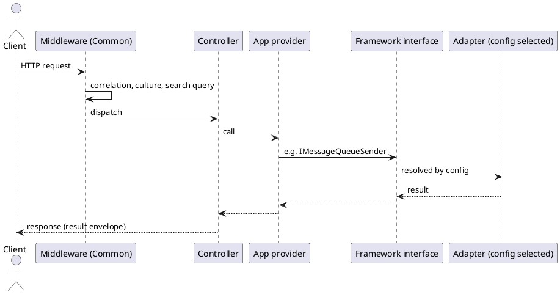

# Recipe 3 — New Application

<!-- nav -->
[↑ 04 — New Project Blueprint](./README.md) · [← Recipe 2 — New Vendor Adapter](./02-new-vendor-adapter.md) · [Recipe 4 — New Framework Family in a New Repository →](./04-new-framework-repository.md)
<!-- nav -->

An application is the composition root: it owns almost no infrastructure code ([architecture principle](../01-architecture/10-architectural-principles.md)).

## Steps

1. Create the project (`Microsoft.NET.Sdk.Web` or worker) targeting `net10.0`, nullable on, implicit usings off.
2. Reference `OoBDev.Common.Complete` (everything) or the specific `OoBDev.Common.*` roll-ups.
3. Compose in `Program.cs`:

```csharp
var builder = WebApplication.CreateBuilder(args);
builder.Services.TryAllCommonExtensions(builder.Configuration /*, per-layer builder records */);
var app = builder.Build();
app.UseAuthentication();     // ordering stays in the app
app.UseAuthorization();
app.UseAllCommonMiddleware(/* builder */);
app.MapControllers();
app.Run();
```

4. Configuration: only sections the application needs; provider selection by `OoBDev::ServiceKeys::{Type}` keys; environment switches for deployment differences.
5. Application code: controllers depend on small application-level providers, which depend on Framework interfaces (`IMessageQueueSender<T>`, `ICachingManager`).
6. Add a tests project and, if needed, Docker services for integration tests.
7. Add `README.md`, `.runsettings` variables, and update `CONFIGURATION_SETTINGS.md`.

*Figure 3 — request flow through a new application*



## Checklist

- [ ] One `Try*` call per layer, builder records only for overrides
- [ ] Middleware ordering explicit in the app
- [ ] No vendor SDK referenced directly
- [ ] Configuration keys documented; secrets outside the repo
- [ ] Tests and readme present

---

<!-- nav -->
[↑ 04 — New Project Blueprint](./README.md) · [← Recipe 2 — New Vendor Adapter](./02-new-vendor-adapter.md) · [Recipe 4 — New Framework Family in a New Repository →](./04-new-framework-repository.md)
<!-- nav -->
