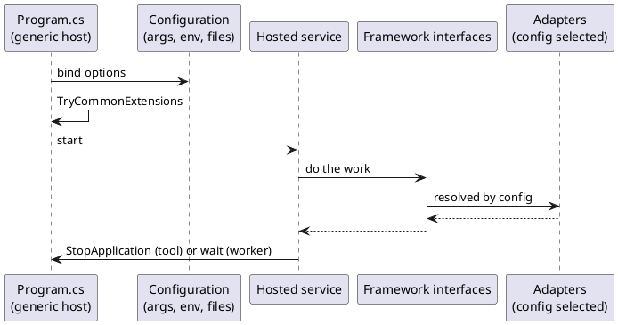

# Recipe 5 — New Worker or Command-Line Tool

<!-- nav -->
[↑ 04 — New Project Blueprint](./README.md) · [← Recipe 4 — New Framework Family in a New Repository](./04-new-framework-repository.md) · [Index →](./README.md)
<!-- nav -->

A worker (long-running background service) and a command-line tool share one shape: a generic host, the same composition calls as a web application, and one or more hosted services. Existing examples: `MessageReceiverHost` (`OoBDev.MessageQueueing.Hosting`), `EmbeddingSentenceTransformerQueueReaderHost` (`OoBDev.Data.Vectors.Hosting`), and the tools under `src/Tools` (`OoBDev.FileRagEngine.Cli`, `OoBDev.DocumentConverter.Cli`, `OoBDev.DacPacCompiler.Cli`, `OoBDev.TemplateEngine.Cli`).

## Steps

1. Create the project (`Microsoft.NET.Sdk.Worker` for a service, or `Microsoft.NET.Sdk` with `OutputType` `Exe` for a tool) targeting `net10.0`, nullable on, implicit usings off. Place tools under `src/Tools/OoBDev.{Name}.Cli`.
2. For a tool published as a dotnet tool, set `PackAsTool` to `true` and a short kebab-case `ToolCommandName` (for example `file-rag`, `file-convert`).
3. Compose in `Program.cs` with the generic host:

```csharp
await Host.CreateDefaultBuilder(args)
    .ConfigureAppConfiguration((context, config) => config.AddCommandLine(args,
        CommandLine.BuildParameters<MyToolOptions>()))
    .ConfigureServices((context, services) =>
    {
        services.Configure<MyToolOptions>(o => context.Configuration.Bind(nameof(MyToolOptions), o));
        services.AddHostedService<MyToolService>();
        services.TryCommonExtensions(context.Configuration, new());
        services.TryCommonExternalExtensions(context.Configuration, new(), new());
    })
    .StartAsync();
```

4. Put the work in a hosted service (`BackgroundService` or `IHostedService`), not in `Program.cs`. It takes its dependencies by interface and its settings from validated options.
5. Command-line parameters map to options through `CommandLine.BuildParameters<TOptions>()`, so the same option classes bind from arguments, environment variables and files.
6. For a worker that reads a queue, reference the queue framework and register `TryAddMessageQueueingHosting()`; handlers are ordinary framework handlers ([messaging](../02-design-patterns/README.md)), and polling intervals are options, not literals.
7. Stop cleanly: honor the `CancellationToken`, finish or abandon work deliberately, and return a non-zero exit code on failure for tools. A tool calls `IHostApplicationLifetime.StopApplication()` when finished so the host exits.
8. Add tests for the hosted service against faked interfaces, an Integration test if it uses Docker services, a `README.{Project}.md` with usage and every parameter, and an entry in `CONFIGURATION_SETTINGS.md`.

*Figure 4 — shape of a worker or tool*



## Runner pattern for interactive or long loops

Extracted from the retired BotChat sample. When the work is a loop that must be restartable and cancellable (an interactive chat, a polling reader), split it into two parts:

- `IRunner` with a single `Task ExecuteAsync(CancellationToken)`; the runner holds the work and takes its dependencies by constructor injection.
- A generic `IHostedService` (`RunnerHost<TRunner>`) that, on start, runs a task which creates a scope, builds the runner with `ActivatorUtilities.CreateInstance<TRunner>` and awaits it, repeating until cancelled; on stop it cancels and awaits the task.

Each runner gets a fresh scope per iteration, so scoped services (database contexts, HTTP clients) never leak across runs. The existing hosts (`MessageReceiverHost`, `EmailMessageReceiverHost`, `EmbeddingSentenceTransformerQueueReaderHost`) are purpose-built variants of this shape; use the generic form for new loops rather than copying one of them. Poll delays between iterations are options and use `TimeProvider` ([resilience](../03-practices-and-conventions/14-resilience-practices.md)).

## Rules that carry over

- Delays, batch sizes and timeouts are options with defaults, and calls use `TimeProvider` and a `CancellationToken` ([resilience](../03-practices-and-conventions/14-resilience-practices.md)).
- Log with `[LoggerMessage]`, and emit traces and metrics through `ActivitySource` and `Meter` ([observability](../03-practices-and-conventions/13-observability-practices.md)).
- Secrets come through configuration only ([security](../03-practices-and-conventions/12-security-practices.md)).
- A worker exposes health where it runs under an orchestrator (a small HTTP endpoint or a file or process check).
- A tool must not need a web host, a database or Docker unless its readme says so.

## Checklist

- [ ] Generic host in `Program.cs`, work in a hosted service
- [ ] Options bound from arguments, environment and files; validated at startup
- [ ] Cancellation and exit codes handled
- [ ] `PackAsTool` and `ToolCommandName` set for tools
- [ ] Tests, readme and configuration reference present

---

<!-- nav -->
[↑ 04 — New Project Blueprint](./README.md) · [← Recipe 4 — New Framework Family in a New Repository](./04-new-framework-repository.md) · [Index →](./README.md)
<!-- nav -->
