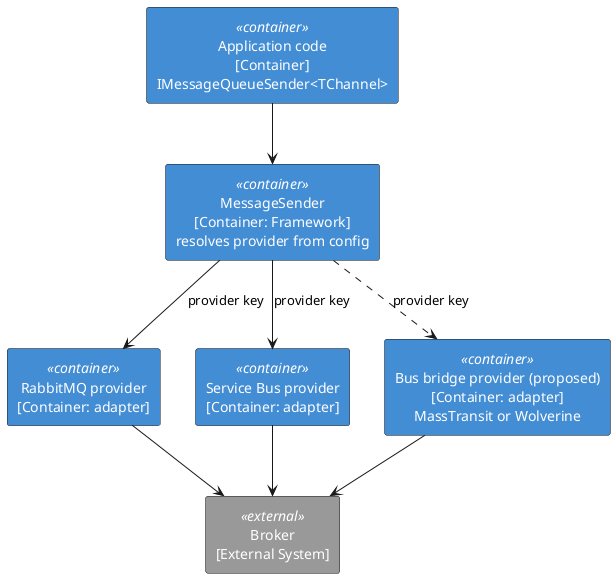

# Messaging

<!-- nav -->
[↑ 05 — Industry Alternatives](./README.md) · [← Cross-Cutting Runtime Concerns](./03-cross-cutting-runtime.md) · [Data Access and HTTP API →](./05-data-and-api.md)
<!-- nav -->

## 17. Custom messaging abstraction

**Today:** `IMessageQueueSender<TChannel>`, marker-generic handlers, config-resolved keyed providers, a supervised receiver host ([patterns 5, 11, 12, 13](../02-design-patterns/README.md)).

**Table 17 — Messaging options**

| Option | Pros | Cons |
|--------|------|------|
| Current custom abstraction | Small; provider per channel and message from config; fits the DI conventions | No sagas, outbox or retries beyond the host loop; the team owns every bug |
| MassTransit | Broad transport support, sagas, outbox, retries | Commercial licensing announced for recent major versions; heavy |
| Wolverine | Message bus plus mediator, outbox, low ceremony | Opinionated conventions; smaller ecosystem |
| NServiceBus | Enterprise-grade sagas and tooling | Commercial licence |
| Vendor SDK directly | Full feature access | Lock-in; no shared conventions |
| `System.Threading.Channels` | In-process, fast | Not durable or distributed |
| CloudEvents envelope | Standard event metadata | Only an envelope; still needs transport |

**Verdict: Keep,** for the simple cases it was built for. **Consider** two cheap improvements: use the CloudEvents attribute names for `IMessageContext` metadata so messages interoperate, and add an outbox capability before adopting a full bus. If sagas or exactly-once handling appear in a product, adopt Wolverine or MassTransit behind the existing `IMessageQueueSender` interface as another provider instead of rewriting callers.

*Figure 1 — replacing the transport without changing callers*

---

<!-- nav -->
[↑ 05 — Industry Alternatives](./README.md) · [← Cross-Cutting Runtime Concerns](./03-cross-cutting-runtime.md) · [Data Access and HTTP API →](./05-data-and-api.md)
<!-- nav -->
