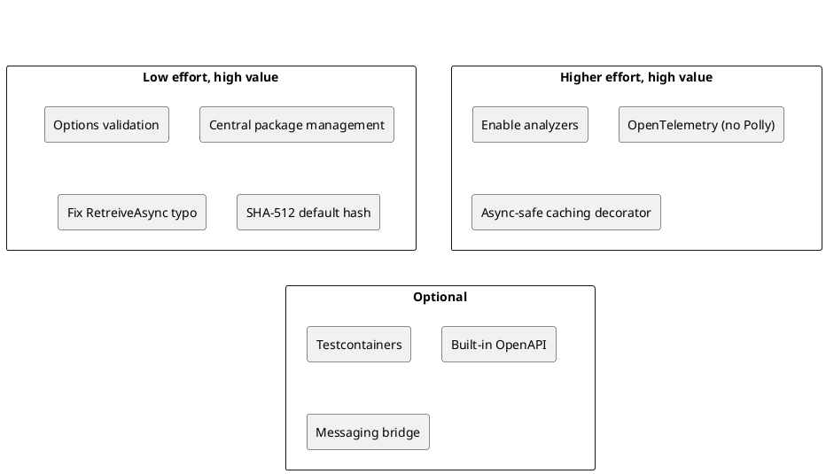

# 05 — Industry Alternatives

The [current patterns](../02-design-patterns/README.md) and [practices](../03-practices-and-conventions/README.md) are the author's preferences and are documented as the standard to carry forward. This section is different: it lists **common industry approaches that differ** from them, with pros and cons, so each can be adopted, ignored or deferred on purpose.

## How to read it

Each topic has the same shape: what the code does today, the alternatives with pros and cons in a table, and a verdict.

**Table 1 — Verdict scale**

| Verdict | Meaning |
|---------|---------|
| **Keep** | The current approach is a sound match for industry practice or better suited to this codebase; carry it forward. |
| **Consider** | A worthwhile improvement that can be adopted incrementally or in new projects only. |
| **Change** | The current approach has a real defect or risk; fix or replace it in new work. |

Products change quickly. Licensing and feature statements below reflect what was generally known at the time of writing and should be re-checked before a decision.

## Summary of recommendations

**Table 2 — All topics and verdicts**

| # | Topic | Verdict | Where |
|---|-------|---------|-------|
| 1 | Provider selection (`ISelectedService` vs keyed DI vs named options) | Keep intent; migrate to a keyed-service selection factory; third-party DI rejected | [DI and composition](./01-di-and-composition.md) |
| 2 | Options binding and validation | Change (add validation via `AddValidatedOptions<T>()`) | [DI and composition](./01-di-and-composition.md) |
| 3 | `#if DEBUG` required parameters | Keep; analyzer preferred, spike wanted | [DI and composition](./01-di-and-composition.md) |
| 4 | Builder records vs configure delegates | Keep | [DI and composition](./01-di-and-composition.md) |
| 5 | `IServiceProvider` injection | Keep, contained | [DI and composition](./01-di-and-composition.md) |
| 6 | Abstractions / implementation split | Keep | [Structure and build](./02-project-structure-and-build.md) |
| 7 | Glob-based Common aggregator | Consider | [Structure and build](./02-project-structure-and-build.md) |
| 8 | Layering style (Clean, Onion, Vertical Slice) | Keep | [Structure and build](./02-project-structure-and-build.md) |
| 9 | Central package management | Change (restore) | [Structure and build](./02-project-structure-and-build.md) |
| 10 | Analyzers and warnings as errors | Change (zero warnings, enforce patterns) | [Structure and build](./02-project-structure-and-build.md) |
| 11 | Versioning tool | Keep | [Structure and build](./02-project-structure-and-build.md) |
| 12 | `DispatchProxy` caching | Change (source generator) | [Cross-cutting](./03-cross-cutting-runtime.md) |
| 13 | Result envelope | No HTTP envelope; ProblemDetails middleware | [Cross-cutting](./03-cross-cutting-runtime.md) |
| 14 | Observability and resilience | Add OpenTelemetry; avoid Polly | [Cross-cutting](./03-cross-cutting-runtime.md) |
| 15 | Logging style | Change (`[LoggerMessage]`; no third-party logging) | [Cross-cutting](./03-cross-cutting-runtime.md) |
| 16 | Default hash algorithm | Change (SHA-512) | [Cross-cutting](./03-cross-cutting-runtime.md) |
| 17 | Custom messaging | Keep, consider bridge | [Messaging](./04-messaging.md) |
| 18 | Stored procedure mapper | Keep, consider Dapper | [Data and API](./05-data-and-api.md) |
| 19 | Swagger generation | Change (Scalar) | [Data and API](./05-data-and-api.md) |
| 20 | Test framework and mocking | Keep MSTest; spike other mocks | [Testing and quality](./06-testing-and-quality.md) |
| 21 | Docker test infrastructure | Consider (Aspire spike) | [Testing and quality](./06-testing-and-quality.md) |
| 22 | Documentation tooling | Consider (spikes) | [Documentation](./07-documentation.md) |
| 23 | UI architecture and JS/TS framework choice | Keep (MVVM with commands) | [UI patterns](./08-ui.md) |
| 24 | Authentication and token exchange | Keep (OAuth/OIDC/JWT plus STS) | [Authentication](./09-authentication.md) |
| 25 | HTTP API style and query syntax | Keep REST; OData and GraphQL for all `IQueryable<T>` endpoints | [HTTP API](./10-http-api.md) |
| 26 | Authorization model | Keep (RBAC with application rights) | [Authorization](./11-authorization.md) |
| 27 | Secrets, abuse control and supply chain | Keep configuration-first; vault adapter, built-in rate limiter, allow-list CORS | [Security](./12-security.md) |
| 28 | Metrics, tracing and health checks | Adopt OpenTelemetry (owner decision) | [Observability](./13-observability.md) |
| 29 | Retries, timeouts and idempotency | Avoid Polly; in-house decorators or `Microsoft.Extensions.Resilience` after license check | [Resilience](./14-resilience.md) |
| 30 | Model abstractions, vector stores and orchestration | Keep own contracts; consider `Microsoft.Extensions.AI` | [AI and RAG](./15-ai-and-rag.md) |

*Figure 1 — effort and value of the recommended changes*

<!-- toc:start -->
## Contents

1. [DI and Composition](./01-di-and-composition.md)
2. [Project Structure and Build](./02-project-structure-and-build.md)
3. [Cross-Cutting Runtime Concerns](./03-cross-cutting-runtime.md)
4. [Messaging](./04-messaging.md)
5. [Data Access and HTTP API](./05-data-and-api.md)
6. [Testing and Quality](./06-testing-and-quality.md)
7. [Documentation](./07-documentation.md)
8. [UI Patterns](./08-ui.md)
9. [Authentication Approaches](./09-authentication.md)
10. [HTTP API and Querying](./10-http-api.md)
11. [Authorization Approaches](./11-authorization.md)
12. [Security Approaches](./12-security.md)
13. [Observability Approaches](./13-observability.md)
14. [Resilience Approaches](./14-resilience.md)
15. [AI and RAG Approaches](./15-ai-and-rag.md)

### List of Figures

1. [Figure 1 — replacing the transport without changing callers](./04-messaging.md)

### List of Tables

1. [Table 1 — Provider selection options](./01-di-and-composition.md)
2. [Table 2 — Options approaches](./01-di-and-composition.md)
3. [Table 3 — Alternatives](./01-di-and-composition.md)
4. [Table 4 — Configuration objects](./01-di-and-composition.md)
5. [Table 5 — Service-locator concerns](./01-di-and-composition.md)
6. [Table 6 — Packaging of contracts](./02-project-structure-and-build.md)
7. [Table 7 — Aggregation approaches](./02-project-structure-and-build.md)
8. [Table 8 — Structural styles](./02-project-structure-and-build.md)
9. [Table 9 — Version management](./02-project-structure-and-build.md)
10. [Table 10 — Static analysis](./02-project-structure-and-build.md)
11. [Table 11 — Version derivation](./02-project-structure-and-build.md)
12. [Table 12 — Caching approaches](./03-cross-cutting-runtime.md)
13. [Table 13 — Error and result models](./03-cross-cutting-runtime.md)
14. [Table 14 — Operational libraries](./03-cross-cutting-runtime.md)
15. [Table 15 — Logging approaches](./03-cross-cutting-runtime.md)
16. [Table 16 — Hash choices](./03-cross-cutting-runtime.md)
17. [Table 17 — Messaging options](./04-messaging.md)
18. [Table 18 — Data access options](./05-data-and-api.md)
19. [Table 19 — OpenAPI generation](./05-data-and-api.md)
20. [Table 20 — Test tooling](./06-testing-and-quality.md)
21. [Table 21 — Container strategies](./06-testing-and-quality.md)
22. [Table 22 — Documentation options](./07-documentation.md)
23. [Table 23 — Suggested next documentation steps](./07-documentation.md)
24. [Table 24 — UI architecture options](./08-ui.md)
25. [Table 25 — JS/TS frameworks by fit to MVVM (general knowledge; re-check before deciding)](./08-ui.md)
26. [Table 26 — Approaches to cross-application tokens](./09-authentication.md)
27. [Table 27 — Ways to obtain an STS](./09-authentication.md)
28. [Table 28 — API styles](./10-http-api.md)
29. [Table 29 — Query syntax options for collections](./10-http-api.md)
30. [Table 30 — Combination strategies](./10-http-api.md)
31. [Table 31 — Authorization models](./11-authorization.md)
32. [Table 32 — Where rights get attached](./11-authorization.md)
33. [Table 33 — Secret management options](./12-security.md)
34. [Table 34 — Abuse control and hardening options](./12-security.md)
35. [Table 35 — Telemetry approaches](./13-observability.md)
36. [Table 36 — Health check styles](./13-observability.md)
37. [Table 37 — Resilience implementation options](./14-resilience.md)
38. [Table 38 — Messaging failure handling](./14-resilience.md)
39. [Table 39 — Model abstraction options](./15-ai-and-rag.md)
40. [Table 40 — Vector store options](./15-ai-and-rag.md)
41. [Table 41 — RAG design choices](./15-ai-and-rag.md)
<!-- toc:end -->
