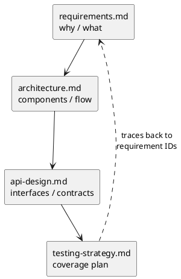
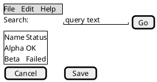

# 06 — Design Document Standard

<!-- nav -->
[↑ Patterns Discovery](./README.md) · [← Index](./README.md) · [Index →](./README.md)
<!-- nav -->

How design documents are created in this repository. It formalizes the "Epic 11" pattern already used in `CLAUDE.md` (four documents per feature) and adds the diagram rules.

## Contents

- [1. Rules](#1-rules)
- [2. The four documents per feature](#2-the-four-documents-per-feature)
- [3. UI mockups (PlantUML + Salt)](#3-ui-mockups-plantuml--salt)
- [4. Document skeleton](#4-document-skeleton)
- [5. Checklist before marking Accepted](#5-checklist-before-marking-accepted)

### List of Figures

1. Figure 1 — The four documents per feature
2. Figure 2 — Salt UI mockup example

### List of Tables

1. Table 1 — Design document rules

---

## 1. Rules

**Table 1 — Design document rules**

| Rule | Requirement |
|------|-------------|
| Validation | Run `python scripts/docs/validate-docs.py docs` (see [scripts/docs/README.md](../../scripts/docs/README.md)); every diagram must render and every link must resolve. Prefer deterministic scripts over manual/LLM editing for repeatable doc tasks. |
| Architecture diagrams | Use **C4-model style** (Context, Container, Component, Code levels), but drawn with **plain PlantUML** (`rectangle`/`component` with stereotypes and `skinparam` colors). **Do not `!include` the C4-PlantUML library** – remote includes break in production/offline rendering. Label each element `Name
[Type: technology]
description` and each relationship with its purpose. |
| Diagrams | **Always PlantUML**, fenced as `plantuml` with `@startuml`/`@enduml`. No ASCII art, no Mermaid. |
| UI mockups | **Always PlantUML + Salt** (`@startsalt`/`@endsalt`), embedded in the markdown. |
| Location | `docs/design/{feature}/` (or the epic's existing folder). |
| Grounding | Describe real code paths and link to them; mark anything proposed as *Proposed*. |
| Consistency | Follow the patterns in [Design Patterns](./02-design-patterns/README.md) unless the document explicitly justifies a deviation. |
| Length | When a document passes ~250 lines or ~6 major sections, split it: a **folder** per topic area (`NN-topic/`) with a `README.md` index (Contents, lists of figures/tables, overview) and **one file per headline** (`NN-headline.md`). Each file carries `↑ Index · ← Previous · Next →` navigation at top and bottom. Caption numbering is continuous across the folder and the index links to each caption. |
| Cross references | Prefer valid relative links (file, or file + `#anchor`) over prose such as "see above". Link the first mention of any concept that has its own document. Check that every link resolves before marking a document Accepted. |
| Navigation | Any document with 3+ sections has a **Contents**; one with figures has a **List of Figures**; one with tables has a **List of Tables** (placed after the intro, before section 1). Omit a list when it would have fewer than 2 entries. |
| Captions | Every figure is followed by `*Figure N — title*`; every table is preceded by `**Table N — title**`. Numbering is per document. |
| Status | Every document starts with a status line: `Draft`, `Review`, `Accepted` or `Superseded`, plus date. |

## 2. The four documents per feature



*Figure 1 — The four documents per feature*


### requirements.md
* Problem statement, goals, **non-goals**.
* Numbered requirements (`REQ-001…`) with priority (Must/Should/Could).
* Use cases / actors, constraints (net10.0, nullable on, implicit usings off).
* Open questions.

### architecture.md
* Layer placement (Common / Framework / Extensions / ExternalServices) and why.
* Project list following the `X.Abstractions` + `X` + `X.Tests` split.
* **Component diagram** and **sequence diagram(s)** in PlantUML.
* Which patterns from 02 are used (provider/keyed, configured keyed factory, builder record, options section, attributes).
* Configuration keys and defaults; lifetimes; failure and retry behavior.
* Alternatives considered (short table of option, pro, con, decision).

### api-design.md
* Public interfaces, records and attributes as compilable C# with XML docs.
* The `TryAdd{Capability}Services` signature and builder record.
* Config JSON sample.
* Class diagram (PlantUML) for non-trivial type relationships.
* Error and result model (`IResult` vs exceptions).

### testing-strategy.md
* Coverage target (Framework layer ≥ 80%; epics state 85–90%).
* Table mapping each requirement to tests and category (`Unit`, `Simulate`, `Integration`, `LiveIntegration`, `DevLocal`).
* Mock strategy (Moq strict), `TestContext` properties needed, Docker services required.

## 3. UI mockups (PlantUML + Salt)



*Figure 2 — Salt UI mockup example*


## 4. Document skeleton

````markdown
# {Feature} — {Requirements|Architecture|API Design|Testing Strategy}

**Status:** Draft · **Date:** YYYY-MM-DD · **Epic:** N · **Related:** links

## Contents
### List of Figures
### List of Tables

## Summary
## (type-specific sections)
## Open Questions
## References
````

## 5. Checklist before marking Accepted

- [ ] All four documents exist and cross-link.
- [ ] Long documents are split into folder + files, and every relative link resolves.
- [ ] Contents / List of Figures / List of Tables present where useful and captions match.
- [ ] `validate-docs.py` passes.
- [ ] Architecture diagrams are C4-style plain PlantUML (no `!include`).
- [ ] Every diagram is PlantUML; every mockup is Salt.
- [ ] Every requirement is traced to a test row.
- [ ] Deviations from established patterns are justified.
- [ ] README.md and TODO.md updated.

---

<!-- nav -->
[↑ Patterns Discovery](./README.md) · [← Index](./README.md) · [Index →](./README.md)
<!-- nav -->
