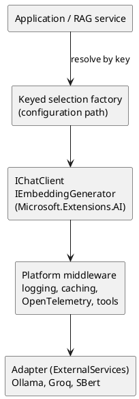

# Spike — Microsoft.Extensions.AI

<!-- nav -->
[↑ 08 — Spikes](./README.md) · [← Index](./README.md) · [Index →](./README.md)
<!-- nav -->

## Question

`OoBDev.AI.Abstractions` (`ILanguageModelProvider`, `IEmbeddingProvider`, `IMessageCompletion`) was written before `Microsoft.Extensions.AI` existed. Can the platform abstractions (`IChatClient`, `IEmbeddingGenerator<string, Embedding<float>>`) replace the hand-built vendor plumbing, and what does a migration cost? The owner expects to accept the migration; this spike looks for blockers and sizes the work.

Code: [`src/Spikes/OoBDev.Spike.ExtensionsAI`](../../../src/Spikes/OoBDev.Spike.ExtensionsAI/README.Spike.ExtensionsAI.md). Six unit tests pass.

## What was built

**Table 1 — Spike results**

| Experiment | Result |
|------------|--------|
| `ILanguageModelProvider` implemented once over any `IChatClient` (`ChatClientLanguageModelProvider`) | Works for all eight methods: chat, streaming, context chat, RAG and RAG with citations are prompt composition plus `GetResponseAsync` or `GetStreamingResponseAsync`; embedding uses an optional generator |
| `IEmbeddingProvider` over `IEmbeddingGenerator` (`EmbeddingGeneratorProvider`) | Works; the model name maps to `EmbeddingGenerationOptions.ModelId`; `Length` still has to be supplied because the generator does not expose it |
| Keyed registration (`AddKeyedSingleton`) of the client, generator and owner contract | Works; fits the keyed selection factory decision, with provider keys as kebab-case constants |
| Platform middleware (`ChatClientBuilder.UseFunctionInvocation()`) over a client | Works; logging, caching, OpenTelemetry and tool calling come from the platform builder instead of our own proxies |
| Fake `IChatClient` and `IEmbeddingGenerator` for tests | About 40 lines each; replaces vendor client fakes |

## Findings

**Table 2 — Findings**

| # | Finding | Consequence |
|---|---------|-------------|
| 1 | `ILanguageModelProvider` has no implementation in the repository. `OllamaController` and `AIController` inject it with the keys `OLLAMA` and `OPENAI`, but only the abstraction and the controllers reference it | The interface is effectively unimplemented today, so replacing it costs little; the example controllers need the registration that the spike shows |
| 2 | The Ollama adapter uses `OllamaSharp` 5.4.12 and the Semantic Kernel Ollama connector (`1.40.0-alpha`); the Groq adapter uses `GroqNet` 1.0.1 | The installed `OllamaSharp` references `IChatClient` and `IEmbeddingGenerator` (string match in the assembly), so the Ollama adapter can expose the platform interfaces directly; Groq needs a thin `IChatClient` wrapper or an OpenAI-compatible client pointed at the Groq endpoint (to verify) |
| 3 | Mixing `Microsoft.Extensions.AI.Abstractions` 10.5.2 with `Microsoft.Extensions.AI` 10.0.1 fails at run time with `TypeLoadException` (`FunctionApprovalRequestContent`) | Pin both packages to the same version in one place; this is another reason to restore central package management |
| 4 | `IEmbeddingProvider.GenerateEmbeddingAsync` requires a `CancellationToken` in Debug builds (`#if DEBUG` required parameters) | Consistent with the owner decision; callers must pass a token |
| 5 | `IMessageCompletion` and `CompletionRequest` (model name plus prompt, response model) are a third, older abstraction beside the chat contract | Fold into `IChatClient` (`ChatOptions.ModelId`) and remove after callers move |
| 6 | The RAG methods are prompt templates, not vendor features | Move them out of the provider contract into a small RAG service that takes an `IChatClient`; the contract shrinks to what vendors really differ on |
| 7 | `IEmbeddingGenerator` has no vector length property | Keep `IEmbeddingProvider.Length` (or record it in options) because the vector store collection needs the dimension |
| 8 | Semantic Kernel also builds on these abstractions; `OoBDev.SemanticKernel` only adds two plug-ins | Kernel use can stay optional on top of `IChatClient` instead of being the Ollama adapter's foundation |

## Proposed target shape

*Figure 1 — platform clients under the owner contracts*

## Recommendation

**Accept the migration.** Steps, in order:

1. Pin `Microsoft.Extensions.AI` and `Microsoft.Extensions.AI.Abstractions` together through central package management.
2. Make `IChatClient` and `IEmbeddingGenerator` the contracts adapters register (keyed, kebab-case keys in `{Vendor}Globals`); keep `IEmbeddingProvider` only where the dimension is needed, implemented by `EmbeddingGeneratorProvider`.
3. Move the RAG prompt composition into a service over `IChatClient`; retire `ILanguageModelProvider` and `IMessageCompletion` after the example controllers, `DocumentSummaryGenerationProvider`, `SearchProvider`, `FileRagEngineService` and the vector queue reader move (see the `ILanguageModelProvider`, `IEmbeddingProvider` and `IMessageCompletion` references found by search).
4. Ollama: register `OllamaApiClient` as the client and generator; drop the alpha Semantic Kernel connector from the adapter. Groq: verify an OpenAI-compatible client against the Groq endpoint, else write a thin `IChatClient`.
5. Replace hand-built logging and caching around model calls with the platform builder pipeline plus OpenTelemetry ([observability](../03-practices-and-conventions/13-observability-practices.md)).
6. Record the decision as an ADR and update the [AI practices](../03-practices-and-conventions/15-ai-vector-rag-practices.md) page and the [alternatives verdict](../05-industry-alternatives/15-ai-and-rag.md).

## Limits of this spike

No live model was called; behavior is shown against fakes only. Package versions were the newest in the local NuGet cache (10.0.1), so newer releases should be checked before migrating. The claim that `OllamaSharp` implements the platform interfaces comes from a string match in the assembly and needs a compile-time confirmation in the migration.

---

<!-- nav -->
[↑ 08 — Spikes](./README.md) · [← Index](./README.md) · [Index →](./README.md)
<!-- nav -->
